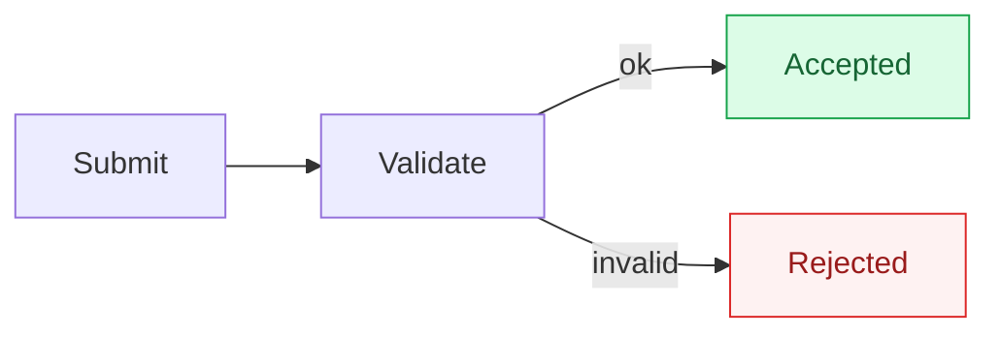

# Mermaid Authoring

Mermaid diagrams fail in two ways, and they look identical from the author's side: the syntax is wrong, or the syntax is fine but the target renderer is too old to know that diagram type. This skill covers both — per-diagram syntax under `references/`, and a version-support model so a diagram is chosen for the platform it has to render on.

**GitHub ran mermaid 11.16.0 as of 2026-07-26**, not re-verified since. This skill's docs now cover through 11.17.1, so anything marked **Introduced: 11.17** may not render on GitHub until it upgrades — re-run the `info` probe below before relying on an 11.17 feature there. Off GitHub the gap is wider by default: GitLab, self-hosted GitHub Enterprise, docs generators, and IDE previewers all pin their own versions and routinely lag further behind.

To read any renderer's version, give it a mermaid block containing only `info` — it renders the deployed version number. On GitHub, paste it into a comment box and hit Preview; there is no need to post. That number is what the **Introduced** field in each `references/` entry should be compared against.

With version handled, the failures that remain are syntax and escaping — see Gotchas.

## When to use

- Writing any mermaid block, in a PR body, issue, README, or doc.
- Choosing which diagram type fits what you are trying to show.
- Fixing a diagram that renders as a broken box, an error, or nothing at all.
- Deciding whether a diagram type is safe to use on a given target (GitHub, GitLab, a docs site, a local renderer).

## When NOT to use

- **Validating a diagram programmatically.** That is a tool's job, not a skill's. This skill teaches you what to write; it does not check what you wrote. Step 6 names the validators.
- **Non-mermaid diagrams.** Graphviz/DOT, PlantUML, D2 are different languages entirely.
- **Diagrams as images.** If the deliverable is a PNG/SVG asset rather than a fenced block, this is the wrong tool.

## Procedure

1. **Pick the diagram type** from the Stable index below. If two fit, prefer the older one — it renders in more places. Only drop to the beta table when nothing stable expresses what you need.
2. **Check the target's version tolerance.** Treat GitHub like any other pinned target: compare the type's **Introduced** version against the renderer's version from the info probe (11.16.0 as of 2026-07-26) and pick a different type if it is older; do not ship a diagram that renders as a broken box. Beta types (`-beta` suffix) stay risky everywhere: their syntax changes between releases regardless of how new the renderer is.
3. **Read `references/<diagramId>/README.md`** for the type you picked, before writing. It carries the core syntax and the per-type gotchas.
4. **Load deeper material only if you need it:**
   - `assets/<diagramId>/shapes.md` — when you need the full node/element vocabulary rather than the common few.
   - `assets/<diagramId>/examples.md` — when you want a worked, realistic starting point instead of building from syntax.
5. **Write the diagram**, applying the craft rules below.
6. **Validate before shipping.** Run the block through a real parser — the mermaid CLI (`@mermaid-js/mermaid-cli`) or [`mermaid-check`](https://github.com/sammcj/mermaid-check) — rather than trusting a read-through. Both check grammar only, so neither catches the quote trap in Gotchas; for anything load-bearing, render it. On GitHub the comment-box Preview tab is ground truth and costs nothing.

## Craft

Syntax correctness gets a diagram to render. It does not make it worth reading.

### Size is the main lever

A diagram earns its place by being faster to read than the paragraph it replaces. Past roughly **12-20 nodes** that stops being true — the reader spends longer decoding the layout than they would have spent reading prose. Treat ~15 as the working ceiling.

When a diagram outgrows that, the fix is never a bigger diagram:

- **Split by question.** One diagram answers one question — "what happens when a payment fails?", not "how does billing work?". A 50-node registration-and-onboarding-and-payment flow is three diagrams.
- **Group with subgraphs** before adding nodes, but keep nesting shallow; deep nesting inflates height fast.
- **Insert an intermediate node** when one node fans out to many edges, instead of letting the layout spread them horizontally.
- **Cut anything decorative.** If removing an element does not reduce understanding, remove it.

Nested decisions are the other size trap: diamonds inside diamonds stop being readable around 3-4 levels. Past that, a `stateDiagram-v2` usually models the thing better, or the logic wants splitting across diagrams.

Shrinking is the only portable fix. Better layout engines exist — ELK, tidy-tree — but they are separate packages the embedding site must register, so on GitHub and anywhere else you do not control you get mermaid's default dagre.

### Direction

- **`TD`/`TB`** — hierarchies, decision trees, org charts, anything with a clear start and end. The safe default.
- **`LR`** — pipelines and sequential stages: `Code --> Build --> Test --> Deploy`. Readers expect time to run horizontally.

Mismatching the two produces sprawl. A pipeline forced into `TD` becomes a tall ribbon; a wide decision tree in `LR` needs horizontal scrolling, which on GitHub means the reader sees a fragment. `BT`/`RL` are for reversed hierarchies and RTL contexts.

### Shape conventions

Shapes carry meaning to anyone who has read a flowchart before; contradicting the convention costs comprehension for no gain.

| Shape | Syntax | Means |
| --- | --- | --- |
| Rectangle | `A[Process]` | A process, action, or call |
| Diamond | `A{Decision}` | A branch or conditional |
| Rounded / stadium | `A(Start)` / `A([Start])` | Terminal — start or end |
| Parallelogram | `A[/Input/]` | Input or output |
| Cylinder | `A[(Database)]` | A datastore |

Full vocabulary, including the v11.3.0+ `A@{ shape: ... }` form, is in `assets/flowchart/shapes.md`.

### Labels

- **Nodes take noun phrases** (`Auth Service`); **edges take verb phrases** (`validates`, `on failure`).
- **Name steps as commands, not states.** "Send verification email" beats "Verification email" — it makes causality legible.
- **Label every branch out of a decision** (`-->|yes|` / `-->|no|`). A reader should never infer which arm is the success path.
- **Keep edge labels under about five words.** Link to docs instead of narrating inside the diagram.
- **Use meaningful node ids.** `AuthSvc --> UserDB` reads as source; `A --> B` forces a render to understand. This matters more for mermaid than most languages, because the source is what lands in a PR diff.
- **Stay internally consistent** on casing.

### Styling

Reach for a built-in theme before hand-styling: `default`, `forest`, `dark`, `neutral`, `base` (only `base` is meant to be customised). For per-node emphasis define the style once with `classDef` and apply with `:::name` — repeated inline `style` statements drift as the diagram grows:



Green for success, red for error, blue for informational, amber for pending, grey for inactive. Hold the palette to three or four meanings — colour stops signalling once everything is coloured.

**Always set `fill`, `stroke`, and `color` together.** Setting `fill` alone inherits the platform's text colour, which is how a node ends up dark-on-dark for every reader using the other theme. GitHub renders both; check both.

### Keep them true

A stale diagram is worse than none, because it is confidently wrong. Keep diagrams beside what they describe and update them in the same PR that changes the behaviour. That diffability is the whole advantage over an exported image.

## Gotchas

These are renderer-level traps that hold across diagram types. Per-type traps live in each `references/<diagramId>/README.md`.

**Quotes inside bracket labels break GitHub even when validators pass.** A bare double-quote inside a `[]`/`()`/`{}` label that is not the whole-label quote form breaks GitHub's real mermaid.js parser, while strict validators parse it clean. This is verified, not theoretical:

```text
A[bundle name<br/>e.g. "code-reviewer"]     ← breaks: the bare quotes, NOT the <br/>
A["label with \"quotes\""]                   ← mermaid's actual escape form
```

If a label needs quotes, quote the whole label and escape the inner ones. If it does not need them, drop them. The `<br/>` in the broken line above is fine and is the correct way to break a line — it is the unescaped `"` around `code-reviewer` that ends the label early.

**A validator passing is not proof it renders.** Validators implement the mermaid grammar; GitHub runs a specific, older mermaid build with its own behaviour. Passing a local check narrows the failure set — it does not empty it.

**The fence info string must be `mermaid`.** GitHub matches it case-insensitively, so `Mermaid` works, but any other tag — `mmd`, `mermaidjs` — renders as a plain code block with no diagram and no error.

**Version skew is silent.** A too-new diagram type does not warn; it renders as a broken box or empty space. It is the usual cause of "renders locally, not on the wiki/GitLab/Confluence" — and since GitHub itself may lag the docs (see the version note above), that now includes GitHub.

**Beta syntax is not stable.** Any keyword ending `-beta` can change syntax in a minor release. Avoid in anything long-lived.

### Parser traps that cross diagram types

**`end` as a node id or bare label breaks flowcharts and sequence diagrams.** Mermaid's own syntax reference calls this out. It is the single most common "why won't this render" cause, because `end` is a natural word to put in a diagram. Quote it (`A["end"]`) or rename it. `class`, `subgraph`, `link`, `default`, `note`, `style` are worth quoting for the same reason. Misspelling a keyword also breaks the diagram rather than degrading.

**A line break in a label is `<br/>`, not `\n`.** Mermaid source is line-based: a newline ends a statement, and a literal backslash-n is just two characters. Both of these are wrong in different ways:

```text
A[first line\nsecond line]              ← parses, but renders the literal text "\n"
B[one]\nsetContent{x}\n B --> C[two]     ← \n as a statement separator: syntax error
```

The second is the one that bites, because a model reaching for `\n` to mean "new line" tends to use it between statements too, and that is not valid anywhere. Write `A[first line<br/>second line]`, and put real newlines between statements.

**Special characters in labels need quoting.** `(`, `)`, `[`, `]`, `{`, `}`, `:`, `#`, `|`, `&`, `"` inside a label will end it early or confuse the shape parser. Quote the whole label: `A["Order (paid)"]`, `A["milk & eggs"]`. See the quote-escaping trap above for the case where quoting is itself the problem.

**The first line must declare the diagram type.** No `flowchart TD` / `sequenceDiagram` / `erDiagram` opener means no grammar to parse against.

**Arrow syntax is per-diagram, not shared.** Flowchart arrows (`-->`, `-.->`, `==>`) are not sequence arrows (`->>`, `-->>`, `-x`), and mixing them fails. Check the target type's README rather than carrying syntax across.

**Block constructs need their `end`.** Every `alt` / `else` / `loop` / `par` / `opt` / `rect` in a sequence diagram, and every `subgraph`, takes a matching `end`. An unclosed block stops parsing where it started, so the error often points nowhere near the real problem.

**A subgraph id cannot collide with a node id in the same scope.**

**Mindmaps are whitespace-significant.** Children indent strictly deeper than their parent; mixing tabs and spaces, or skipping a level, breaks the tree. Nothing else in mermaid cares about indentation this way.

**Gantt dates must match the declared `dateFormat`.** Writing `2026/01/01` under `dateFormat YYYY-MM-DD` does not error — every task silently starts today, which looks like a rendering bug rather than a data bug.


## Resources

Load on demand — never read the whole tree.

| Path | Load when |
|---|---|
| `references/<diagramId>/README.md` | Before writing that diagram type — syntax, version, per-type gotchas. |
| `assets/<diagramId>/shapes.md` | You need the full node/element vocabulary for that type (only exists where the type has one). |
| `assets/<diagramId>/examples.md` | You want a realistic worked example to start from. |

`<diagramId>` is the mermaid keyword, including any `-beta` suffix — see the Keyword column in the index.

## Diagram index

### Stable

Safe to reach for. `core` types render on effectively any mermaid; a version is the release that introduced the type.

| Diagram | Min version | Files | What it draws | Use when |
|---|---|---|---|---|
| **Block**<br>`block` | core | `block/` · shapes+examples | Fixed-grid blocks you place by hand | full manual control over node placement (grid/columns), unlike a… |
| **C4**<br>`C4Context` | core | `C4Context/` · shapes+examples | C4 architecture views (context/container/component) | the C4 model's four levels (context/container/component/deployment) and… |
| **Class Diagram**<br>`classDiagram` | core | `classDiagram/` · shapes+examples | Classes, members, and their relationships | model object-oriented structure |
| **Entity Relationship Diagram**<br>`erDiagram` | core | `erDiagram/` · shapes+examples | Entities and relationship cardinality | model data entities and the cardinality of relationships between them… |
| **Event Modeling Diagram**<br>`eventmodeling` | v11.15.0+ | `eventmodeling/` · examples | Event-modeling timeline of one flow | documenting an Event Modeling timeline (UI/trigger -> command -> event ->… |
| **Flowchart**<br>`flowchart` (aliases: `graph`) | core | `flowchart/` · shapes+examples | Nodes joined by directed edges | show a process, decision tree, or dependency graph as nodes and… |
| **Gantt Chart**<br>`gantt` | core | `gantt/` · shapes+examples | Dated schedule of tasks and dependencies | a project schedule with dated, sequential or dependent tasks across sections |
| **GitGraph Diagram**<br>`gitGraph` | core | `gitGraph/` · examples | Branch, merge, and cherry-pick history | document or visualize a branching/merge strategy (git flow, release… |
| **User Journey Diagram**<br>`journey` | core | `journey/` · examples | UX steps scored by satisfaction | showing a user's satisfaction/effort across the sequential steps of a… |
| **Kanban**<br>`kanban` | 11.x | `kanban/` · examples | Board columns of work items | showing tasks moving through workflow stages (columns) |
| **Mindmap**<br>`mindmap` | v9.4.0+ | `mindmap/` · examples | Hierarchy radiating from one centre | brainstorming or outlining a hierarchy radiating from one central concept |
| **Packet**<br>`packet` | v11.0.0+ | `packet/` · examples | Bit/byte layout of a wire format | documenting the bit/byte layout of a network packet, binary header, or… |
| **Pie Chart**<br>`pie` | core | `pie/` · examples | Proportional slices of a whole | showing proportional share of a whole across a small number of categories |
| **Quadrant Chart**<br>`quadrantChart` | core | `quadrantChart/` · examples | Items plotted into four quadrants | plotting items on two independent axes |
| **Requirement Diagram**<br>`requirementDiagram` | core | `requirementDiagram/` · shapes+examples | SysML requirements and what satisfies them | tracing formal requirements (SysML-style) to the elements that satisfy,… |
| **Sankey Diagram**<br>`sankey` | v10.3.0+ | `sankey/` · examples | Weighted flow between stages | visualizing flow/quantity moving between named stages (energy flows,… |
| **Sequence Diagram**<br>`sequenceDiagram` | core | `sequenceDiagram/` · shapes+examples | Time-ordered messages between participants | show time-ordered messages between participants (API calls, protocol… |
| **State Diagram**<br>`stateDiagram-v2` | core | `stateDiagram/` · examples | States and the transitions between them | model the finite states of a single system/entity and the transitions… |
| **Timeline Diagram**<br>`timeline` | core | `timeline/` · examples | Events in chronological order | showing a chronological sequence of events/eras, optionally grouped into… |
| **XY Chart**<br>`xychart` | core | `xychart/` · examples | Bar/line series on x/y axes | plotting numeric or categorical series on a real x/y axis |


### Beta and experimental

**Prefer a stable type above.** A `-beta` keyword means mermaid can change the syntax in any release, so a diagram that renders today can break on a later renderer with no warning and no error. Reach for these only when nothing stable expresses the thing, and expect to revisit them. `zenuml` is not beta but is an external diagram: the host must register a separate package, so by default it renders nowhere.

| Diagram | Min version | Files | What it draws | Use when |
|---|---|---|---|---|
| **Architecture**<br>`architecture-beta` | v11.1.0+ | `architecture-beta/` · shapes+examples | Cloud/infra service topology | showing how cloud/infra services (servers, DBs, storage, network) relate |
| **Cynefin Framework Diagram**<br>`cynefin-beta` | v11.16.0+ | `cynefin-beta/` · examples | Items sorted into Cynefin domains | categorizing problems/items into the five Cynefin sense-making domains… |
| **Ishikawa (Fishbone) Diagram**<br>`ishikawa-beta` | v11.12.3+ | `ishikawa-beta/` · examples | Fishbone of candidate causes | doing root-cause analysis, showing candidate causes of one problem grouped… |
| **Radar Diagram**<br>`radar-beta` | v11.6.0+ | `radar-beta/` · examples | Entities compared across shared axes | comparing multiple entities across 3+ shared dimensions on the same scale… |
| **Railroad Diagrams**<br>`railroad-ebnf-beta` (EBNF) | v11.16.0+ | `railroad/` · shapes+examples | Grammar as a syntax/railroad diagram | documenting a context-free grammar (a language, a config format, a… |
| **Swimlanes**<br>`swimlane-beta` | v11.16.0+ | `swimlane-beta/` · examples | Process split into owner lanes | a process where "who owns this step?" matters as much as "what happens next?" |
| **Treemap Diagram**<br>`treemap-beta` | 11.x | `treemap-beta/` · examples | Nested rectangles sized by value | showing hierarchical part-of-whole data where both nesting AND relative… |
| **TreeView**<br>`treeView-beta` | v11.14.0+ | `treeView-beta/` · examples | Directory/file tree | showing a directory/file structure |
| **Venn Diagram**<br>`venn-beta` | v11.12.3+ | `venn-beta/` · examples | Overlap between sets | showing set overlap |
| **Wardley Map**<br>`wardley-beta` | v11.14.0+ | `wardley-beta/` · shapes+examples | Components by visibility vs evolution | doing Wardley Mapping |
| **ZenUML**<br>`zenuml` | external | `zenuml/` · examples | Sequence diagram in code-like syntax | a sequence diagram written in a code-like, nestable syntax (method calls,… |
Paths are relative to the skill root: `references/<id>/README.md` and `assets/<id>/{shapes,examples}.md`. **core** = present in the mermaid 10.9.6 diagram registry or earlier, so it renders on effectively anything. A version means the release that introduced the type; **11.x** means it postdates 10.9.6 but its doc gives no exact release. A `-beta` keyword means the syntax itself can change between releases — avoid for anything long-lived. **external** = not in mermaid's core registry at any version; the host must register a separate package.
