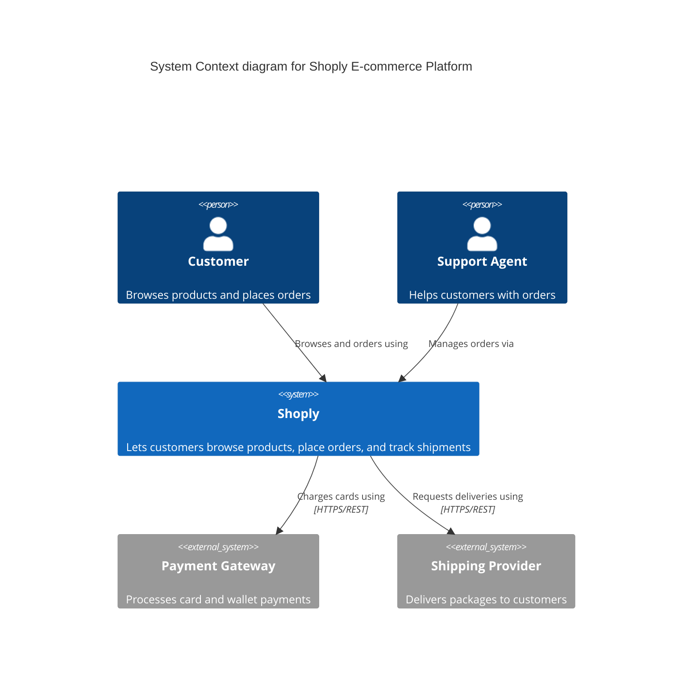
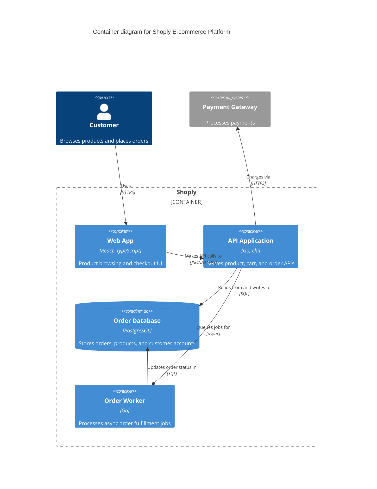
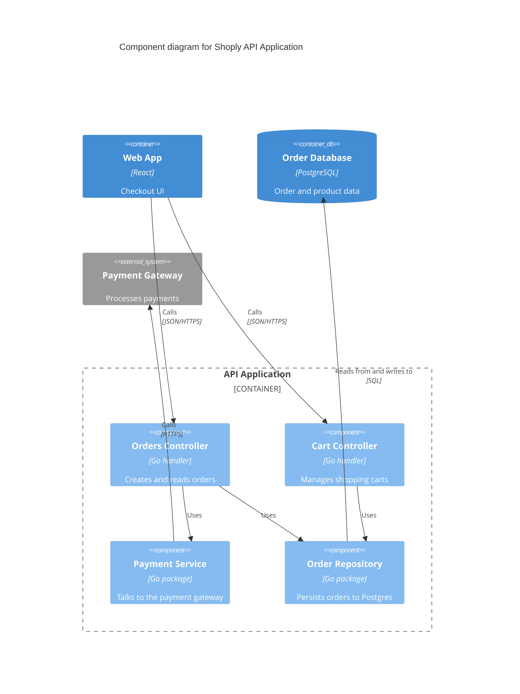
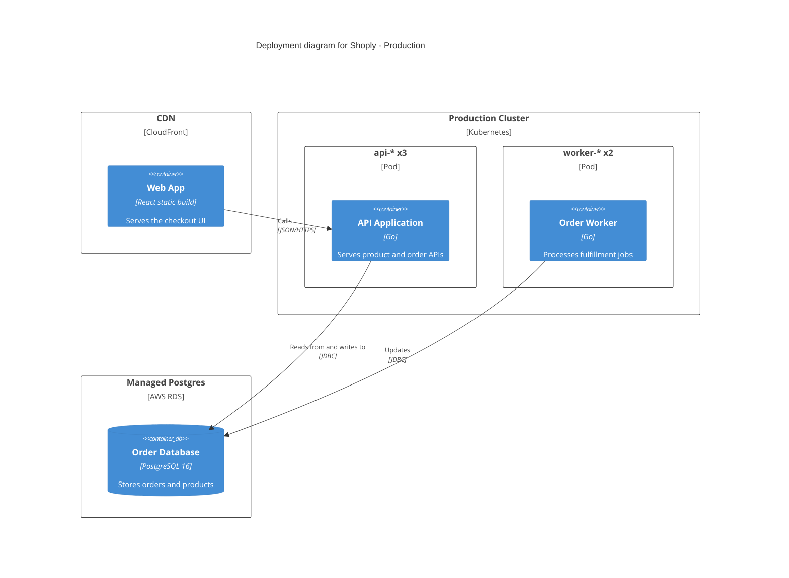

# C4 — examples

## 1. System Context — e-commerce platform

What this shows: the top-level view — who uses the system and which external systems it talks to.

## 2. Container — inside the e-commerce platform

What this shows: one level deeper — the deployable units inside Shoply and how they talk to each other and to the payment gateway.

## 3. Component — inside the API Application

What this shows: the internal components of a single container, useful when a container is complex enough to need its own breakdown.

## 4. Deployment — production topology

What this shows: where containers actually run — CDN, Kubernetes pods, and a managed database instance.

