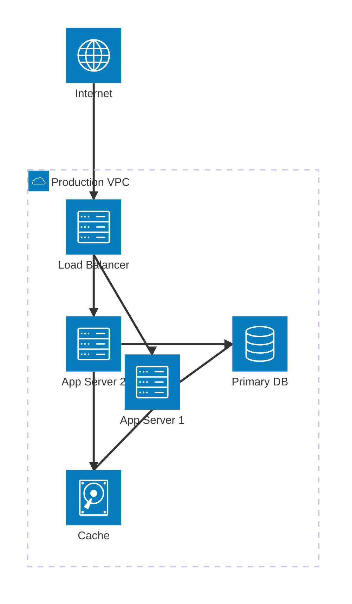
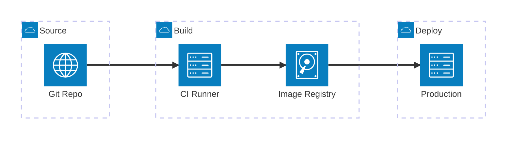
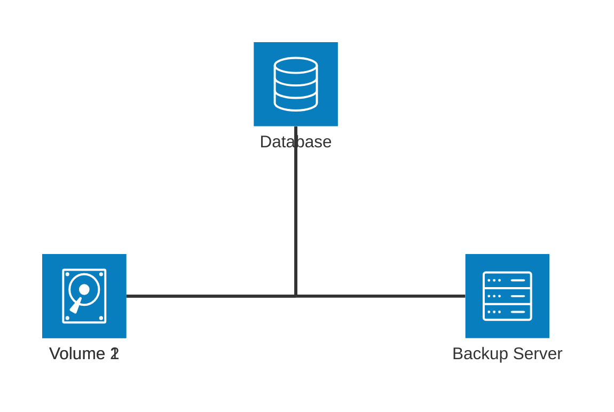

# Architecture — examples

## 1. Three-tier web app

What this shows: a load balancer fanning out to two app servers that share a database and a cache — a standard scale-out web tier.

## 2. Multi-source data pipeline (using `align`)

What this shows: three source databases feeding a single ETL service — `align column` keeps them stacked instead of collapsing onto each other, since all three share the same `R --> L` port pair into `etl`.

## 3. CI/CD pipeline across stages

What this shows: source, build, and deploy as separate groups, with a straight-line pipeline crossing group boundaries.

## 4. Storage fan-in with a junction

What this shows: two disks and a database routed through a shared junction before reaching a backup server — useful when several nodes need to merge onto one path without pairwise edges.

