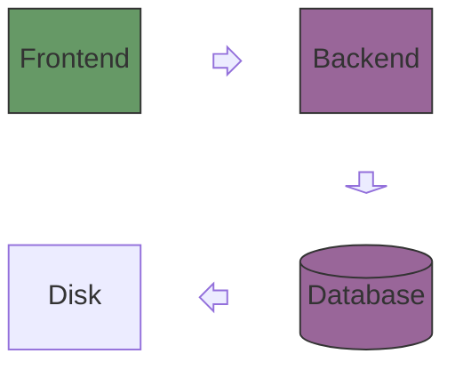
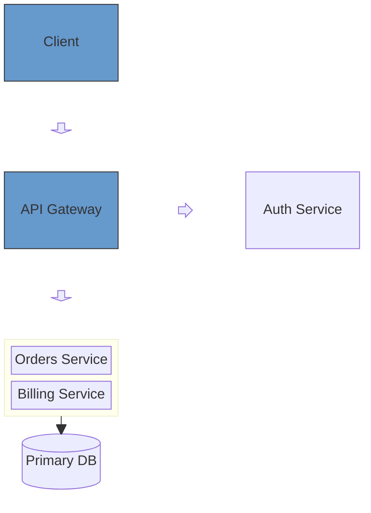
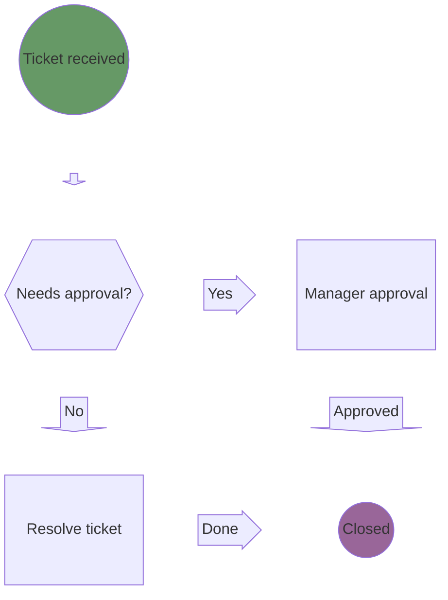
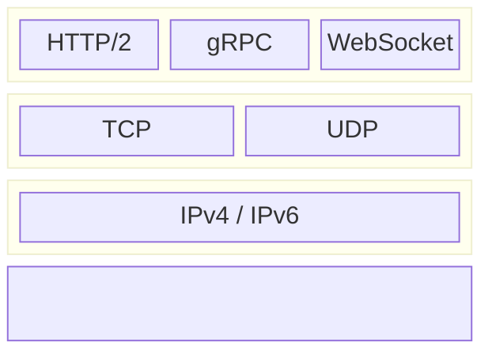

# Block — examples

## 1. Frontend/backend/database architecture

What this shows: a small web system laid out on a fixed 3-column grid, with directional block arrows carrying the flow and classes coloring the tiers.

## 2. API gateway with a composite backend block

What this shows: a gateway routing to an auth service and a nested `Backend` composite block holding two internal services, all landing in a shared database.

## 3. Support ticket approval flow

What this shows: a decision-driven process flow using rhombus, circle, and block-arrow shapes with labeled edges for yes/no branches.

## 4. Protocol stack (layered composite blocks)

What this shows: three composite blocks stacked vertically to represent a network protocol stack, each with its own internal column layout.

