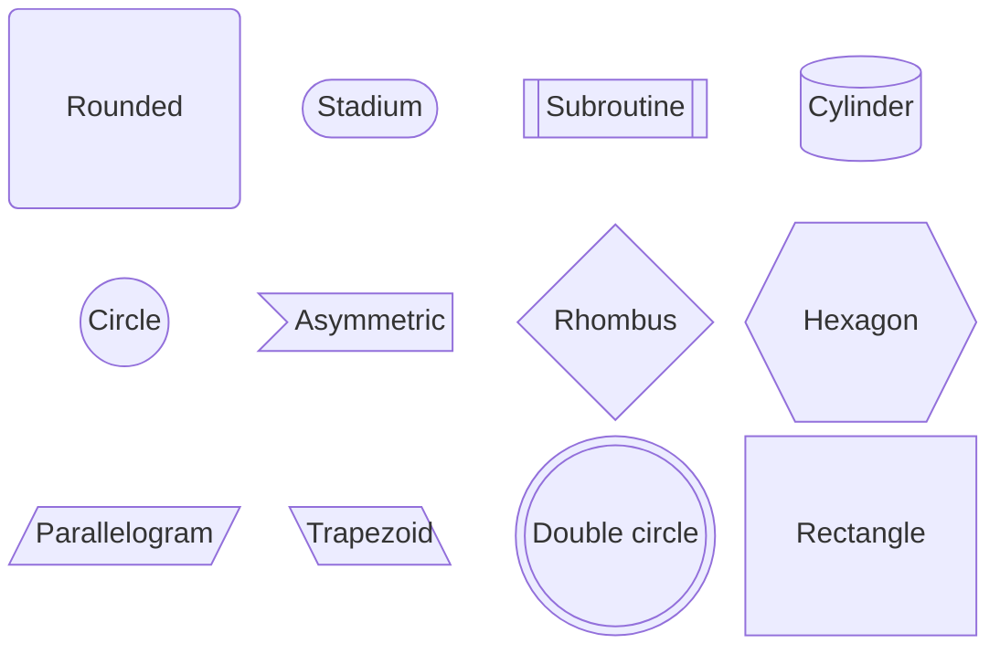

# Block — shapes and column spans

## Shape catalog

| Shape | Syntax | Renders as |
|---|---|---|
| Rectangle (default) | `id["Text"]` | rectangle |
| Round edge | `id("Text")` | rounded rectangle |
| Stadium | `id(["Text"])` | pill/stadium |
| Subroutine | `id[["Text"]]` | double vertical lines |
| Cylinder | `id[("Text")]` | database/storage cylinder |
| Circle | `id(("Text"))` | circle |
| Double circle | `id((("Text")))` | concentric circle |
| Asymmetric | `id>"Text"]` | flag shape |
| Rhombus | `id{"Text"}` | decision diamond |
| Hexagon | `id{{"Text"}}` | hexagon |
| Parallelogram | `id[/"Text"/]` | input/output |
| Parallelogram (alt) | `id[\"Text"\]` | input/output, mirrored |
| Trapezoid | `id[/"Text"\]` | transitional step |
| Trapezoid (alt) | `id[\"Text"/]` | transitional step, mirrored |
| Block arrow | `id<["Text"]>(direction)` | directional arrow shape |

Block arrow directions: `right`, `left`, `up`, `down`, `x`, `y`, or a pair like `x, down`.



## Columns and spans

```text
columns {n}
```

Sets the grid width for the current scope (top level or inside a composite block). Blocks are placed left to right, top to bottom, wrapping after `n` per row.

```text
id:{n}
```

Makes a single block span `n` columns. Column width is dynamic — it auto-sizes to the widest block placed in it.

## Space blocks

```text
space          %% one empty column
space:{n}      %% n empty columns
```

Use to hold a layout gap where no block or edge belongs — required whenever two blocks that aren't linked would otherwise land adjacent and appear merged.

## Composite (nested) blocks

```text
block:groupId
  columns 1
  child1
  child2
end
```

A composite block behaves as one cell in the parent grid. It can declare its own `columns` for its children. Edges can target either `groupId` (the whole composite) or a child id inside it.
