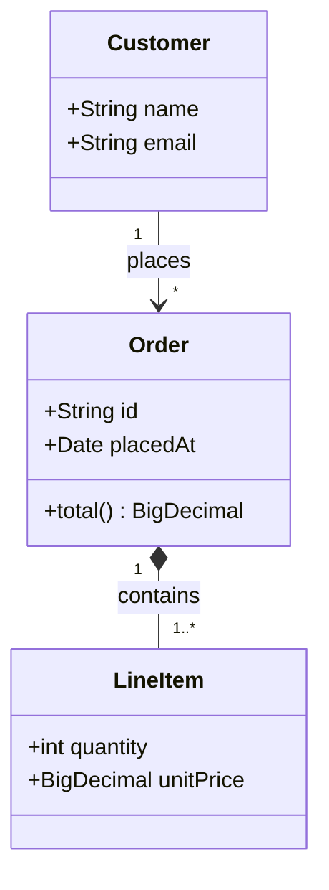
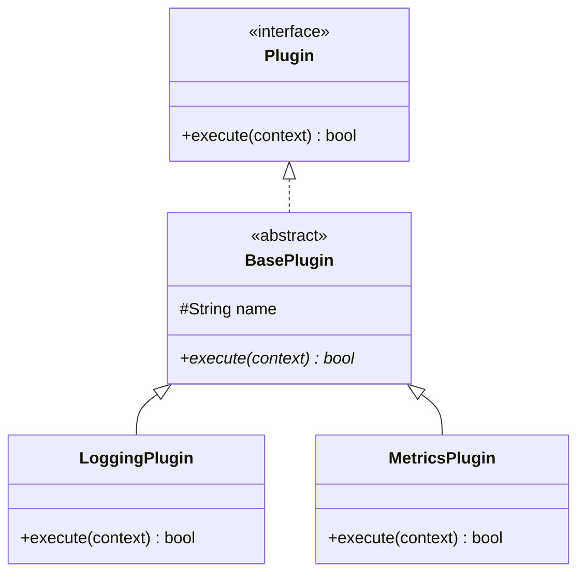
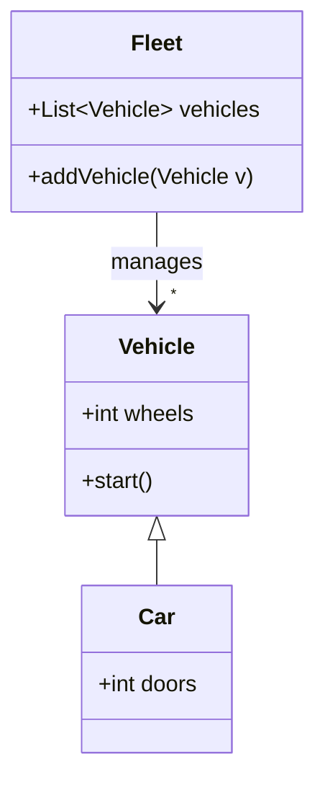
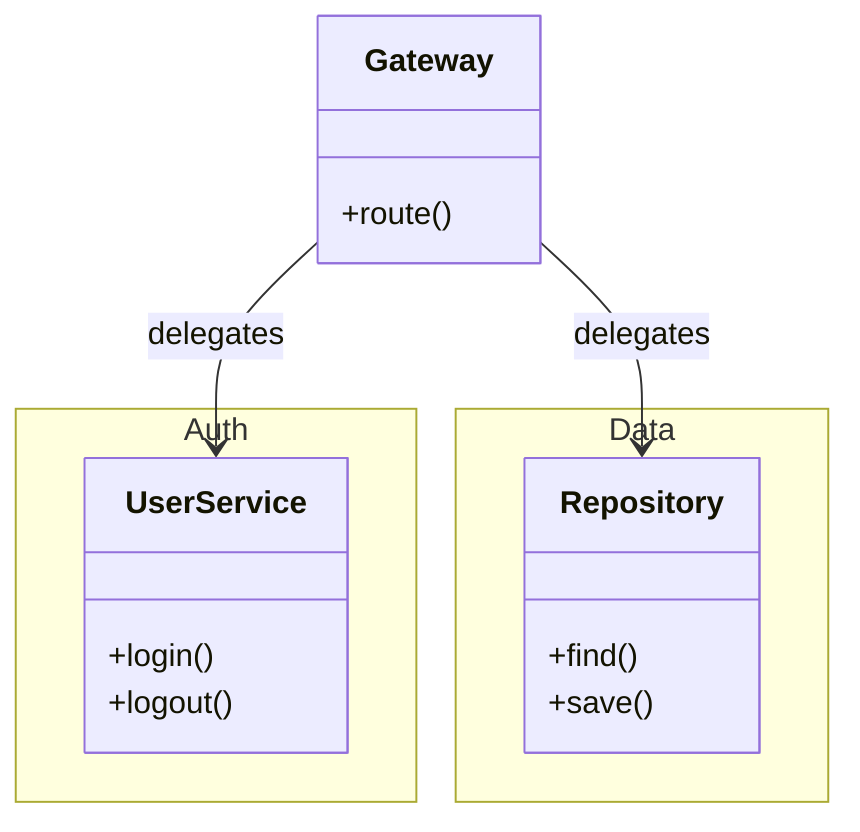

# Class diagram examples

## E-commerce domain model

What this shows: composition/aggregation contrast and cardinality on associations.

## Plugin interface with implementations

What this shows: an interface annotation, realization arrows, and an abstract base class.

## Vehicle inheritance hierarchy

What this shows: plain inheritance plus a generic-typed field.

## Microservice namespaces

What this shows: grouping related classes into namespaces with cross-namespace relationships.

