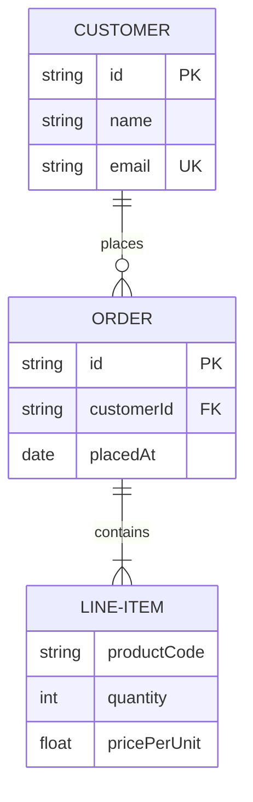
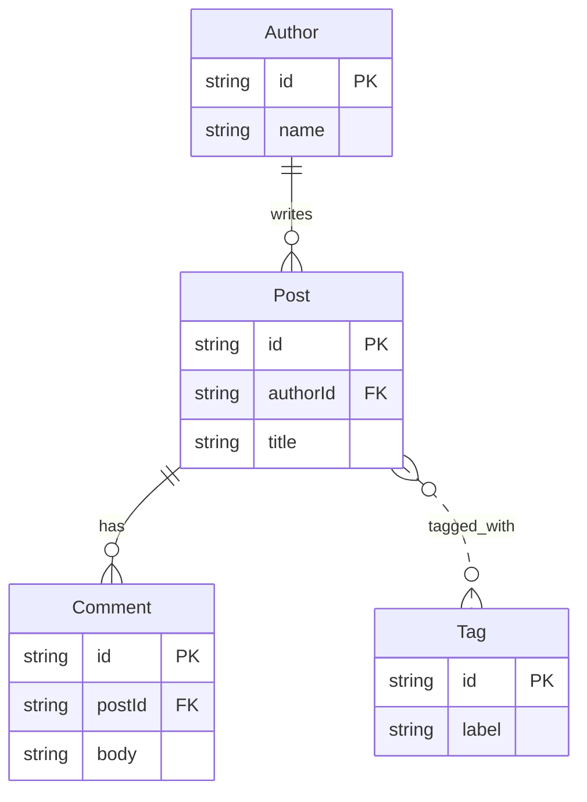
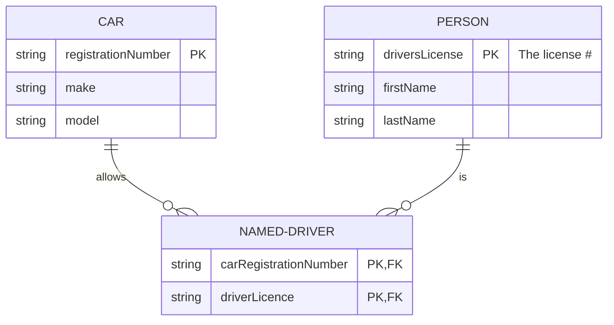

# ER diagram examples

## E-commerce order schema

What this shows: one-to-many identifying relationships with attributes and primary keys.



## Blog schema with a many-to-many tag relationship

What this shows: an aliased entity and a non-identifying many-to-many relationship.



## Car insurance named-driver resolution

What this shows: resolving a many-to-many relationship into an identifying join entity (adapted from the mermaid docs' own example).



## User auth schema

What this shows: a role/permission many-to-many join and optional (nullable, v11.16.0+) attributes.

```mermaid
erDiagram
    USER ||--o{ USER-ROLE : has
    ROLE ||--o{ USER-ROLE : grants
    ROLE ||--o{ ROLE-PERMISSION : includes
    PERMISSION ||--o{ ROLE-PERMISSION : grants
    USER {
        string id PK
        string email UK
        string? displayName
    }
    ROLE {
        string id PK
        string name
    }
    PERMISSION {
        string id PK
        string action
    }
```
