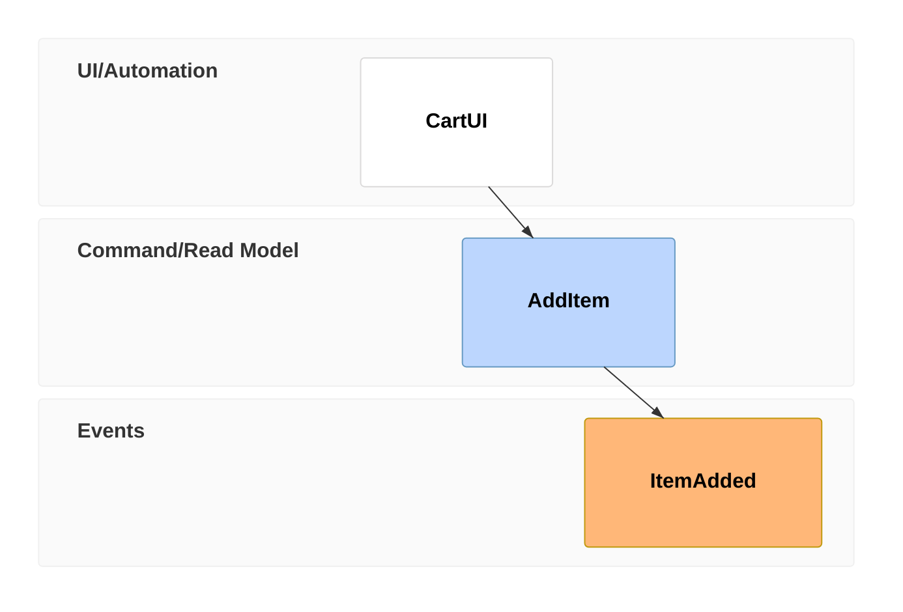
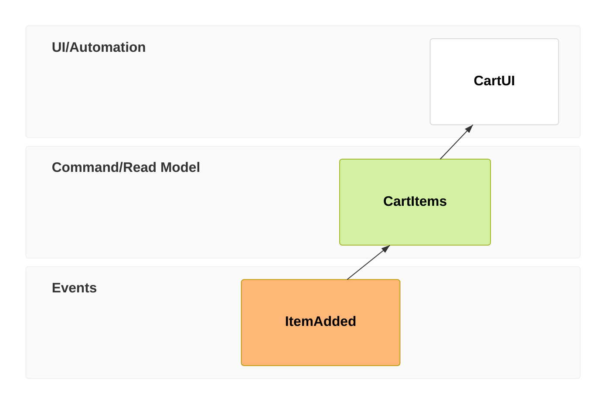
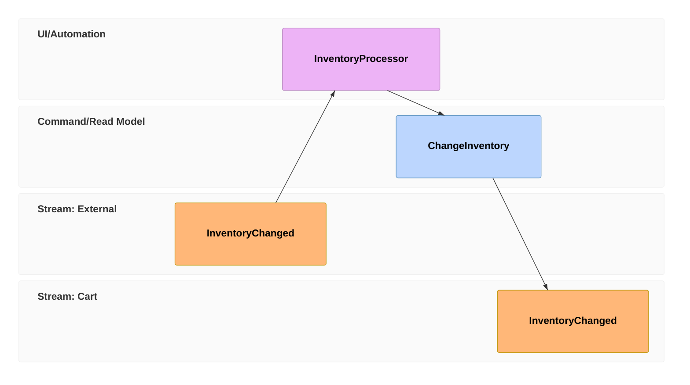

# Event Modeling examples

The three canonical patterns from the Event Modeling cheat sheet — the methodology's own vocabulary for what a timeline segment is doing.

## State Change

What this shows: a UI trigger issues a command, which produces an event — the basic write path.

## State View

What this shows: an event feeds a read model, which a UI then displays — the basic read path.

## Translation (automation across a boundary)

What this shows: an external event is picked up by a processor, which issues a command that produces a new internal event — how one bounded context reacts to another.

