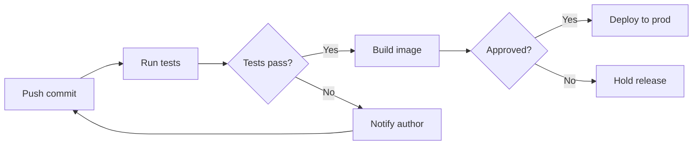
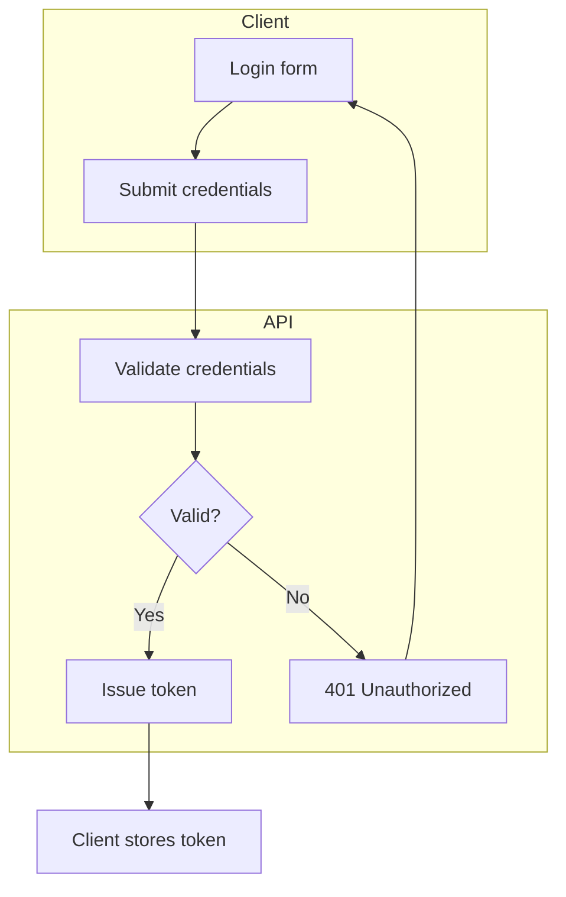
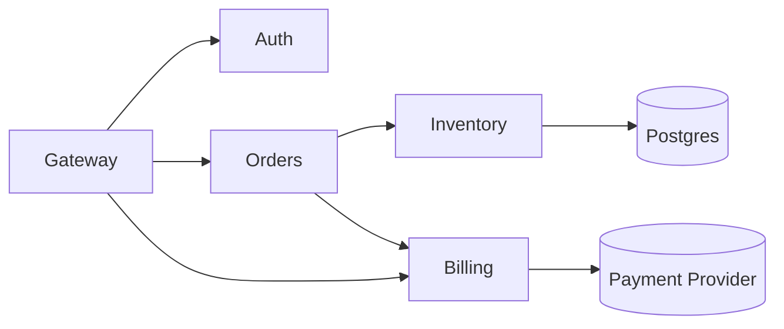
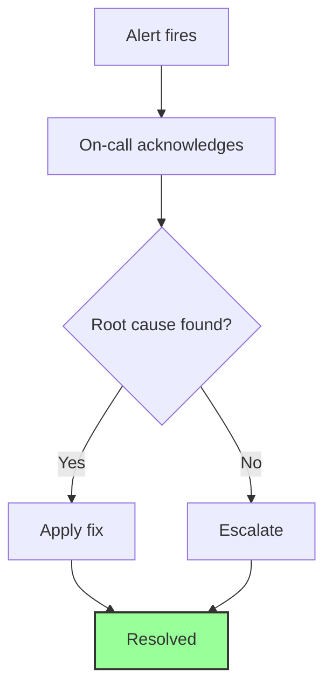
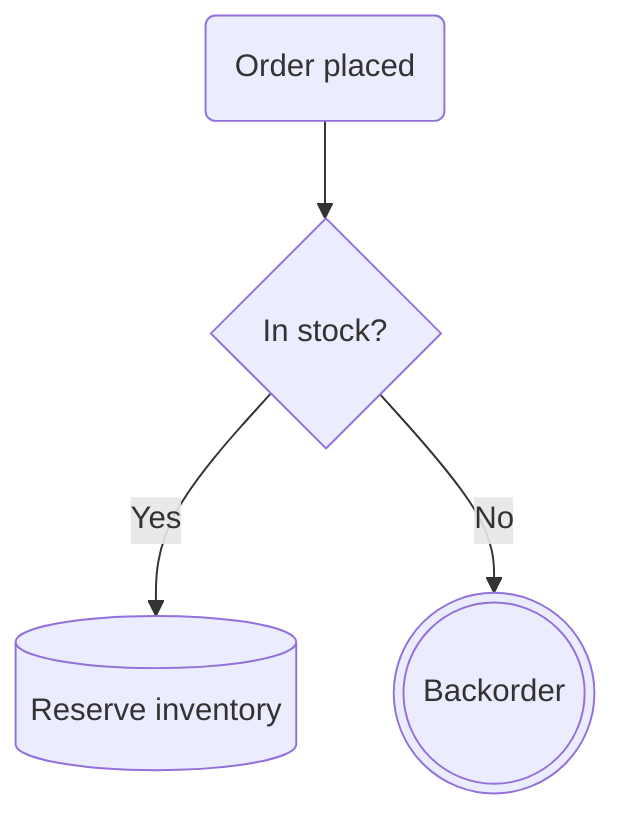

# Flowchart examples

## CI pipeline with a gated deploy

What this shows: linear stages with a decision gate and a failure branch.

## Auth request flow with subgraphs

What this shows: grouping related nodes into subgraphs and linking between the groups.

## Service dependency graph

What this shows: a many-to-many dependency map using fan-out/fan-in link chaining.

## Incident response with styled outcome nodes

What this shows: `classDef`/`class` to visually distinguish terminal states.

## Order processing with the v11.3.0+ shape syntax

What this shows: `@{ shape: ... }` for semantically distinct process/decision/database nodes.

