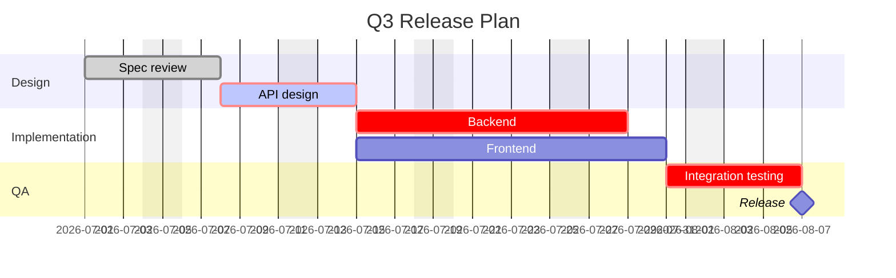
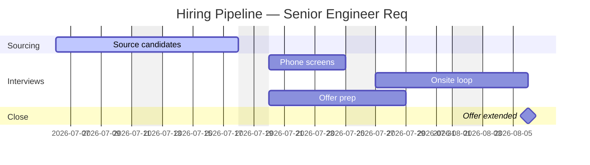
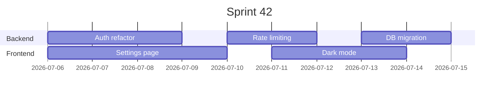

# Gantt: realistic examples

## Software release schedule with dependencies and critical path

What this shows: cross-team phases where later work depends on earlier work finishing, plus a critical-path task and a release milestone.

## Conference day agenda (time-of-day, no calendar dates)

What this shows: `HH:mm` `dateFormat` for a single-day schedule with milestones marking session boundaries.

```mermaid
gantt
    dateFormat HH:mm
    axisFormat %H:%M
    title Conference Day 1

    section Morning
    Doors open          :milestone, 08:30, 0m
    Keynote              :09:00, 45m
    Break                :09:45, 15m
    Workshop A            :10:00, 90m

    section Afternoon
    Lunch                :12:00, 60m
    Workshop B            :13:00, 90m
    Closing               :milestone, 15:00, 0m
```

## Hiring pipeline with excluded weekends

What this shows: real calendar duration accounting for weekends via `excludes`, with a task blocked until another completes via `until`.

## Compact multi-track sprint board

What this shows: `displayMode: compact` packing several short tasks per section row, useful when many small tasks would otherwise sprawl vertically.

