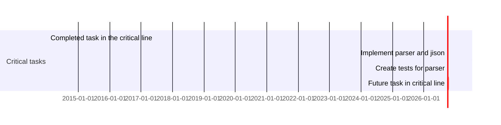

# Gantt: task states, dates, and axis reference

## Task state tags

Placed first in a task's metadata, before positional fields. Optional; combinable is not supported except `crit` + `done`/`active`.

| Tag | Meaning | Render |
|---|---|---|
| `done` | task complete | filled/muted bar |
| `active` | in progress | highlighted bar |
| `crit` | on the critical path | red-tinted bar (combinable with `done`/`active`) |
| `milestone` | single point in time, not a duration | diamond marker at `start + duration/2` |

## Duration units

Numeric value + suffix, no space. Decimals allowed (`1.5d`). Invalid tokens silently become zero-duration.

| Suffix | Unit |
|---|---|
| `ms` | milliseconds |
| `s` | seconds |
| `m` | minutes |
| `h` | hours |
| `d` | days |
| `w` | weeks |
| `M` | months (capital — lowercase `m` is minutes) |
| `y` | years |

## `dateFormat` (input) tokens

Uses day.js tokens. Common ones: `YYYY`/`YY` year, `MM`/`MMM` month, `DD` day, `HH:mm` time, `X`/`x` unix seconds/ms timestamp. Full reference: https://day.js.org/docs/en/parse/string-format/

## `axisFormat` (output) tokens

Uses d3-time-format (`%`-style), independent of `dateFormat`. Common ones: `%Y-%m-%d`, `%b %d`, `%H:%M`, `%s` (unix seconds). Full reference: https://github.com/d3/d3-time-format/tree/v4.0.0#locale_format

## `excludes`

- Accepts: specific dates (`YYYY-MM-DD`), a weekday name (`sunday`), or the literal `weekends`.
- Does NOT accept `weekdays`.
- Excluded dates extend the task to the right (no visual gap inside a task); a gap only appears between two back-to-back tasks when the excluded range falls between them.
- Multiple `excludes` lines concatenate — use this to group long exclusion lists with comments.
- `weekend friday` (v11.0.0+) redefines the weekend to Friday+Saturday instead of the Saturday+Sunday default.

## `tickInterval` (v10.3.0+)

Pattern: `<N><unit>` where unit is `millisecond|second|minute|hour|day|week|month` (e.g. `1week`, `1day`). Week-based intervals start on Sunday unless you set `weekday monday` (or another day) alongside it.
