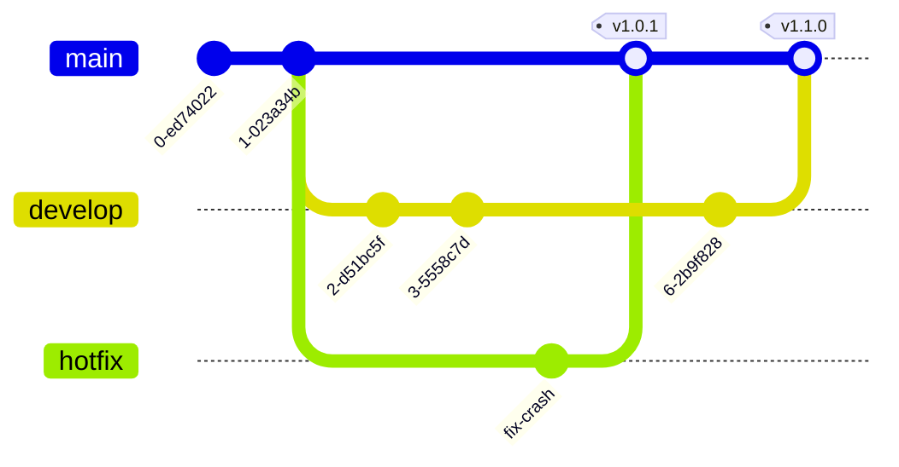
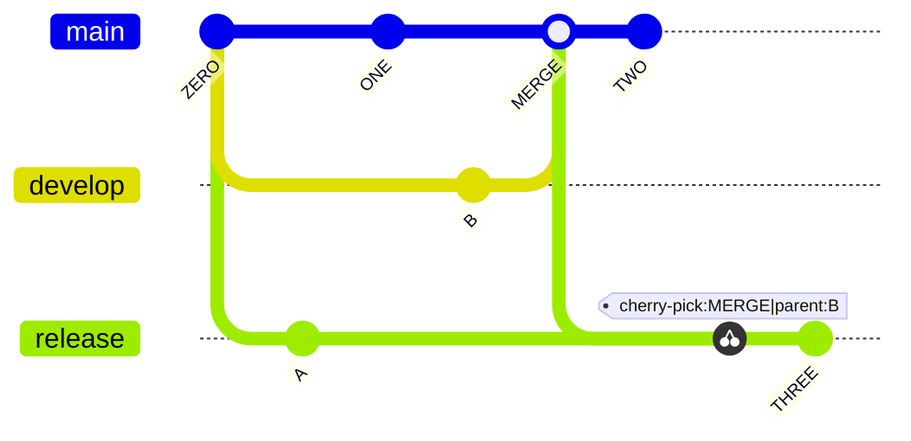
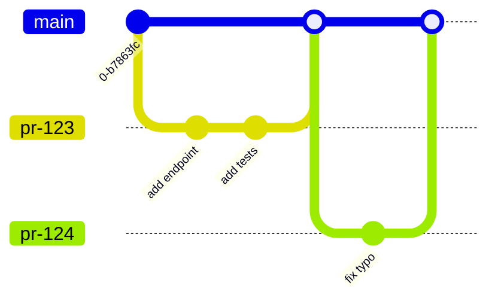
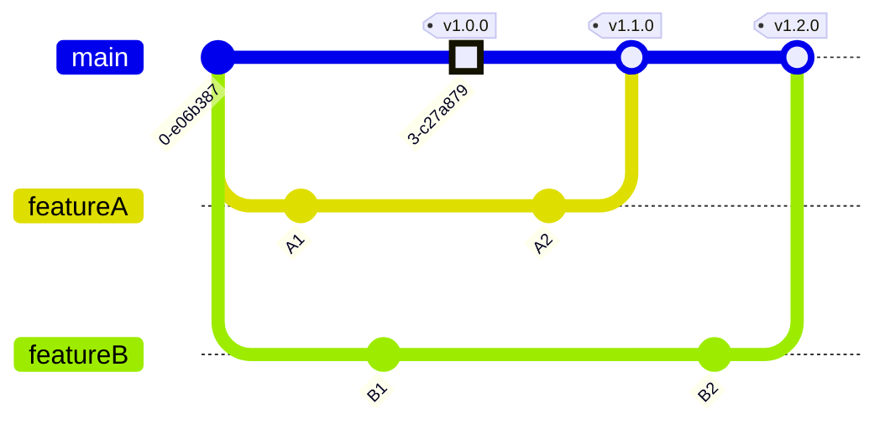

# GitGraph examples

## Git flow with a hotfix

What this shows: a feature branch merging back to main alongside a separate hotfix branch.

## Feature branch with a cherry-picked hotfix

What this shows: `cherry-pick` to bring one specific commit from another branch onto the current branch.

## Trunk-based development with PR merges

What this shows: short-lived branches merged straight back into `main`, a common trunk-based pattern.

## Tagged release train with parallel feature branches

What this shows: `HIGHLIGHT` commit type and tags marking releases across multiple in-flight branches.

