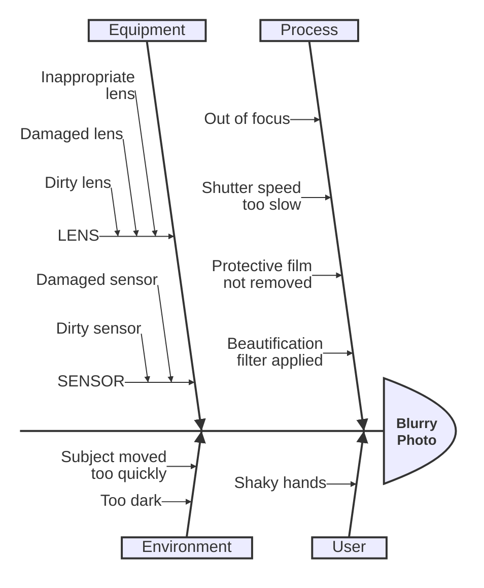

# Ishikawa examples

## Root-cause analysis of a photo defect

What this shows: the full four-category fishbone from the official doc — a problem statement, four cause categories, and a nested sub-breakdown under Equipment (LENS/SENSOR), which is the pattern to reach for when a category itself has distinguishable failure modes.

