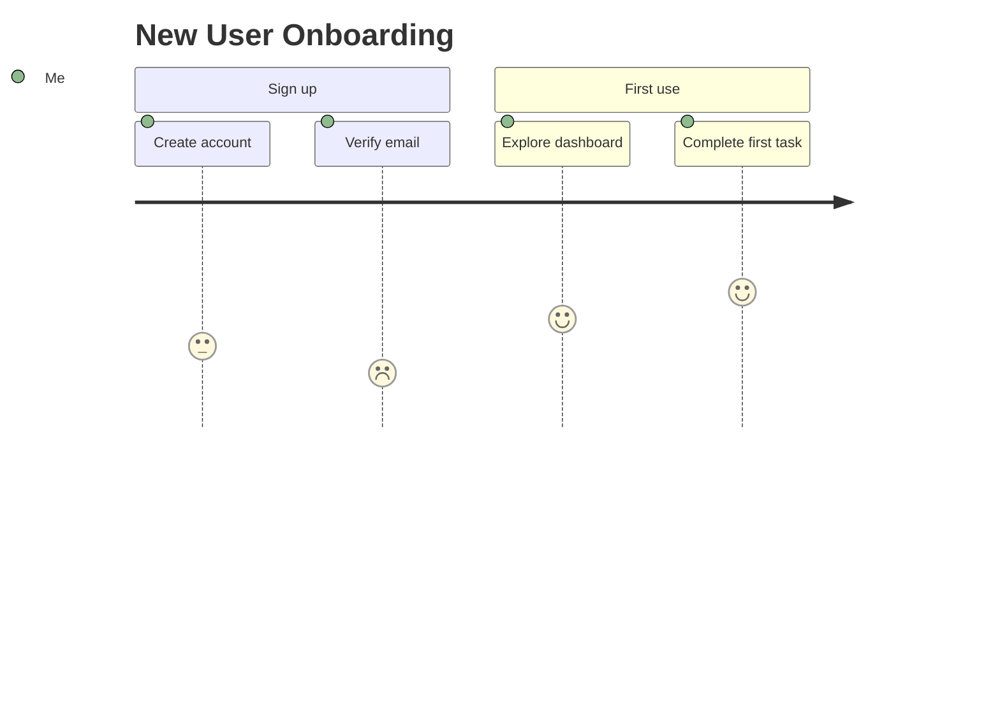
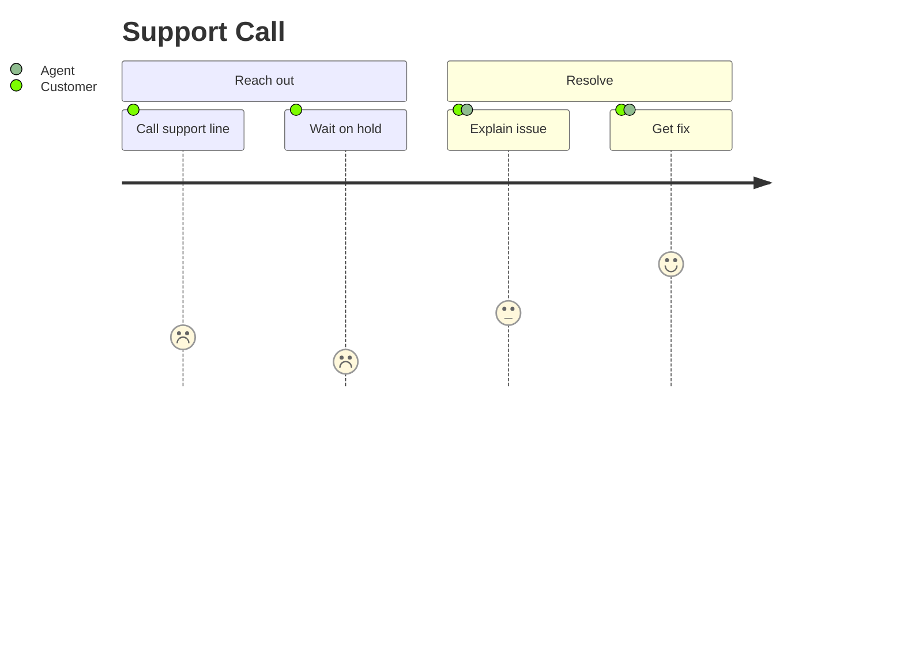

# User Journey examples

## Onboarding a new user

What this shows: a single-actor journey across sequential stages, the most common use — spotting the low-satisfaction step (account setup) that needs fixing.

## Support call with multiple actors

What this shows: tasks shared between actors (customer and agent both present on one step), useful when a journey isn't solo.

