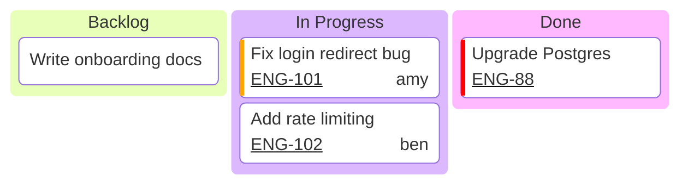
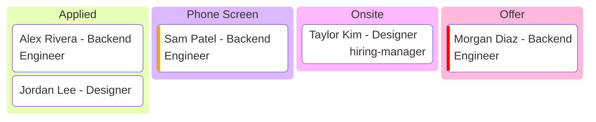
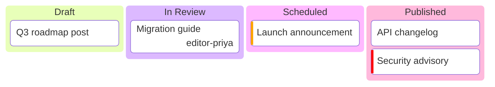

# Kanban — examples

## 1. Sprint board with ticket links

What this shows: a standard three-column sprint board with ticket ids linked out via `ticketBaseUrl`, assignees, and priority.

## 2. Hiring pipeline

What this shows: kanban used for a non-software workflow — candidates moving through interview stages.

## 3. Content publishing workflow

What this shows: an editorial board with assignees and priority, no ticket linking.

