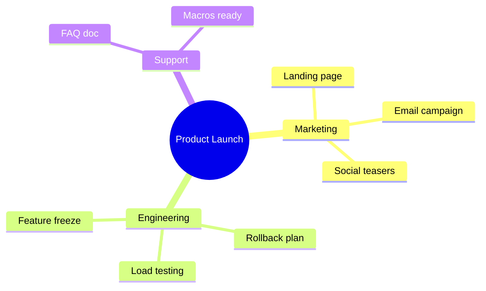
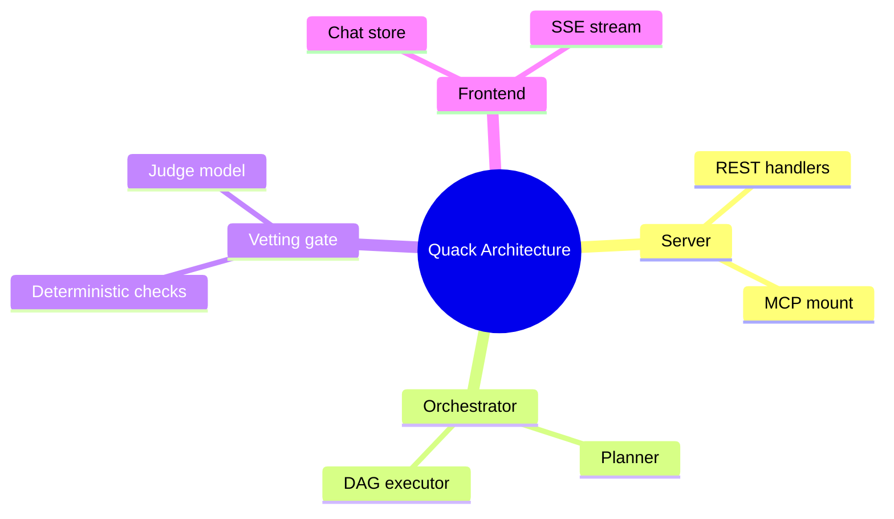
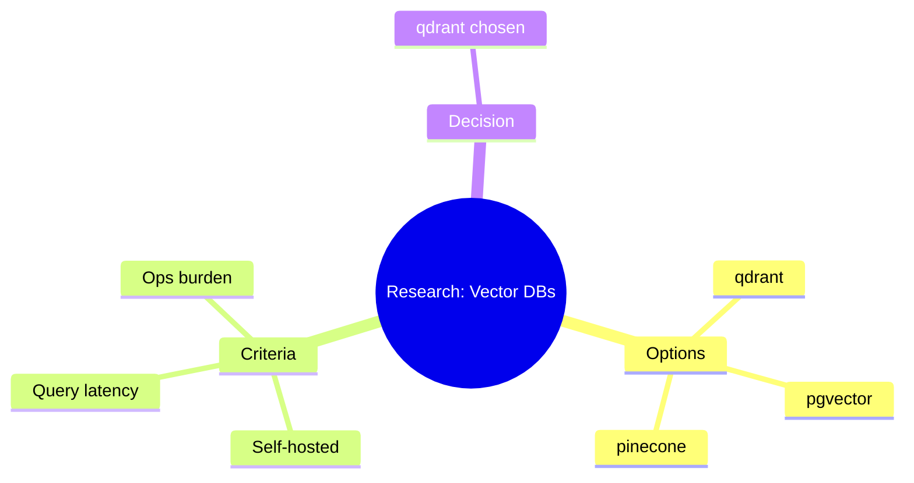

# Mindmap — examples

## 1. Product launch checklist

What this shows: work grouped by owning team, radiating from a single launch milestone.

## 2. Incident postmortem breakdown

What this shows: a postmortem's standard sections captured as one glanceable outline.

```mermaid
mindmap
  root((Incident Postmortem))
    Timeline
      Detection
      Mitigation
      Resolution
    Root cause
      Config drift
      Missing alert
    Impact
      Customers affected
      Revenue at risk
    Follow-ups
      Add alert
      Runbook update
```

## 3. System architecture overview

What this shows: a codebase's major subsystems, useful as an orientation map before diving into a real architecture diagram.

## 4. Technology decision record

What this shows: options and decision criteria for a build choice, with an icon marking the chosen outcome (icon rendering requires the embedding site to register the font — see Gotchas in the README).

