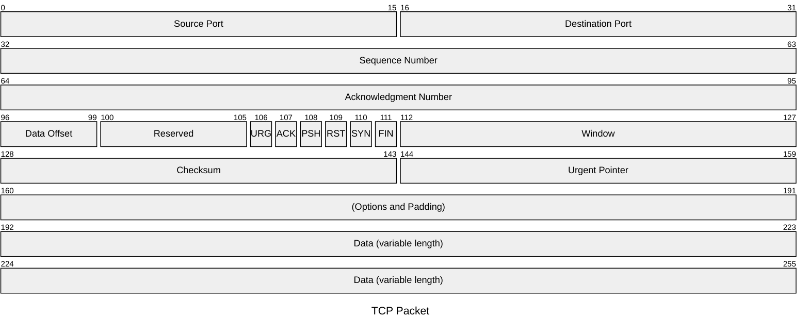
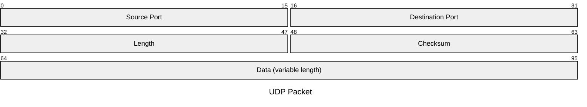
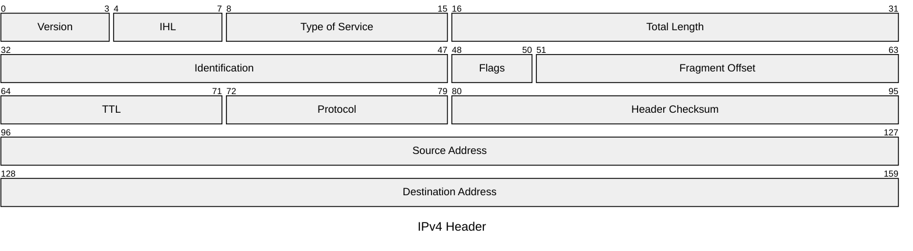
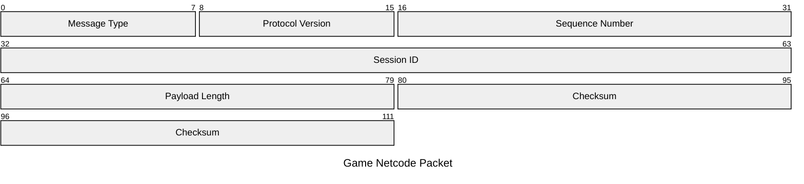

# Packet — examples

## 1. TCP header

What this shows: the full TCP header field layout using explicit bit ranges, including single-bit flag fields.

## 2. UDP header (bit-count shorthand)

What this shows: the same kind of header expressed with `+count` instead of manual bit math for the fixed-width fields.

## 3. IPv4 header

What this shows: a denser header with several sub-byte fields (version/IHL share a byte, flags share bits with fragment offset).

## 4. Custom application packet

What this shows: a hand-rolled binary protocol (game netcode) documented the same way as a standard header.

