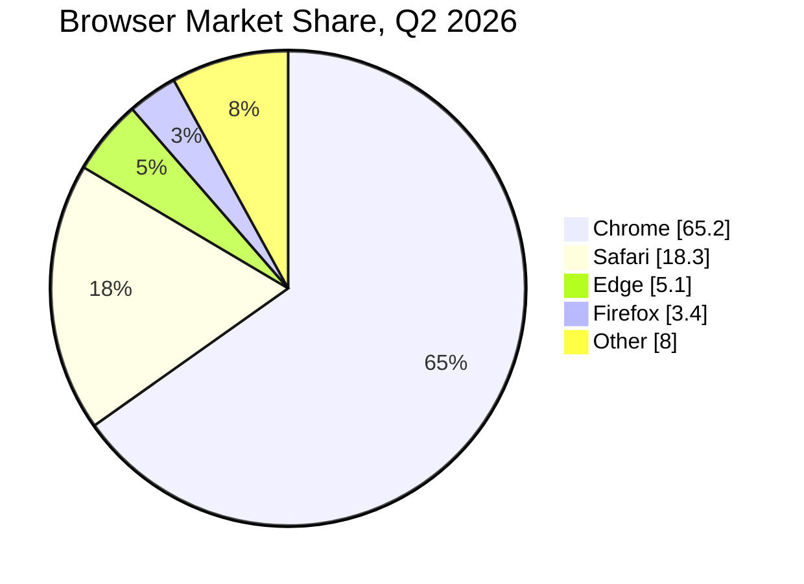
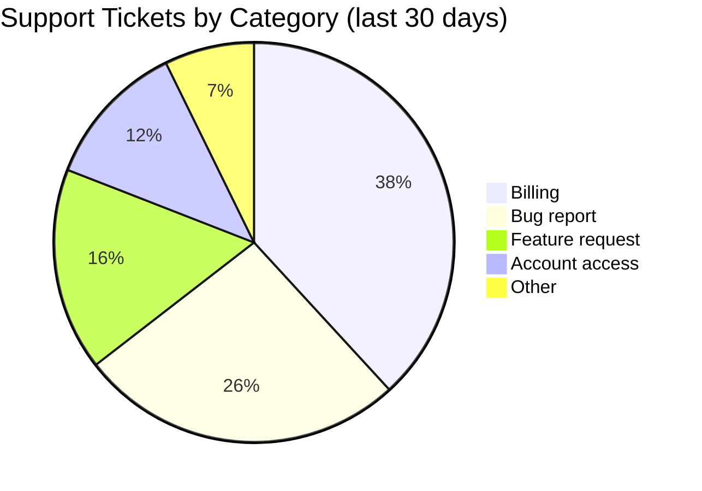
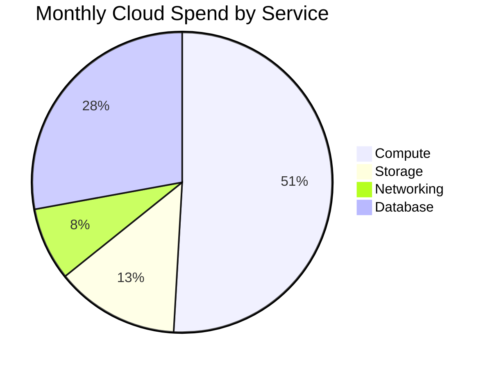
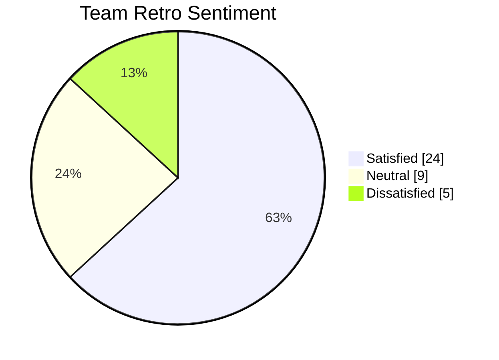

# Pie: realistic examples

## Browser market share

What this shows: a simple proportional breakdown with `showData` printing exact percentages next to the legend.

## Support ticket categories

What this shows: categorical volume comparison, the classic pie use case.

## Infrastructure cost breakdown as a donut chart

What this shows: `donutHole` config for a donut variant, useful when you want a center label area.

## Team survey results with a highlighted slice

What this shows: `highlightSlice` drawing attention to one category, e.g. the one requiring action.

