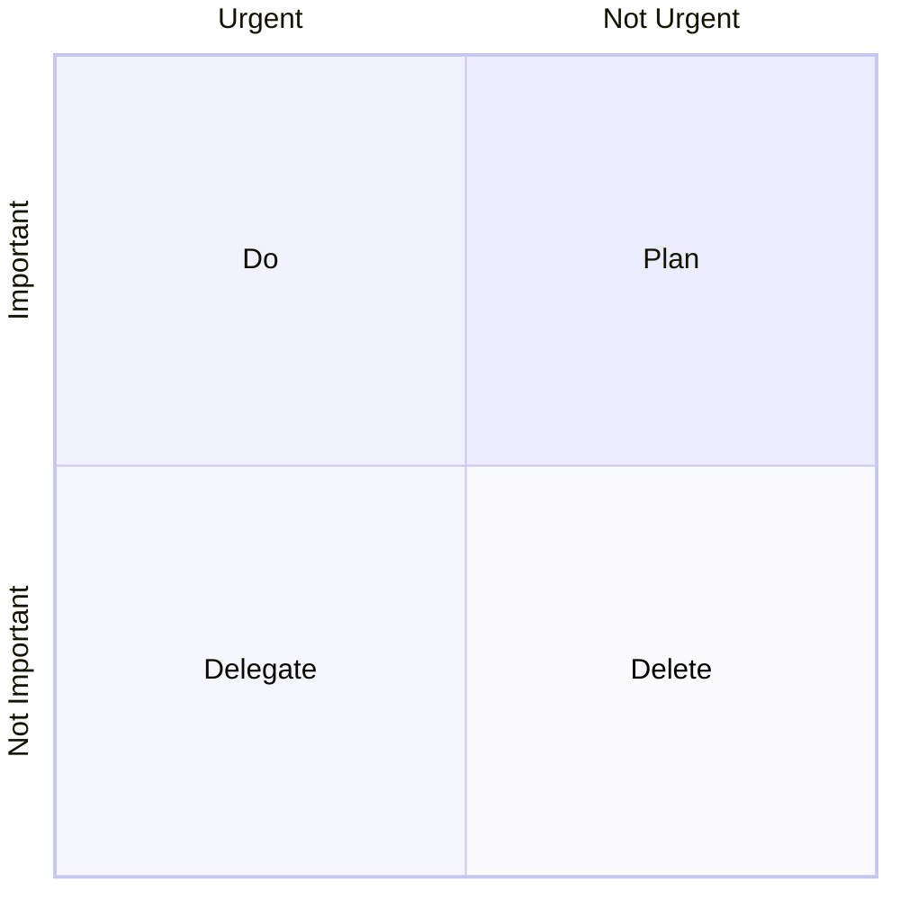
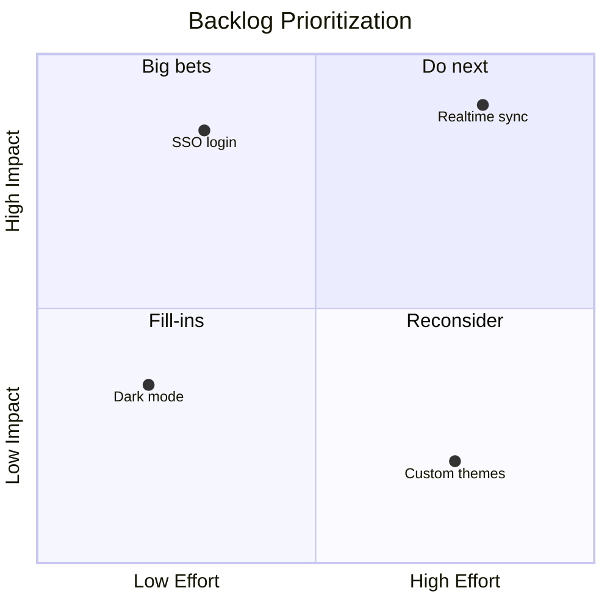
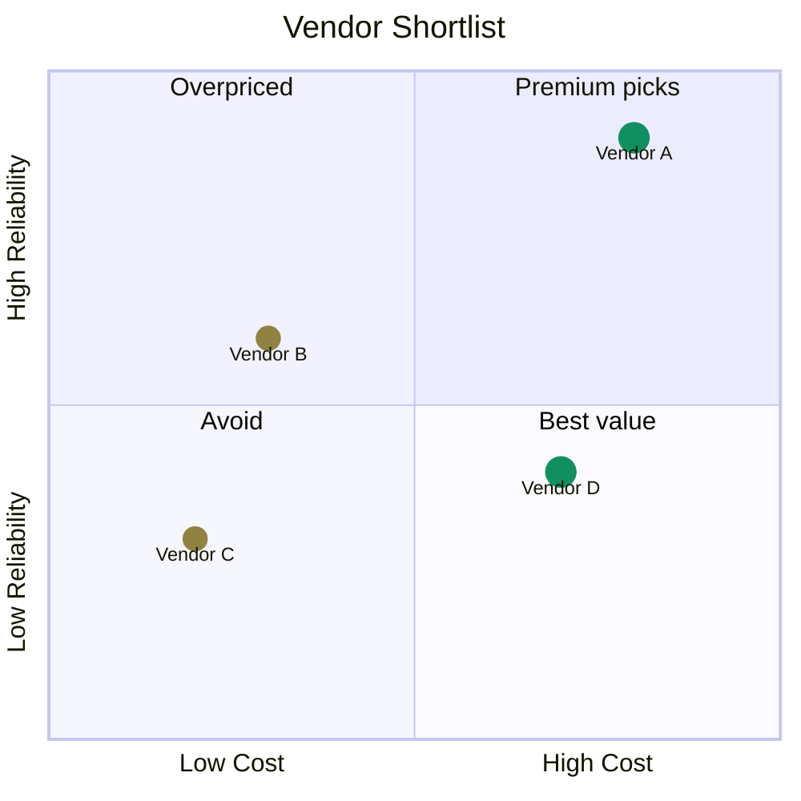
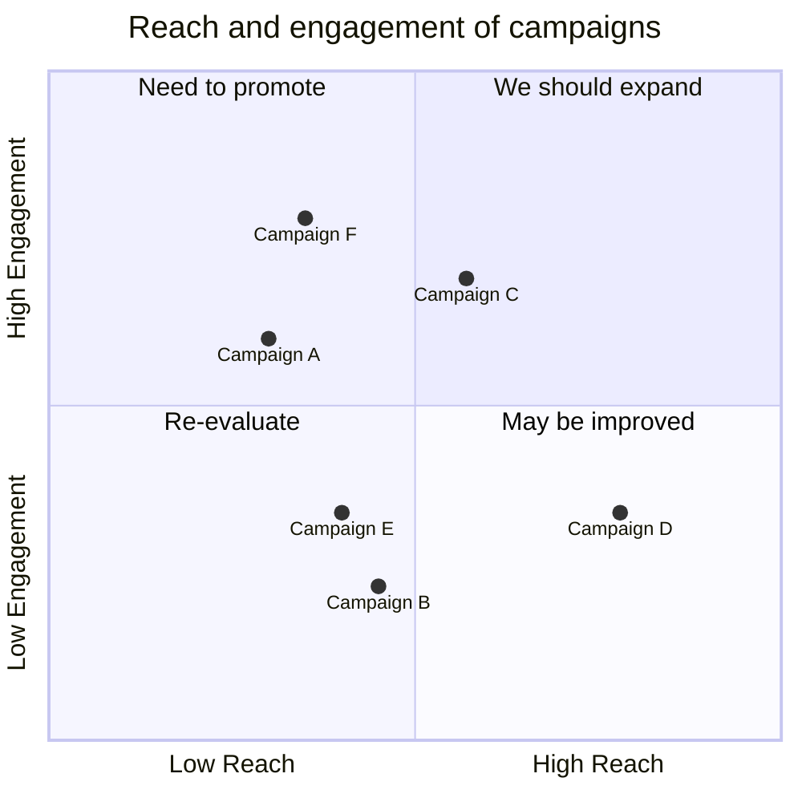

# Quadrant Chart: realistic examples

## Eisenhower matrix for task triage

What this shows: the classic urgent/important prioritization grid, with quadrant labels doing the explanatory work and no data points at all.

## Feature prioritization: effort vs. impact

What this shows: real data points bucketing product backlog items so the team can see what to build first.

## Vendor comparison: cost vs. reliability, styled by tier

What this shows: styled points via classes to distinguish vendor tiers at a glance.

## Marketing campaign reach vs. engagement

What this shows: the doc's own domain example, extended with more campaigns to show real clustering.

