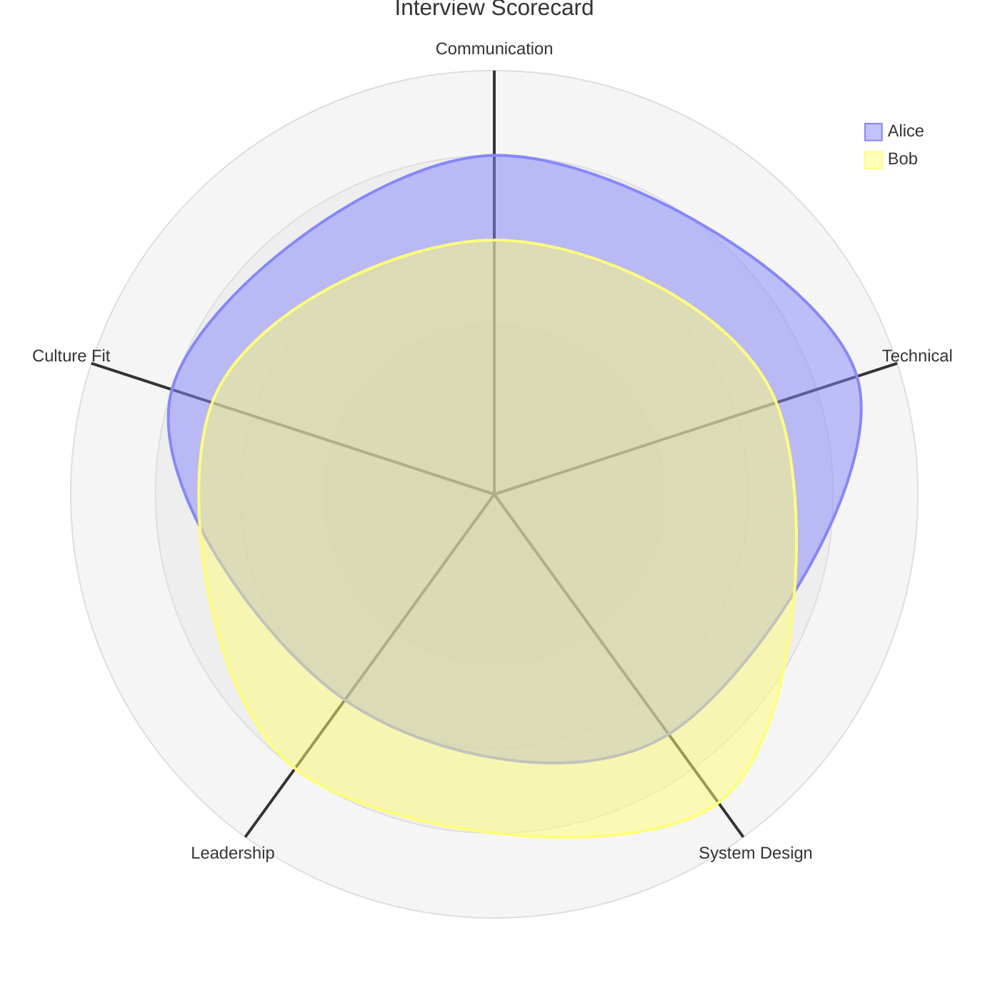
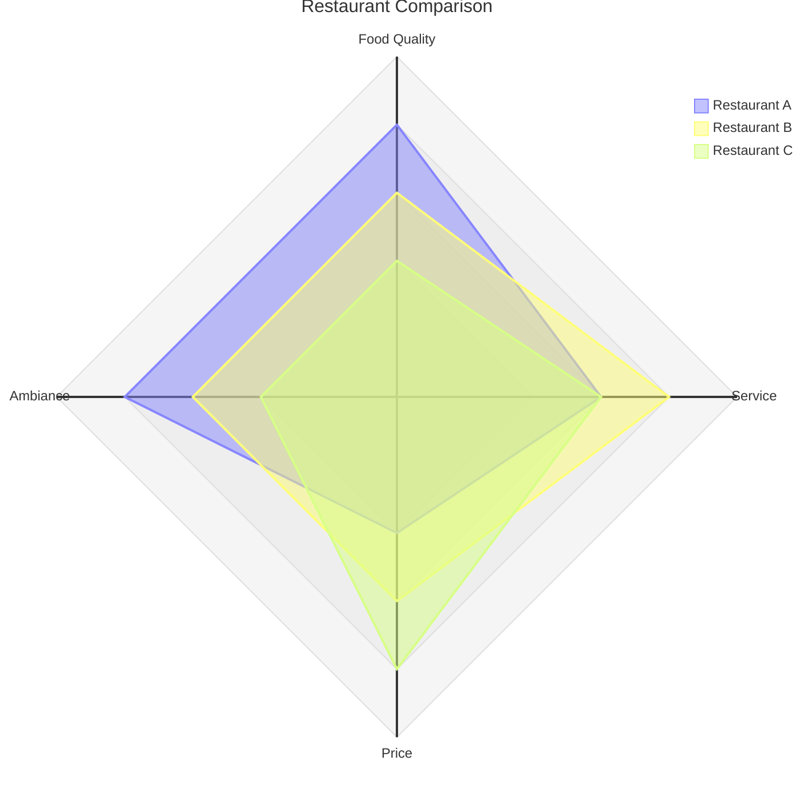
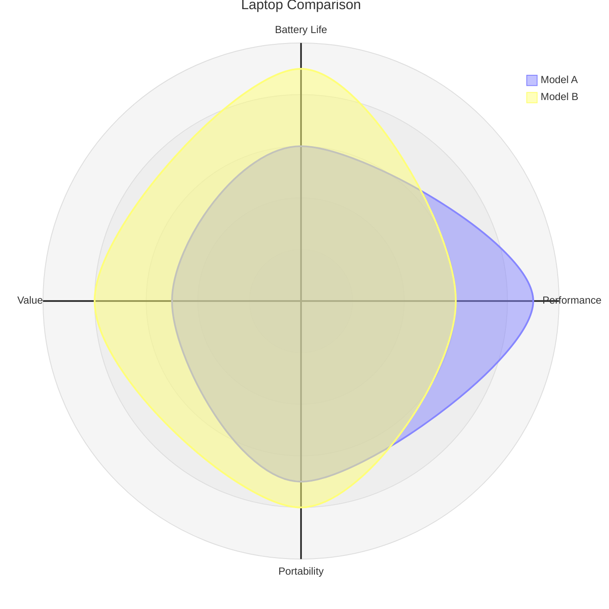
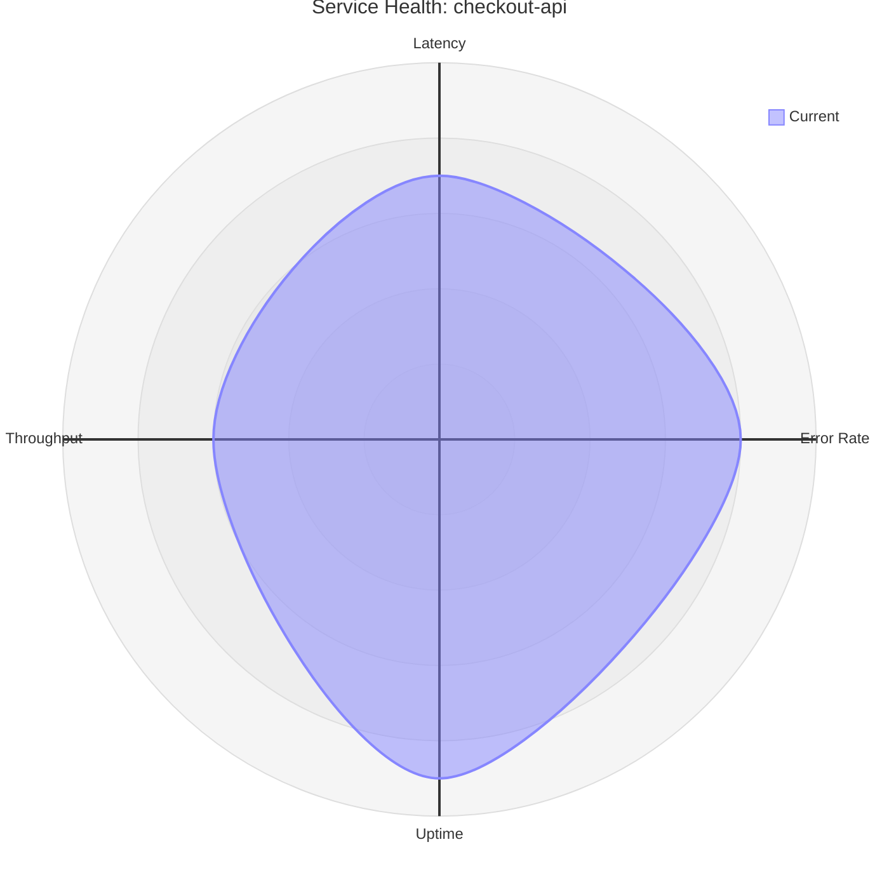

# Radar: realistic examples

## Candidate skills comparison

What this shows: two curves compared across shared skill dimensions, positional value syntax.

## Restaurant comparison with a polygon graticule

What this shows: the doc's polygon graticule option, better suited to a small number of axes than the default circular grid.

## Product spec comparison using key:value curves

What this shows: key:value curve syntax, which avoids ordering bugs when specs are entered out of axis order.

## Service health across on-call metrics

What this shows: a single-curve radar used as a quick health snapshot rather than a comparison.

