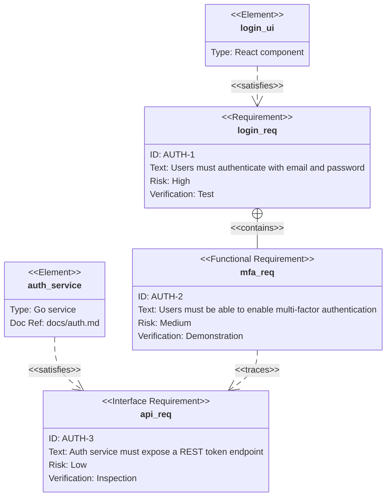
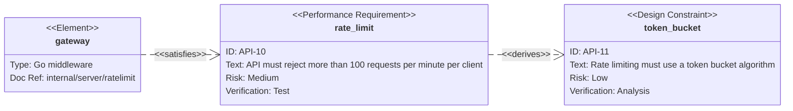
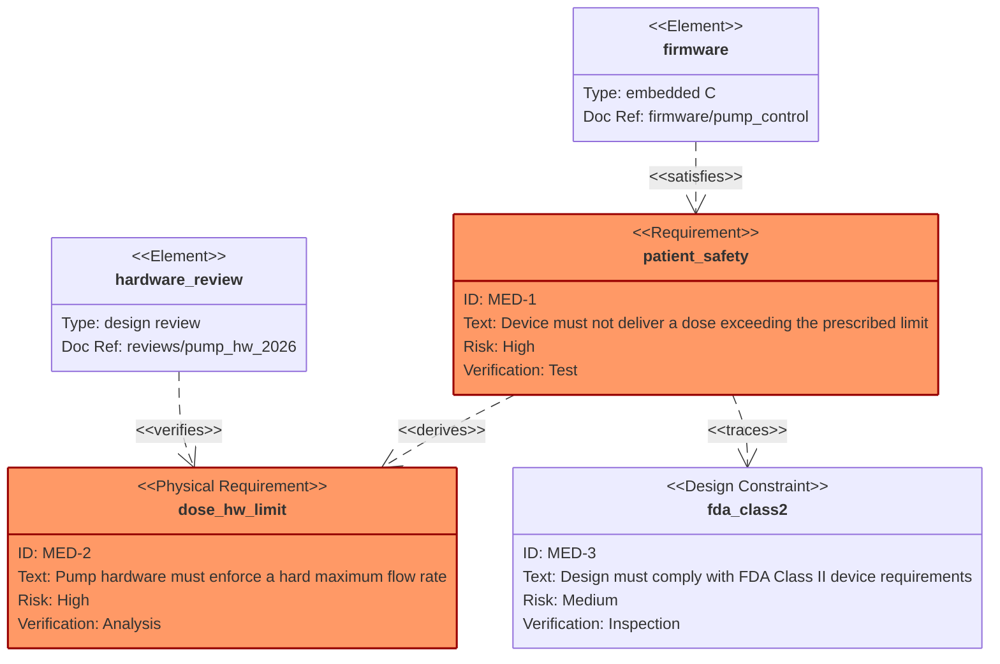

# Requirement Diagram — examples

## 1. Authentication system traceability

What this shows: functional and interface requirements for a login system, traced to the UI and service elements that satisfy them.

## 2. API rate limiting, left-to-right

What this shows: a performance requirement and the design constraint it derives, rendered `LR` for a shorter/wider layout.

## 3. Safety-critical medical device requirements

What this shows: high-risk physical and design requirements with multiple verification methods, plus a highlighted-class for the critical path.

