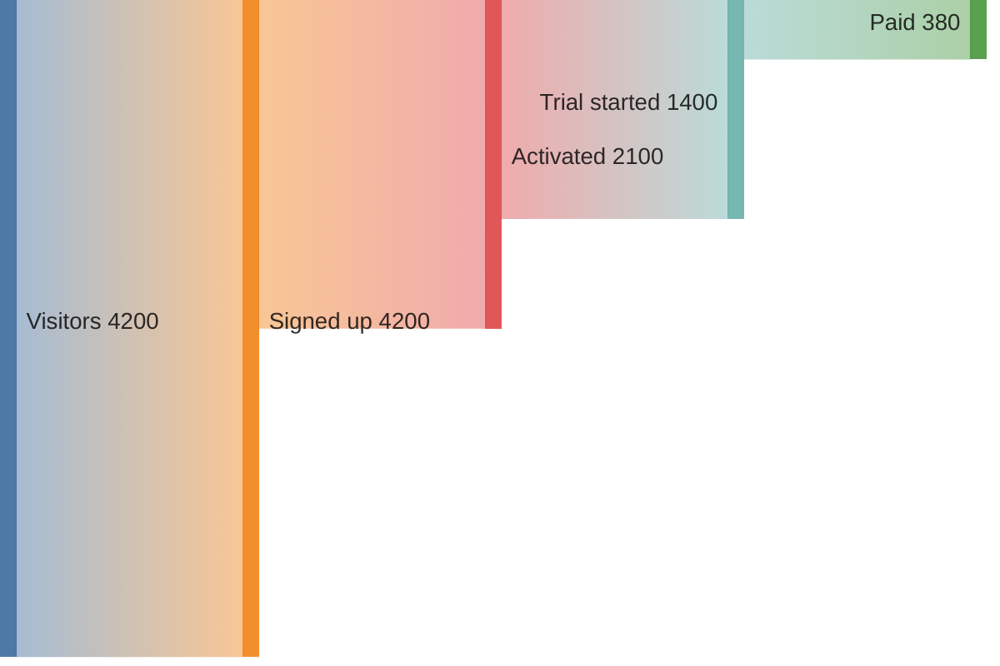
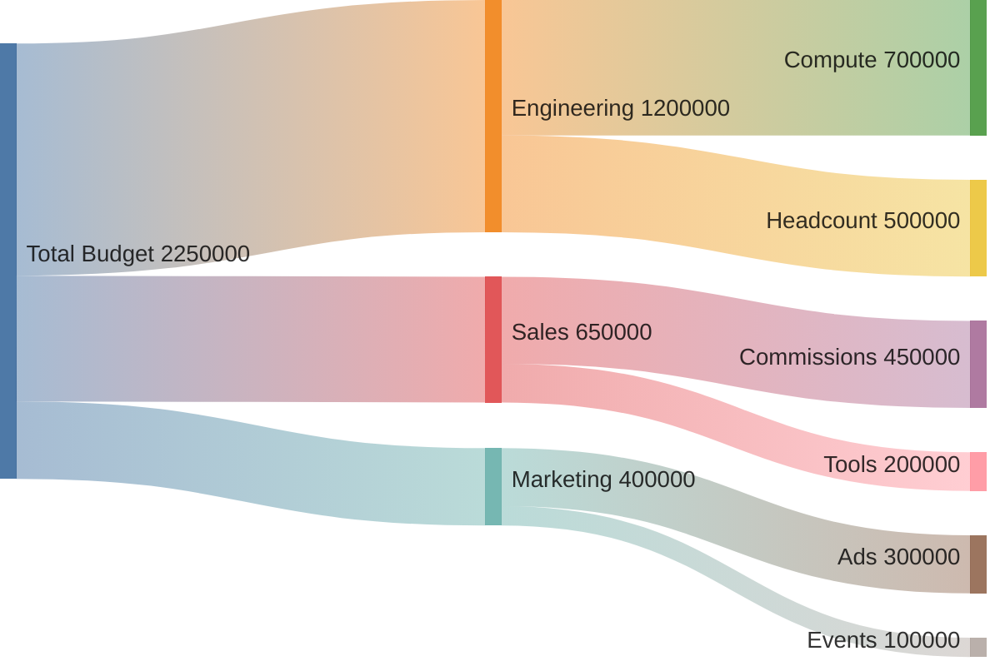
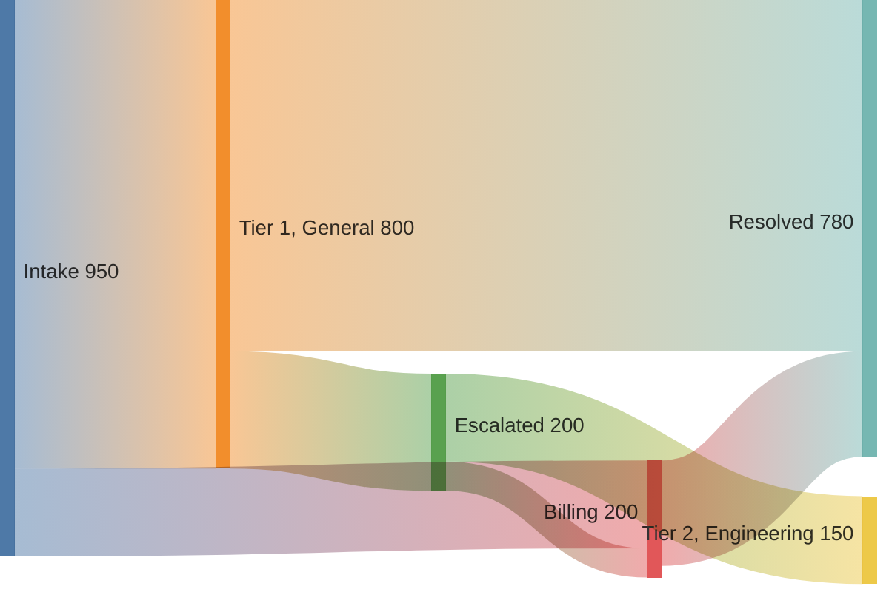
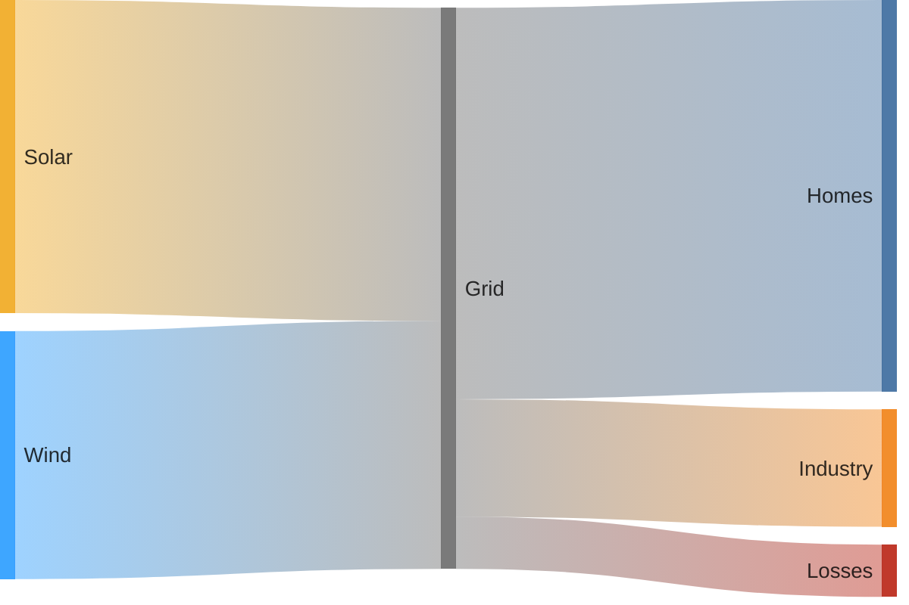

# Sankey: realistic examples

## SaaS signup-to-paid funnel

What this shows: a conversion funnel expressed as flow volume dropping off at each stage — a more informative alternative to a bar-chart funnel because it shows where the drop-off goes (implicitly, to nothing).

## Cloud budget allocation

What this shows: budget flowing from a total pool down through departments into specific line items.

## Support ticket routing between teams

What this shows: how volume moves between intake and resolution teams, with a comma-containing node name requiring quoting.

## Energy flow with custom node colors and no value labels

What this shows: `nodeColors` + `showValues: false` for a cleaner presentational chart where the flow widths, not the numbers, carry the message.

