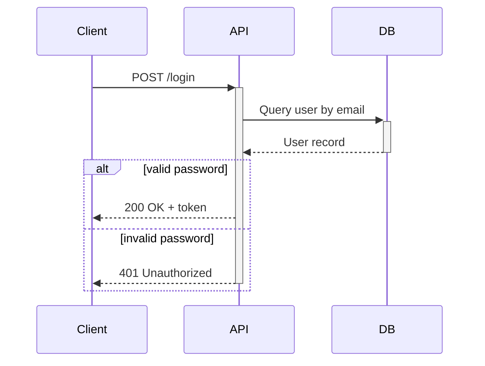
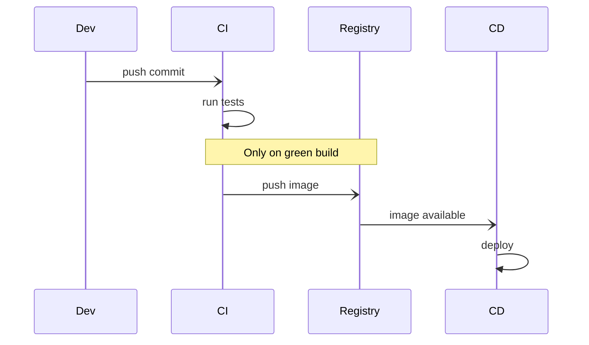
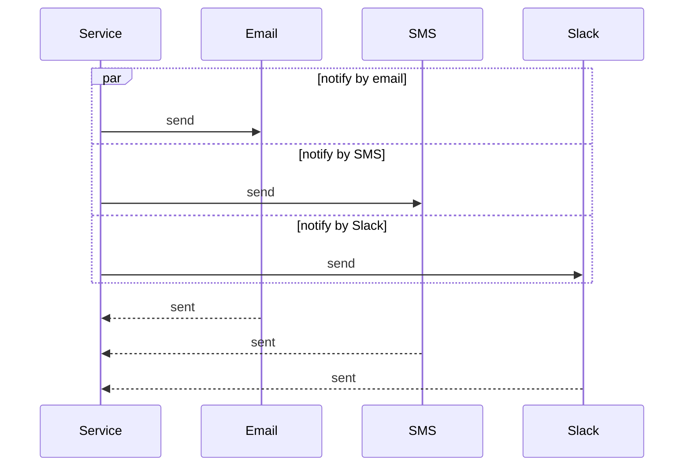
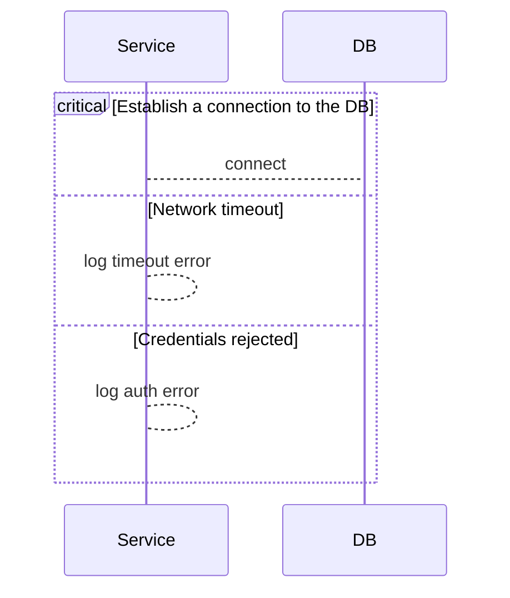
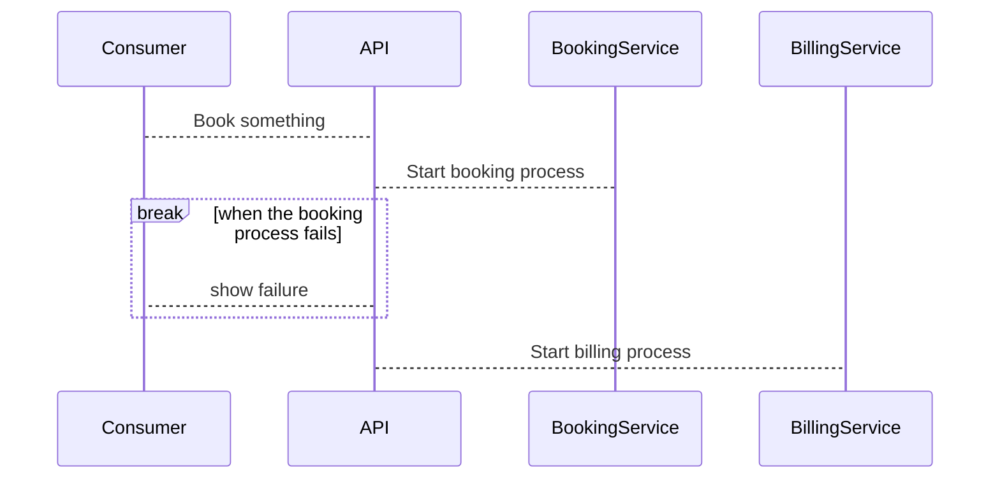

# Sequence diagram examples

## Login flow with activation

What this shows: activation bars via the `+`/`-` shortcut and an `alt` branch for bad credentials.

## CI pipeline handoff between services

What this shows: async fire-and-forget messages (`-)`) and a note spanning two participants.

## Parallel notification fan-out

What this shows: `par`/`and` for concurrent branches converging back on the caller.

## DB connection with critical/option error handling

What this shows: `critical`/`option` for an action that must run with conditional failure handling.

## Order booking with a break on failure

What this shows: `break` to short-circuit the sequence when a step fails.

