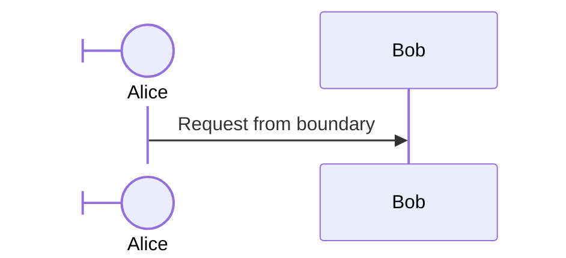

# Sequence diagram vocabulary

## Participant types

Default `participant`/`actor` render as a labelled box or a stick figure. Other symbol types need the JSON-config syntax after the id:

| Type | Syntax |
| --- | --- |
| Box (default) | `participant Alice` |
| Actor (stick figure) | `actor Alice` |
| Boundary | `participant Alice@{ "type" : "boundary" }` |
| Control | `participant Alice@{ "type" : "control" }` |
| Entity | `participant Alice@{ "type" : "entity" }` |
| Database | `participant Alice@{ "type" : "database" }` |
| Collections | `participant Alice@{ "type" : "collections" }` |
| Queue | `participant Alice@{ "type" : "queue" }` |

Inline alias: `participant API@{ "type": "boundary", "alias": "Public API" }`. If both an inline `"alias"` and an external `as Name` are given, the external `as` alias wins.

## Message arrow types

| Arrow | Description |
| --- | --- |
| `->` | Solid line, no arrowhead |
| `-->` | Dotted line, no arrowhead |
| `->>` | Solid line, arrowhead |
| `-->>` | Dotted line, arrowhead |
| `<<->>` | Solid line, bidirectional arrowheads (v11.0.0+) |
| `<<-->>` | Dotted line, bidirectional arrowheads (v11.0.0+) |
| `-x` | Solid line, cross at end |
| `--x` | Dotted line, cross at end |
| `-)` | Solid line, open/async arrow |
| `--)` | Dotted line, open/async arrow |

Half-arrows (v11.12.3+) - solid vs. dotted by dash count (`-` vs `--`):

| Arrow | Description |
| --- | --- |
| `-\|` | Solid, top half arrowhead |
| `--\|` | Dotted, top half arrowhead |
| `-/` | Solid, bottom half arrowhead |
| `--/` | Dotted, bottom half arrowhead |
| `/\|-` | Solid, reverse top half arrowhead |
| `/\|--` | Dotted, reverse top half arrowhead |
| `-//` | Solid, bottom stick half arrowhead |
| `--//` | Dotted, bottom stick half arrowhead |
| `//-` | Solid, reverse top stick half arrowhead |
| `//--` | Dotted, reverse top stick half arrowhead |

The source doc's table lists two additional rows - "reverse bottom half arrowhead" and "reverse bottom stick half arrowhead" - both rendered with what decodes to the identical escaped syntax (`\-` solid / `\--` dotted). That's very likely a documentation bug (two distinct variants can't share one syntax); this reference omits a specific mapping for those two rather than guess which is which. Reach for half-arrows only when you need to distinguish request vs. response direction visually beyond solid/dotted.

Central connection (v11.12.3+): append `()` to route a message through a central point instead of actor-to-actor directly, e.g. `Alice->>()John`, `Alice()->>John`, `John()->>()Alice`.
