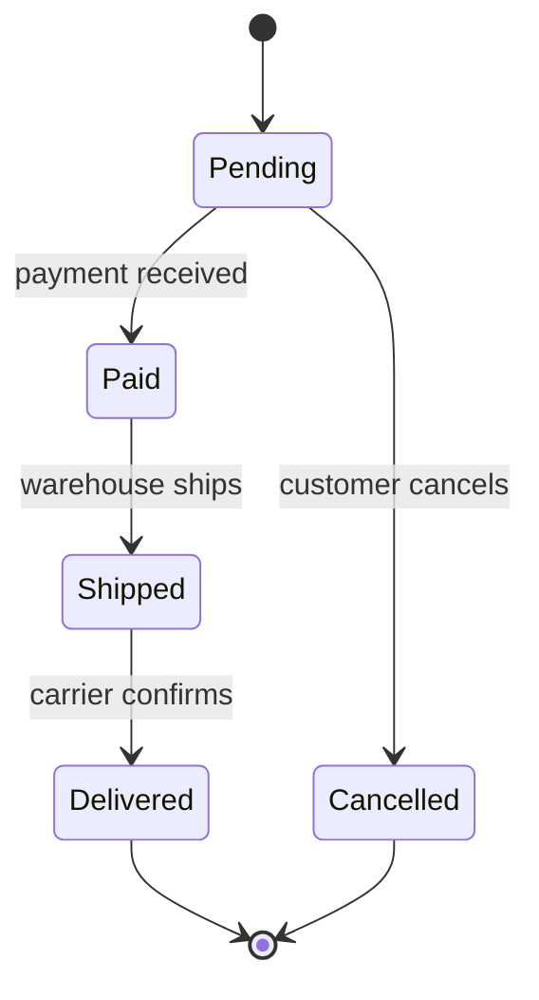
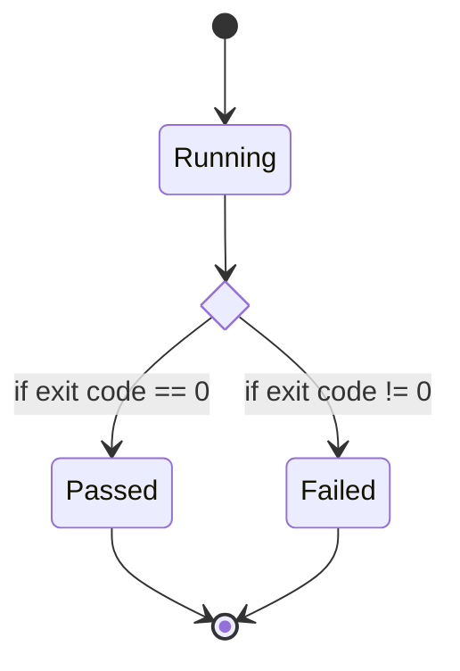
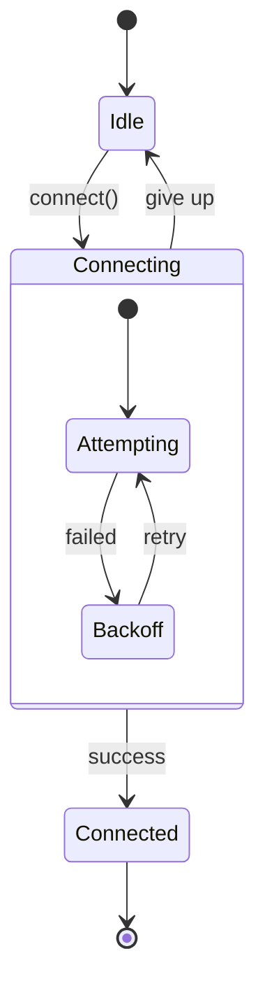
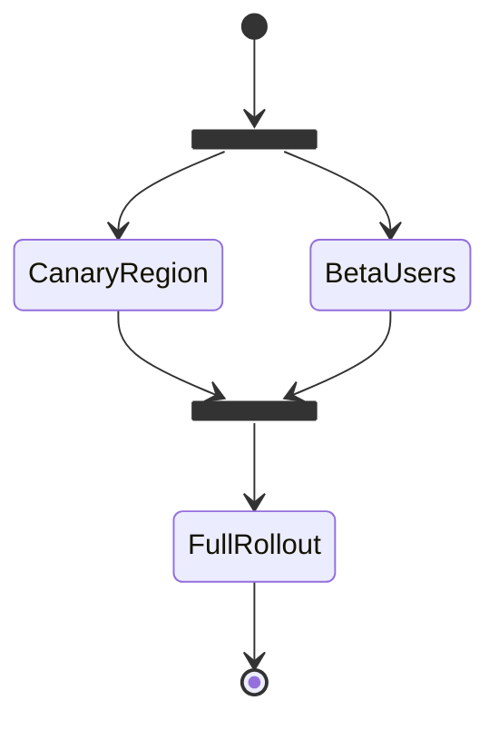
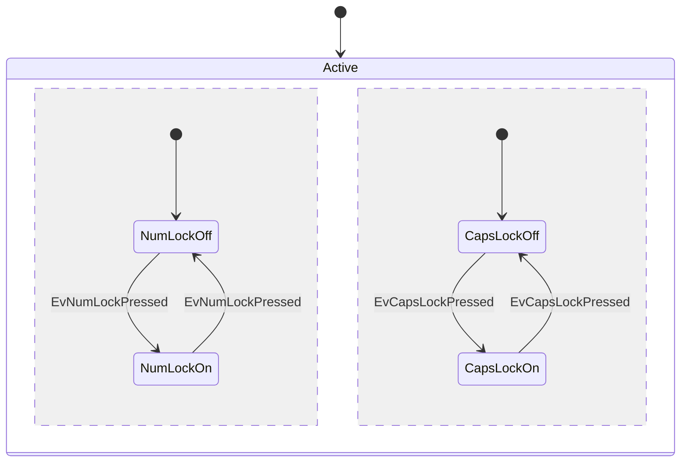

# State diagram examples

## Order lifecycle

What this shows: a linear-ish lifecycle with a cancellation path back to a shared end state.

## CI job with a choice branch

What this shows: `<<choice>>` to model a conditional outcome.

## Connection retry with a composite state

What this shows: nesting internal retry states inside a parent `Connecting` state.

## Feature flag rollout with fork/join

What this shows: `<<fork>>`/`<<join>>` to model parallel rollout stages that must all complete before continuing.

## Keyboard lock concurrency

What this shows: `--` to model independent concurrent regions inside one composite state (adapted from the mermaid docs' own keyboard-lock example).

