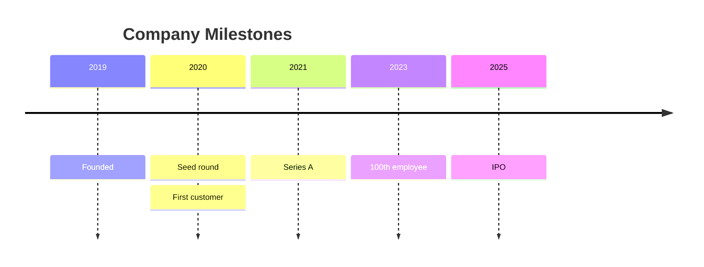
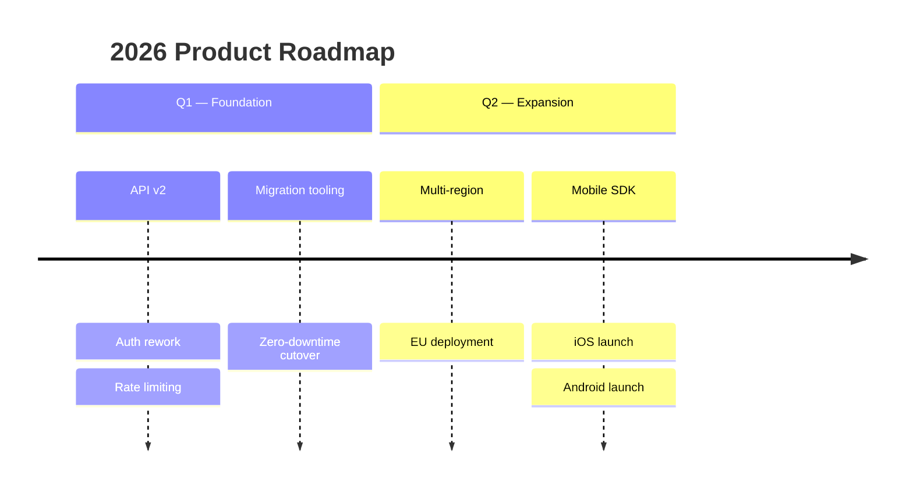
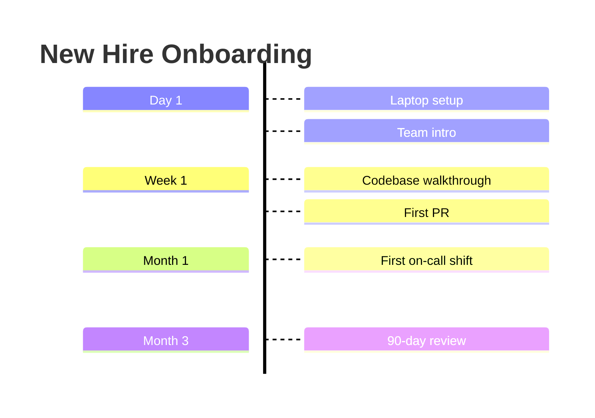
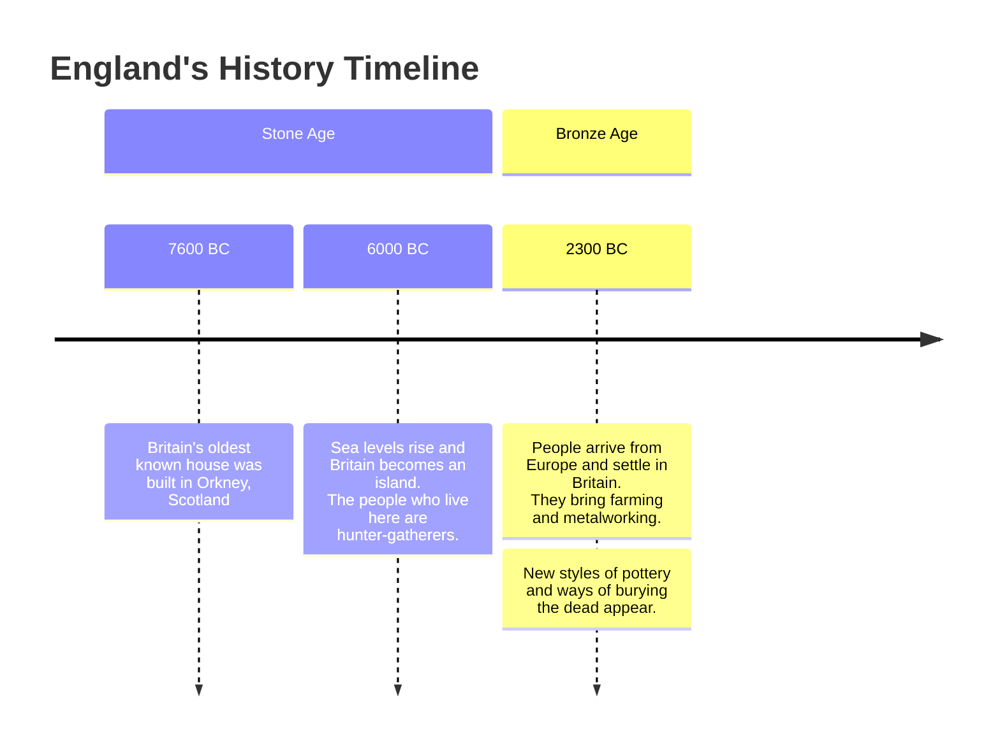

# Timeline: realistic examples

## Company milestones, ungrouped

What this shows: a flat timeline where each period gets its own color automatically (no sections defined).

## Product roadmap grouped by quarter

What this shows: `section` grouping so each release quarter shares one color, with multiple bullet events per quarter on continuation lines.

## Onboarding process, top-down

What this shows: `TD` direction (v11.14.0+) for a vertical flow, better suited to embedding narrow in a doc column than the default left-right layout.

## Historical eras with long event text and forced line breaks

What this shows: ` ` for manual breaks inside long descriptive text, and multiple time periods sharing one section.

