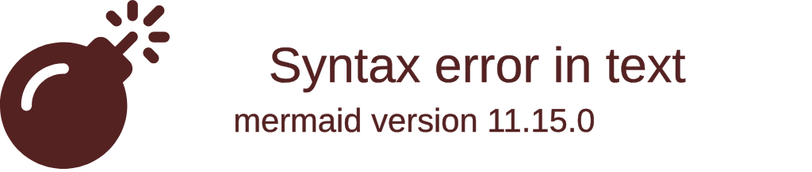

# TreeView — examples

## 1. Monorepo layout (indentation)

What this shows: a Go backend + frontend monorepo, the plain indentation form.

## 2. Frontend source tree with annotations

What this shows: `:::highlight` on the entry component and `##` descriptions marking notable files, plus a generated directory that should not be hand-edited.

## 3. Repo layout with file-type icons

What this shows: `showIcons` plus `filenameIcons`/`extensionIcons` config maps resolving icons by filename and extension through a registered icon pack.

## 4. Agent bundles with quoted labels and a comment

What this shows: directory names with spaces (quoted), a comment marking a generated subtree, and multiple sibling bundle directories.

