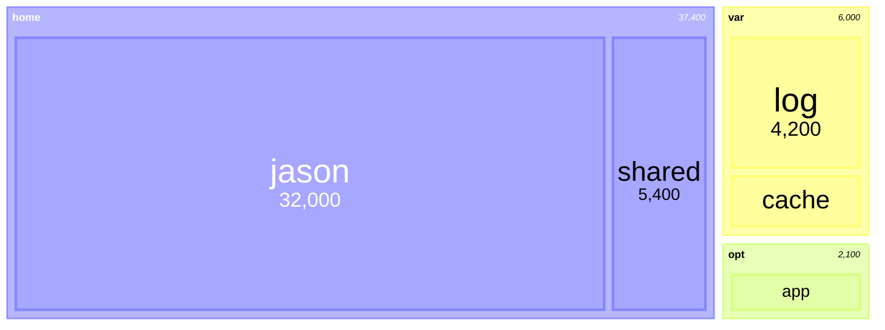
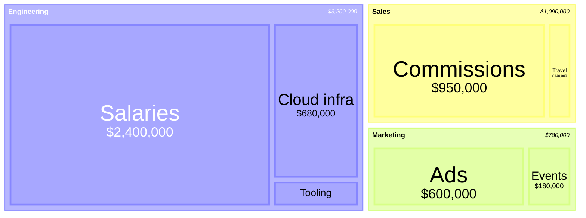
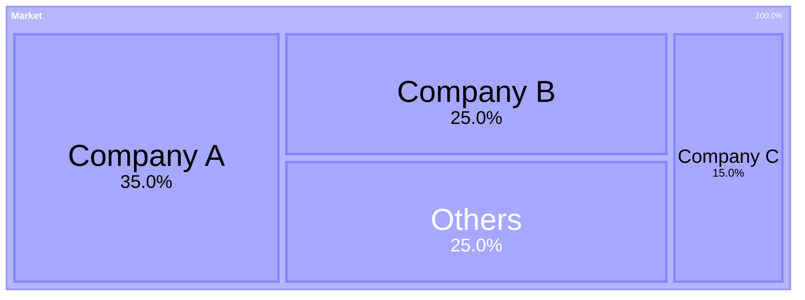

# Treemap: realistic examples

## Disk usage by top-level folder

What this shows: the canonical treemap use case — nested filesystem sizes.

## Org budget by department and line item, formatted as currency

What this shows: `valueFormat` making raw numbers read as dollar figures, a common request when the audience is non-technical.

## Product portfolio revenue with a highlighted underperformer

What this shows: `:::class` styling to flag one leaf (e.g. a product missing target) without touching the rest of the tree.

## Market share by company as a percentage

What this shows: `.1%` value formatting for a proportions-only treemap where the raw numbers are already fractions.

