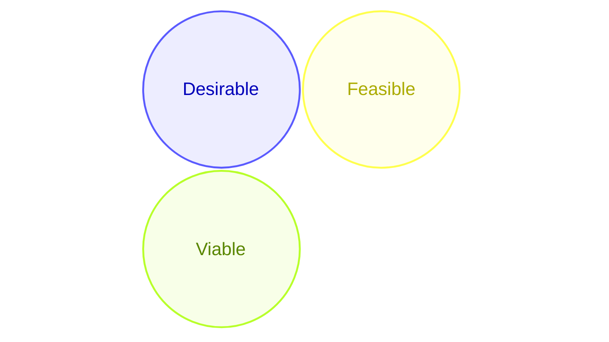
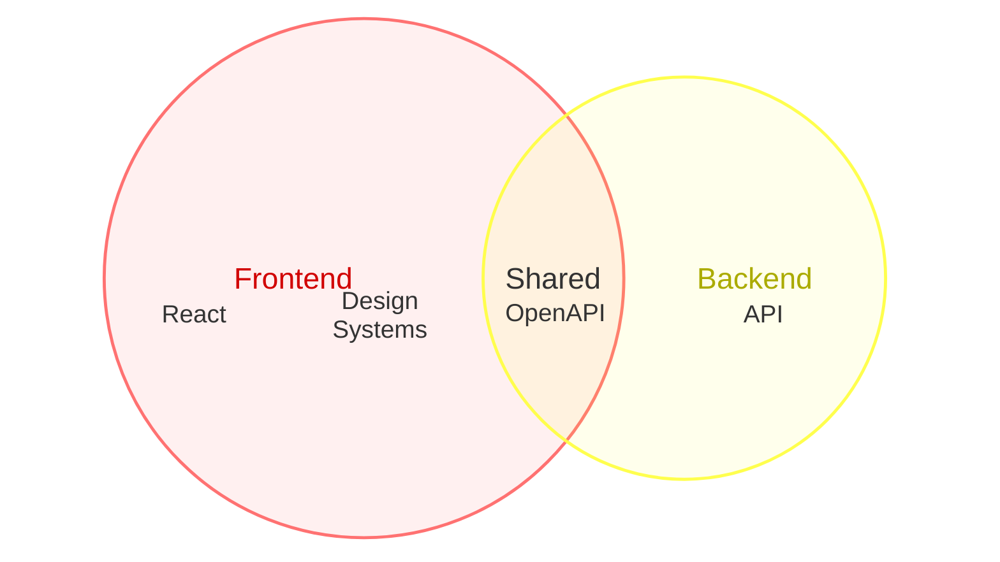
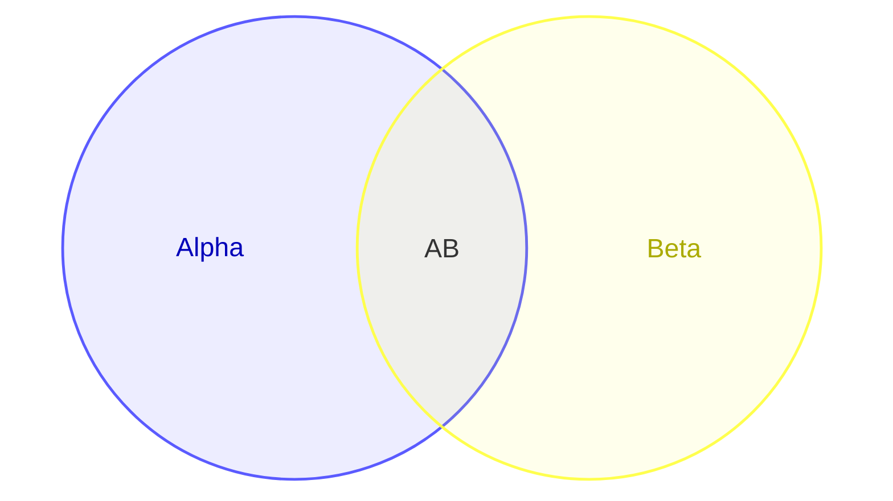

# Venn examples

## Three-way strategic overlap

What this shows: the classic "Innovation" framing (Desirable/Feasible/Viable) — a higher-arity union naming the sweet spot where all three sets overlap.

## Sized sets with nested labels and styling

What this shows: combining `:N` sizing, per-set `text` labels, and `style` overrides in one diagram — the full feature set working together.

## Two labeled sets, short identifiers

What this shows: keeping identifiers terse (`A`, `B`) while giving each a readable display label — useful when the same sets get referenced repeatedly in a longer diagram.

