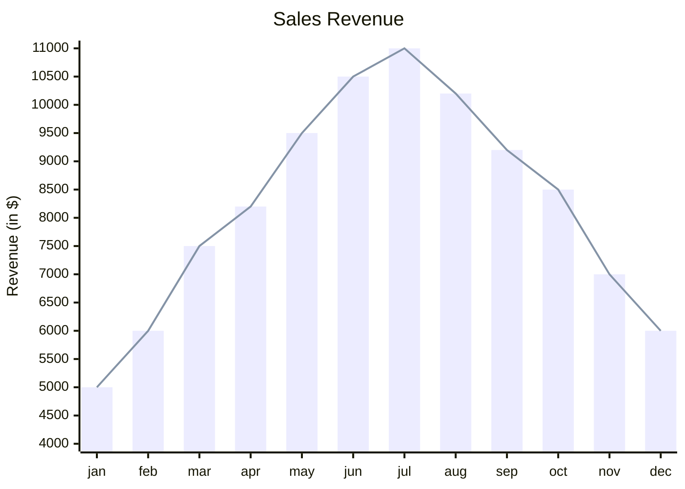
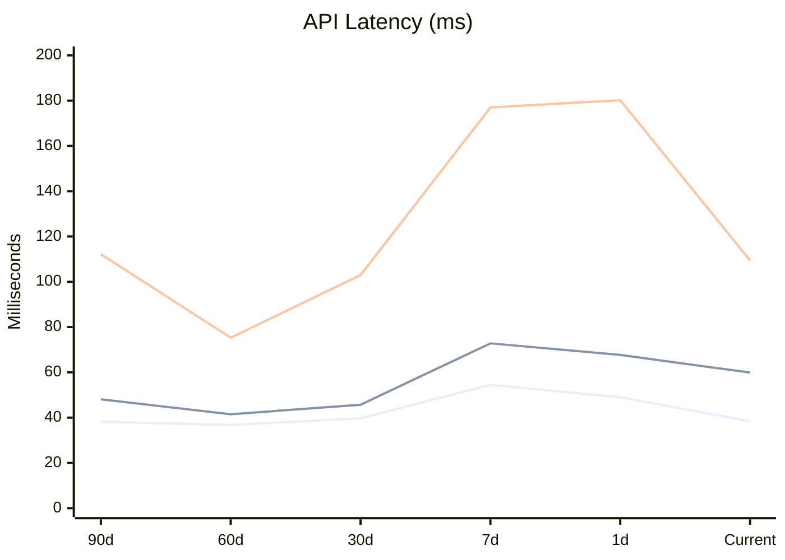
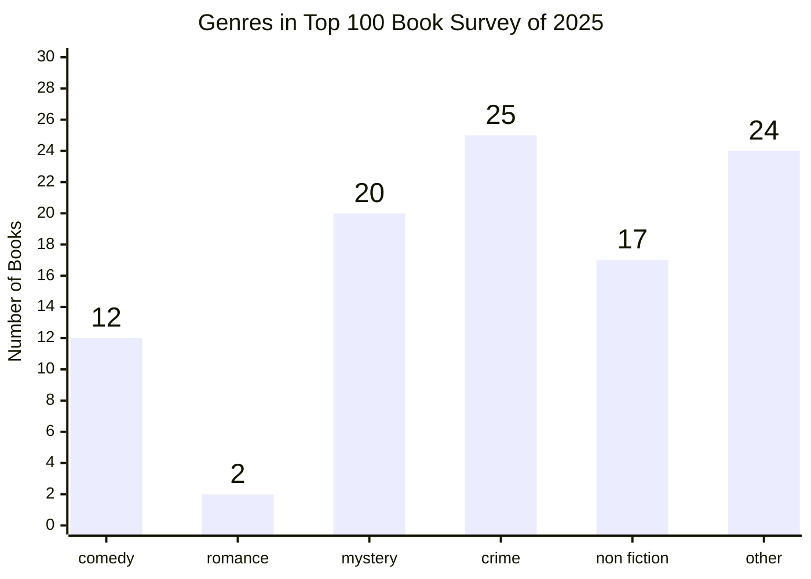

# XY Chart: realistic examples

## Monthly revenue: bar + line overlay

What this shows: actuals as bars with a trend line over them, the most common combo use.



## API latency percentiles over rolling windows

What this shows: multiple named line series for legend-driven comparison — a real observability dashboard pattern.



## Genre survey with data labels shown outside the bars

What this shows: `showDataLabelOutsideBar` for a chart where readers need the exact count, not just the visual comparison.



## Model size vs. capability milestone, with per-point labels

What this shows: per-point line labels (v11.16.0+) annotating specific milestones directly on the trend, avoiding a separate legend lookup.

```mermaid
xychart
    title "Smallest AI Models Scoring Above 60% on MMLU"
    x-axis "Date" ["Apr 2022", "Feb 2023", "Jul 2023", "Sep 2023", "Apr 2024"]
    y-axis "Parameters (B)" 0 --> 600
    line [540 "PaLM", 65 "LLaMA-65B", 34 "Llama 2 34B", 7 "Mistral 7B", 3.8 "Phi-3-mini"]
```
