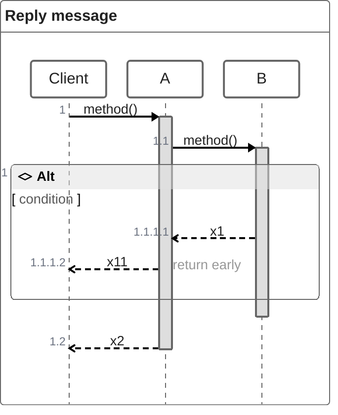
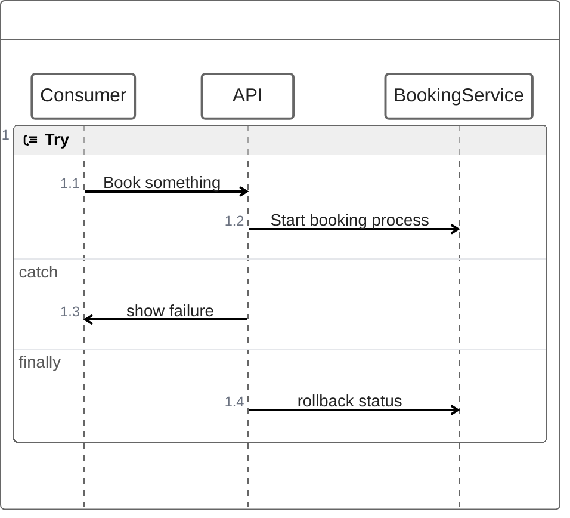
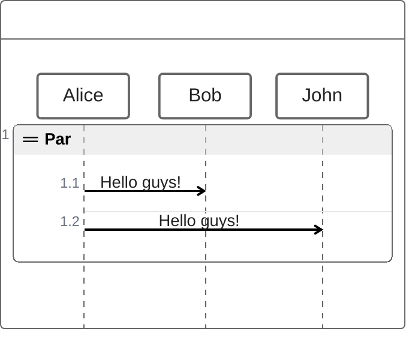

# ZenUML examples

## Reply from a nested level with `@return`

What this shows: using `@return` to short-circuit a reply back up to the top-level caller from inside a nested conditional — the case the plain `return`/assignment forms can't express, since those only return to the immediate caller.

## Try/catch/finally around an external call

What this shows: modeling failure handling in a sequence — a booking flow that rolls back on failure — using ZenUML's code-like exception block instead of mermaid's native `alt`/`opt` fragments.

## Parallel actions

What this shows: `par` for actions that happen concurrently rather than sequentially — two notifications fired at once rather than one after another.

