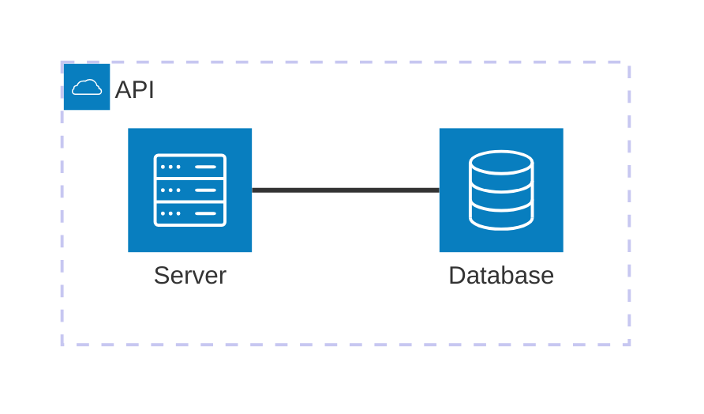

# Architecture

- **Keyword(s):** `architecture-beta`
- **Introduced:** mermaid v11.1.0+. **Beta** — the `-beta` keyword suffix signals unstable syntax. Sibling features layered on top: `randomize` config (v11.14.0+), fcose layout tuning (v11.15.0+), `align row|column` (v11.16.0+).
- **Use when:** showing how cloud/infra services (servers, DBs, storage, network) relate — deployment topology, not application logic.
- **Avoid when:** the diagram is really about control flow or decisions — use `flowchart`; or you need full C4 element semantics (Person/System/Container/Boundary) — use `c4`.

## Minimal example



## Core syntax

Three building blocks: `groups`, `services`, `edges`, plus optional `junctions`.

| Construct | Syntax | Notes |
|---|---|---|
| Group | `group {id}({icon})[{title}] (in {parentId})?` | groups can nest via `in` |
| Service | `service {id}({icon})[{title}] (in {parentId})?` | the node itself |
| Junction | `junction {id} (in {parentId})?` | 4-way edge split point, no icon/label |
| Edge | `{id}:{T\|B\|L\|R} {<}?--{>}? {T\|B\|L\|R}:{id}` | side-to-side connection |

Edges declare which side of each service they leave from (`T`op/`B`ottom/`L`eft/`R`ight). Arrowheads are added with `<` before or `>` after the `--`:

```text
db:R -- L:server        (undirected)
subnet:R --> L:gateway  (arrow into gateway)
```

To route an edge from a group boundary itself (not a specific service), append `{group}` to a service id that lives in that group:

```text
server{group}:B --> T:subnet{group}
```

`groupId`s cannot be used directly in edges — only the `{group}` modifier on a member service.

### Aligning siblings (v11.16.0+)

The fcose layout heuristic can collapse siblings with identical edge topology onto the same coordinate. `align row {id} {id} ...` or `align column {id} {id} ...` (2+ members, each already declared) forces them to spread along that axis:

```text
db1:R --> L:mcp
db2:R --> L:mcp
align column db1 db2
```

Use `column` when members share a horizontal port pair into a common downstream node (they stack vertically); use `row` when they share a vertical port pair (they line up horizontally). Declared member order sets position along the axis, and it must not contradict edge directions between those members or the layout fails.

### Icons

Built in: `cloud`, `database`, `disk`, `internet`, `server`. Anything else needs an iconify.design pack registered via `registerIconPacks`, referenced as `packname:icon-name`.

## Gotchas

- Edge order matters for `align`: if `a:L --> R:b` already implies `b` left of `a`, `align row a b` conflicts and rendering fails — reorder the `align` list or drop the conflicting edge.
- `randomize: false` (the default) is not enough for a fully deterministic layout by itself — fcose's solver still calls `Math.random()`. Pin the render with the `seed` config option (default `1`).
- The `{group}` edge modifier only works on a service that belongs to a group — it cannot target a `groupId` directly.
- Custom (non-built-in) icons render as broken/missing unless the hosting site registered that iconify pack — don't assume `logos:aws-ec2` etc. work outside mermaid's live editor.
- Two siblings can still silently overlap even with layout tuning (`nodeSeparation`, `idealEdgeLengthMultiplier`, etc.) if they share the same logical position in the spatial map — that needs `align`, not the fcose knobs.

## Deeper

- [shapes.md](../../assets/architecture-beta/shapes.md) — icons, groups, edge direction reference
- [examples.md](../../assets/architecture-beta/examples.md) — realistic topologies
