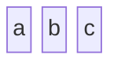

# Block

- **Keyword(s):** `block`
- **Introduced:** core — in mermaid since 10.9.6 or earlier (verified against the v10.9.6 diagram registry), so it renders on effectively any deployed mermaid — the official doc states no version number and does not mark this diagram type beta or experimental.
- **Use when:** you need full manual control over node placement (grid/columns), unlike a flowchart's automatic layout — system diagrams, layered stacks, dashboards.
- **Avoid when:** you want the layout engine to place nodes for you based on relationships — use `flowchart` instead.

## Minimal example

## Core syntax

| Construct | Syntax | Notes |
|---|---|---|
| Columns | `columns {n}` | sets grid width; blocks wrap to the next row after `n` |
| Column span | `id:{n}` | block occupies `n` columns |
| Composite block | `block:groupId` … `end` | nested block acting as one grid cell; can set its own `columns` |
| Space | `space` or `space:{n}` | empty cell(s), for layout only |
| Edge | `A --> B` or `A --- B` | connects two block ids; add text with `A-- "label" -->B` |
| Style | `style id fill:#hex,stroke:#hex,stroke-width:Npx` | per-block CSS-like styling |
| Class | `classDef name prop:val;` then `class id name` | reusable style groups |

Column width auto-sizes to the widest block in that column. A block with no explicit connection still needs a `space` placeholder next to it if you don't want it to auto-merge into the next slot — see Gotchas.

Shapes (id + delimiter pair around the label) cover most needs — see [shapes.md](../../assets/block/shapes.md) for the full catalog, including block arrows (`id<["Label"]>(direction)`) and space blocks.

## Gotchas

- `A - B` is not a valid link — you need `A --> B` or `A --- B`. Two blocks with no relationship still need a `space` between them in the source or they visually merge.
- Composite blocks (`block:ID ... end`) can be the target/source of an edge either by their group id or by a member id inside them — both work in the same diagram.
- `columns` set inside a composite block only applies to that block's own children, not the outer grid.
- Style/class declarations go after the block/edge definitions; misplacing `style` before the block it targets exists is a common source of "nothing styled."

## Deeper

- [shapes.md](../../assets/block/shapes.md) — full shape catalog and column-span reference
- [examples.md](../../assets/block/examples.md) — realistic diagrams
