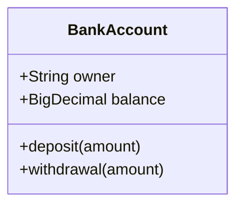
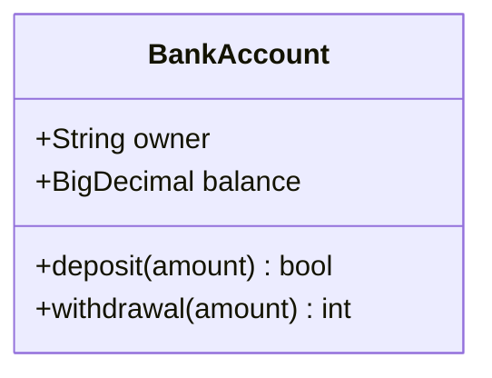

# Class Diagram

- **Keyword(s):** `classDiagram`
- **Introduced:** core — in mermaid since 10.9.6 or earlier (verified against the v10.9.6 diagram registry), so it renders on effectively any deployed mermaid (source doc doesn't state it). Per-feature versions: click/link tooltips v0.5.2+, namespace display labels and nested namespaces v11.15.0+.
- **Renderer default changed in v11.17.0:** `classDiagram` now routes to the unified (v2) renderer by default. Syntax is unaffected, but layout/spacing can shift visually. Restore the legacy renderer with `class: { defaultRenderer: 'dagre-d3' }` in `config` if a diagram depends on the old layout.
- **Use when:** you need to model object-oriented structure - classes, interfaces, members, and the relationships between them.
- **Avoid when:** you need to show call order/timing between objects - use `sequenceDiagram`; or a relational data schema - use `erDiagram`.

## Minimal example

## Core syntax

Define a class explicitly (`class Animal`) or implicitly via a relationship (`Vehicle <|-- Car` defines both). Class names: alphanumeric (unicode ok), underscores, dashes only - use `` `Weird Name!` `` backticks or `class Animal["Animal with a label"]` for anything else.

Members - colon form (one at a time) or brace form (grouped):

Mermaid tells attributes from methods solely by whether `()` is present. Return type goes after the closing `)` with a space. Generics use `~Type~`, e.g. `List~int~ position`; nested generics work (`List~List~int~~`), but a generic containing a comma (`List~List~K, V~~`) is not supported.

Visibility and classifier markers, relationship types, and cardinality are enumerated in `../../assets/classDiagram/shapes.md`.

Annotations: `` class Shape <<interface>> `` (inline), a separate `<<interface>> Shape` line, or nested inside the brace body.

Namespaces group classes: `namespace BaseShapes { class Triangle class Rectangle }`. Nest with dot notation (`namespace Company.Engineering.Backend { ... }`) or by nesting `namespace` blocks syntactically; both auto-create missing parent namespaces.

Direction: `direction RL` (also `TB`, `BT`, `LR`).

Comments: `%% comment text` on its own line.

## Gotchas

- Attribute vs. method is decided purely by `()` presence - `+age` is an attribute, `+age()` is a method, even if that's not your intent.
- A generic's type parameter is not part of the class name for reference purposes, and two classes can't share a name with different generic parameters.
- `cssClass`-shorthand (`:::`) can't be combined with a relationship statement on the same line.
- Notes and namespaces cannot be styled individually with `style`, only via themes.
- `hideEmptyMembersBox` (config) hides the empty compartment on classes with no members - off by default, so a bare `class Duck` still renders a members box.

## Deeper

See `../../assets/classDiagram/shapes.md` for the relation/cardinality/visibility vocabulary and `../../assets/classDiagram/examples.md` for worked examples.
