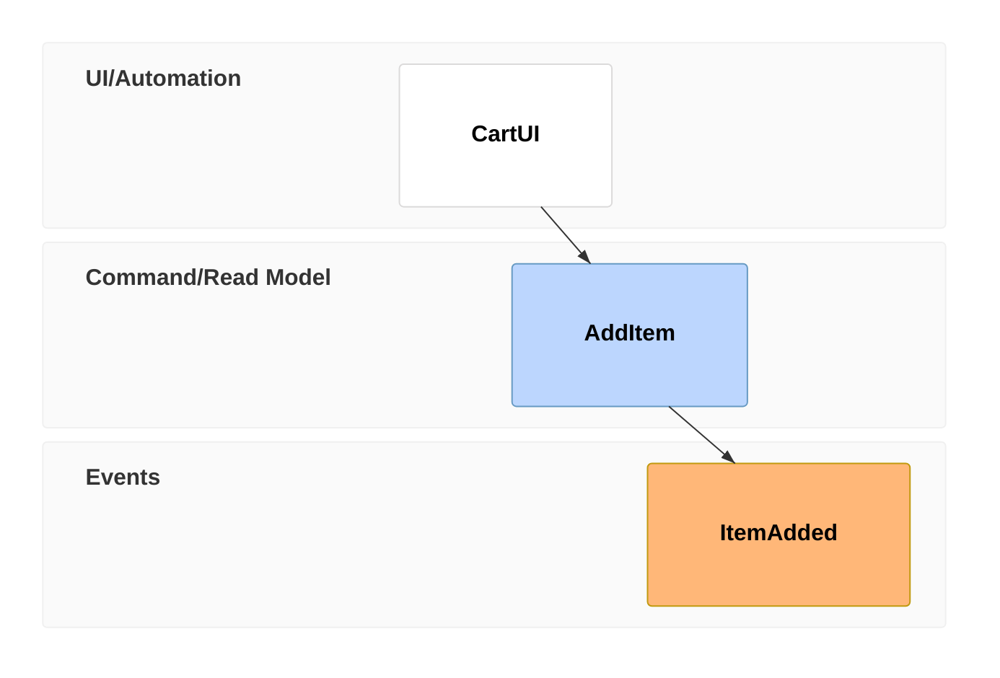
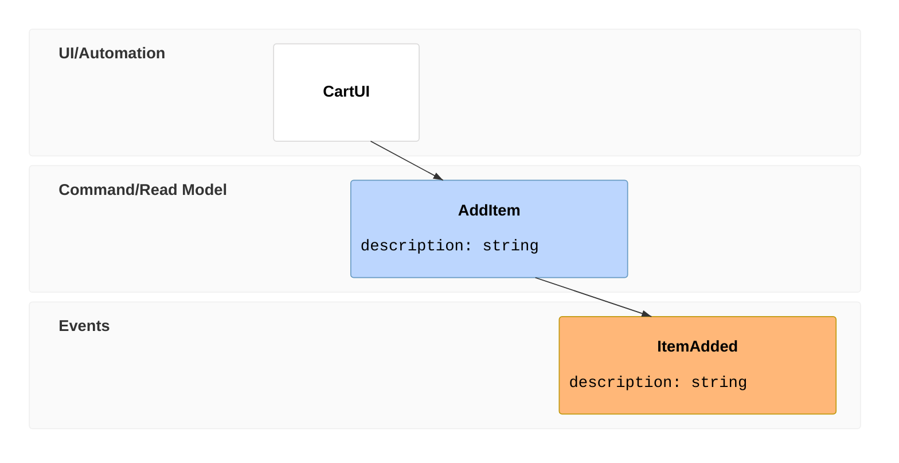

# Event Modeling Diagram

- **Keyword(s):** `eventmodeling`
- **Introduced:** mermaid v11.15.0. No `-beta` suffix and no "new/evolving diagram type" warning appear in the official doc, unlike cynefin/ishikawa/venn — but it's still a very new, very niche diagram type; treat the syntax as young.
- **Use when:** documenting an Event Modeling timeline (UI/trigger -> command -> event -> read model) for a specific business flow, following the Event Modeling methodology.
- **Avoid when:** you want a generic sequence of steps or a general state machine — use `sequenceDiagram` or `stateDiagram-v2`; Event Modeling's swimlane/timeframe structure only makes sense if you're actually doing Event Modeling.

## Minimal example

## Core syntax

The timeline is built from **Time Frames** (`tf`, or `timeframe` in relaxed notation), each with a unique reference number and an entity type + identifier:

| Compact token | Relaxed token | Entity type | Swimlane |
|---|---|---|---|
| `ui` | `ui` | UI | UI/Automation |
| `pcr` | `processor` | Processor | UI/Automation |
| `cmd` | `command` | Command | Command/Read Model |
| `rmo` | `readmodel` | Read Model | Command/Read Model |
| `evt` | `event` | Event | Events |

- Numbers just need to be unique across the timeline, not ordered — they're references, not a sequence guarantee.
- Inline data: `{ key: type }` or literal values, directly on the Time Frame line.
- Data blocks: define once as `data Identifier { ... }`, reference from a Time Frame with `[[Identifier]]`. Needed when the same entity repeats and each occurrence needs distinct sample data.
- Reset Frame (`rf` / `resetframe`) breaks the default inference chain — use it when a new causal chain starts (e.g. an external event triggering a new flow).
- Multiple relations: `tf 01 rmo CartUI ->> 02 ->> 03` — a read model built from several prior time frames.
- Namespaces: `Inventory.InventoryChanged` — the part before `.` groups entities into their own swimlane, ordered by first appearance in the source.

## Gotchas

- Compact and relaxed tokens (`tf`/`timeframe`, `cmd`/`command`, etc.) are interchangeable but pick one style per diagram for readability — the doc doesn't restrict mixing, but mixed diagrams read as sloppy.
- A repeated Data Block identifier for the same entity must be uniquely suffixed (`AddItem01`, `AddItem02`) — reusing one identifier for different sample payloads is not supported.
- Data type prefixes (`` `json`{...} ``) are accepted syntax but the doc explicitly warns there's no special rendering treatment for any of them yet — purely documentation, not enforcement.
- Relations are inferred by default; if your flow doesn't read top-to-bottom as a single causal chain, you need an explicit `rf`/`resetframe` or the diagram will wire frames together incorrectly.

## Deeper

See `../../assets/eventmodeling/examples.md` for the three canonical Event Modeling patterns (State Change, State View, Translation).
