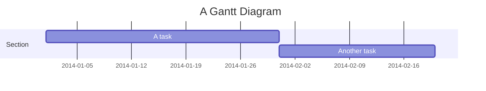

# Gantt Chart

- **Keyword(s):** `gantt`
- **Introduced:** core — in mermaid since 10.9.6 or earlier (verified against the v10.9.6 diagram registry), so it renders on effectively any deployed mermaid — one of mermaid's original diagram types; the official doc gives no introduction version. Individual features are version-tagged: `until` keyword (v10.9.0+), axis `tickInterval` (v10.3.0+), `weekend friday/saturday` (v11.0.0+). Not beta.
- **Use when:** you need a project schedule with dated, sequential or dependent tasks across sections.
- **Avoid when:** you just need to compare durations or counts without real dates — use `xychart-beta` (bar) or `pie` instead.

## Minimal example

## Core syntax

- First line after `gantt`: optional `title <text>`, then `dateFormat <pattern>` (default `YYYY-MM-DD`) — sets how you write input dates.
- `section <name>` groups tasks visually; the name is required once you use sections.
- Each task line: `<task text> :<metadata>` — metadata is comma-separated.
  - Optional tags first: `active`, `done`, `crit`, `milestone` (must come before other fields if present).
  - Then 1–3 positional fields: `[id,] [start,] end` — see the table below.
- A task with no explicit start defaults to starting when the previous task ends (chart order, not the previous section).

| Metadata pattern | Start | End |
|---|---|---|
| `id, startDate, endDate` | startDate | endDate |
| `id, startDate, length` | startDate | startDate + length |
| `id, after otherId, length` | end of `otherId` | start + length |
| `id, startDate, until otherId` | startDate | start of `otherId` |
| `length` (only) | end of preceding task | start + length |

- `after <id> [id2 id3...]` starts a task after the *latest* end date among the referenced tasks.
- `until <id>` (v10.9.0+) ends a task at the start of the referenced task/milestone.
- `milestone` tasks are a point in time, not a bar: position = start + duration/2.
- `vert` adds a full-height vertical marker line (not a row) at a given date — visual only, no task semantics.
- `excludes weekends|sunday|<YYYY-MM-DD>` skips dates from duration math and pushes the task right (not a gap) — multiple `excludes` lines concatenate. `excludes weekdays` is NOT valid.
- `axisFormat <d3-time-format>` controls the rendered axis date format independently of `dateFormat`.
- `%% comment` — full-line comments only.
- `---` YAML frontmatter block sets `displayMode: compact` (stack tasks sharing a row) and other config.

## Gotchas

- `dateFormat` governs *input* parsing; `axisFormat` governs the rendered axis — mixing them up is the #1 source of "dates look wrong."
- Invalid duration tokens (e.g. `3dX`) are silently ignored and the task collapses to zero duration — no error.
- `excludes weekdays` does not exist; only `weekends`, a day name, or explicit dates.
- Tags (`active`/`done`/`crit`/`milestone`) must appear before positional fields in the metadata, or parsing breaks.
- A task with only `<length>` inherits its start from the immediately preceding task in file order — reordering tasks changes downstream dates.
- `until` requires v10.9.0+; older renders (e.g. an outdated pinned mermaid version, or GitHub's bundled version) will fail to parse it.

## Deeper

See `../../assets/gantt/shapes.md` for task-state tags, date/duration format tables, and `excludes`/`axisFormat` reference.

See `../../assets/gantt/examples.md` for realistic examples.
