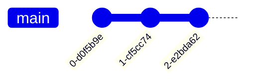

# GitGraph Diagram

- **Keyword(s):** `gitGraph`
- **Introduced:** core — in mermaid since 10.9.6 or earlier (verified against the v10.9.6 diagram registry), so it renders on effectively any deployed mermaid (source doc doesn't state it). Per-feature versions: orientation (`LR:`/`TB:`/`BT:`) v10.3.0+, `BT:` specifically v11.0.0+, `parallelCommits` config v10.8.0+.
- **Use when:** you need to document or visualize a branching/merge strategy (git flow, release branching, a cherry-pick history).
- **Avoid when:** you need a generic process flow unrelated to git history - use `flowchart`.

## Minimal example

## Core syntax

Every gitgraph starts on an implicit `main` branch, which is also the current branch. Four core operations:

| Keyword | Effect |
| --- | --- |
| `commit` | add a commit to the current branch |
| `branch <name>` | create a new branch and switch to it |
| `checkout <name>` (alias: `switch <name>`) | switch the current branch |
| `merge <name>` | merge the named branch's head into the current branch, producing a merge commit |

Commit attributes: `commit id: "custom_id" type: HIGHLIGHT tag: "v1.0.0"` - `id`, `type`, and `tag` are all optional and combinable. `type` is one of `NORMAL` (default, solid circle), `REVERSE` (crossed circle), `HIGHLIGHT` (filled rectangle).

Merge accepts the same `id`/`tag`/`type` overrides: `merge develop id: "my_custom_id" tag: "my_custom_tag" type: REVERSE`.

Cherry-pick: `cherry-pick id: "your_custom_id"` copies an existing commit from another branch onto the current branch. When cherry-picking a merge commit, `parent: "<parentCommitId>"` is mandatory.

Orientation: `gitGraph LR:` (default), `gitGraph TB:`, `gitGraph BT:` (v11.0.0+).

Config (set via YAML frontmatter `config: gitGraph: {...}`):

| Option | Default | Effect |
| --- | --- | --- |
| `showBranches` | `true` | hide branch names/lines when `false` |
| `showCommitLabel` | `true` | hide commit labels when `false` |
| `mainBranchName` | `"main"` | rename the default branch |
| `mainBranchOrder` | `0` | main branch's position among branches |
| `parallelCommits` | `false` | commits equidistant from a parent render at the same level instead of by time |

## Gotchas

- `checkout` and `switch` are interchangeable - pick one convention per diagram.
- A branch name that could be mistaken for a keyword must be quoted: `branch "cherry-pick"`.
- Cherry-picking requires: the source commit id exists, it is not already on the current branch, the current branch has at least one commit, and - for merge commits - a valid `parent` id that is an immediate parent of that merge commit.
- Merging a branch with itself is an error.
- Branch draw order: `main` first (unless `mainBranchOrder` overrides it) → unordered branches by appearance → ordered branches by their `order` value. Give every branch an explicit `order` if you need full control.

## Deeper

No `shapes.md` for this diagram - the commit-type vocabulary (`NORMAL`/`REVERSE`/`HIGHLIGHT`) is small enough to live in Core syntax above. See `../../assets/gitGraph/examples.md` for worked examples.
