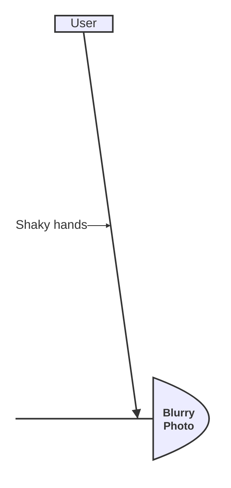
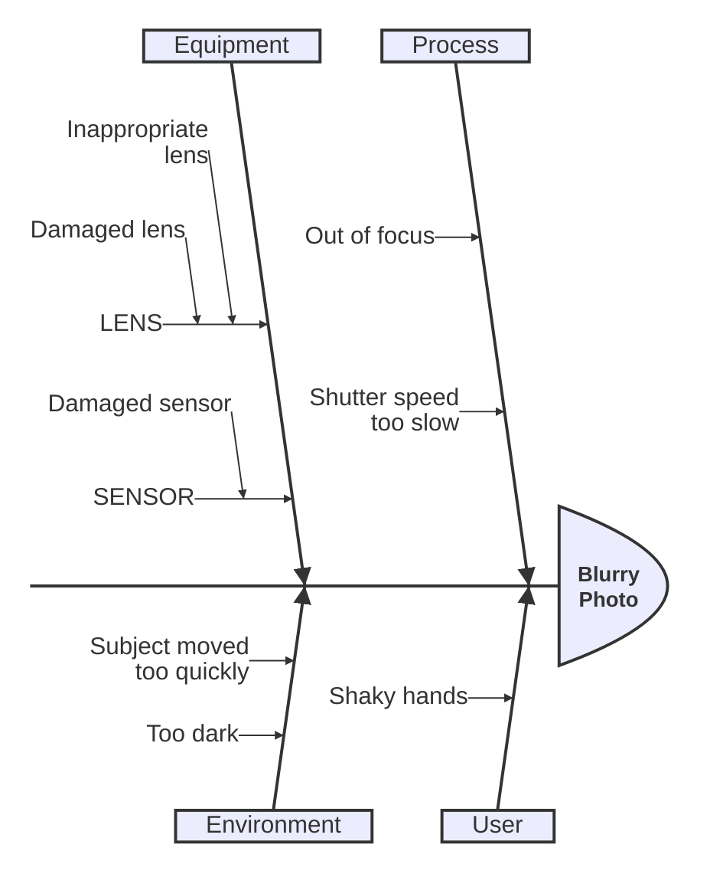

# Ishikawa (Fishbone) Diagram

- **Keyword(s):** `ishikawa-beta`
- **Introduced:** mermaid v11.12.3. **Beta** — the doc explicitly warns this is a new diagram type and syntax may evolve.
- **Use when:** doing root-cause analysis, showing candidate causes of one problem grouped into categories (the classic 6M-style fishbone).
- **Avoid when:** you need a general tree/hierarchy with no "single problem at the head" framing — use `mindmap` or `flowchart` instead; also avoid if you need styling, links, or click events, none of which this type documents.

## Minimal example

## Core syntax

The whole diagram is indentation-driven, no explicit connectors:

- **First line** after `ishikawa-beta` is the event/problem — becomes the fish head.
- **Top-level indented lines** are cause categories — become the fish's main bones (e.g. Process, User, Equipment, Environment).
- **Further-indented lines** nested under a category are individual causes on that bone; nesting can go deeper for sub-causes.

## Gotchas

- Structure is purely whitespace-driven — there's no explicit syntax for categories vs. causes, so a stray indent level silently changes what's a category and what's a cause.
- No documented config, theming, or styling options for this type as of the source doc — don't assume `style`/`classDef` work here.
- Beta means the indentation rules and rendering could change between minor versions; pin your mermaid version if this ships in generated docs.

## Deeper

See `../../assets/ishikawa-beta/examples.md` for a full multi-level fishbone.
