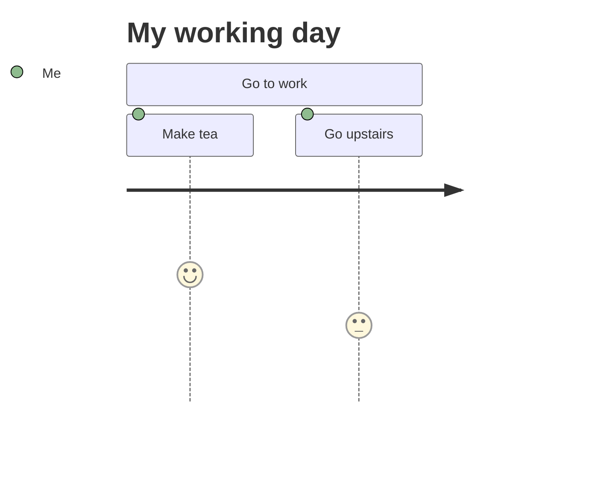
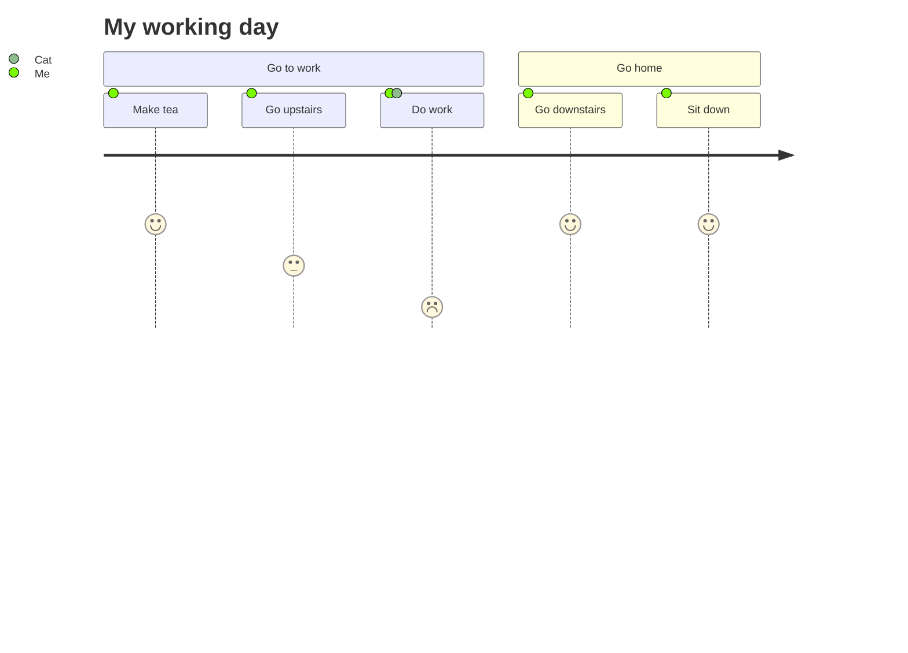

# User Journey Diagram

- **Keyword(s):** `journey`
- **Introduced:** core — in mermaid since 10.9.6 or earlier (verified against the v10.9.6 diagram registry), so it renders on effectively any deployed mermaid — the official doc gives no version number for this type (unlike cynefin/ishikawa/railroad/venn/wardley, whose doc titles all state one), and carries no `-beta` suffix or "new diagram type" warning. That absence suggests it predates the current wave of niche additions and is not beta, but the source doc simply doesn't say when.
- **Use when:** showing a user's satisfaction/effort across the sequential steps of a task, grouped into stages — the classic UX "journey map."
- **Avoid when:** you need branching paths, timing, or actor interactions rather than a single linear satisfaction score per step — use `flowchart` or `sequenceDiagram` instead.

## Minimal example

## Core syntax

- `journey` on the first line, then optional `title Text`.
- `section Name` groups subsequent tasks under a labeled stage of the journey.
- Each task line: `Task name: <score>: <actor1>, <actor2>, ...`
  - Score is an integer 1–5 inclusive (drives the plotted satisfaction/effort line).
  - Actors are a comma-separated list; a task can involve more than one actor at once.

## Gotchas

- The doc documents exactly this one line format — task/score/actors. There's no documented syntax here for notes, links, styling, or click events; don't assume flowchart-style extras carry over.
- Score is a plain 1–5 integer, not a percentage or arbitrary number — out-of-range values aren't covered by the doc.

## Deeper

See `../../assets/journey/examples.md` for two more worked journeys.
