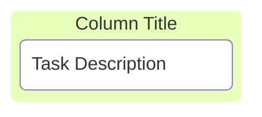

# Kanban

- **Keyword(s):** `kanban`
- **Introduced:** mermaid 11.x — absent from the v10.9.6 diagram registry, so it needs a v11-era renderer — the official doc gives no version number and does not mark this diagram type beta.
- **Use when:** showing tasks moving through workflow stages (columns) — a literal kanban board with optional assignee/ticket/priority metadata.
- **Avoid when:** you need to show sequencing, dependencies, or timing between tasks — use `flowchart` or `gantt` instead; kanban only groups tasks by column, it does not connect them.

## Minimal example



## Core syntax

```text
columnId[Column Title]
  taskId[Task Description]
```

- A column is a top-level `id[Title]` line.
- A task is indented under its column: `taskId[Description]`.
- A column with no explicit id can be written as `[Title]` directly.

### Task metadata

Attach `@{ ... }` after a task for extra fields, rendered inline on the card:

| Key | Meaning |
|---|---|
| `assigned` | who owns the task |
| `ticket` | an external ticket/issue id |
| `priority` | one of `Very High`, `High`, `Low`, `Very Low` |

```text
id4[Create parsing tests]@{ ticket: MC-2038, assigned: 'K.Sveidqvist', priority: 'High' }
```

### Config: `ticketBaseUrl`

When a task has a `ticket`, set `ticketBaseUrl` in frontmatter to turn it into a link — `#TICKET#` is replaced with the ticket value:

```text
---
config:
  kanban:
    ticketBaseUrl: 'https://yourproject.atlassian.net/browse/#TICKET#'
---
```

## Gotchas

- Indentation is what assigns a task to a column — a task line indented at the wrong level attaches to the wrong column or becomes its own column.
- `priority` only accepts the four exact strings above (`Very High`, `High`, `Low`, `Very Low`) — anything else is not documented as supported.
- Task and column ids must be unique per the doc's guidance, but nothing in the syntax itself enforces global column-vs-task id separation — keep them visually distinct to avoid confusion.

## Deeper

- [examples.md](../../assets/kanban/examples.md) — realistic boards
