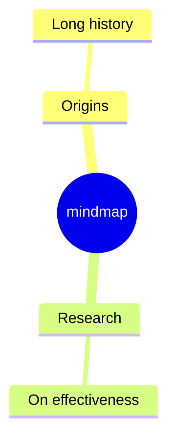

# Mindmap

- **Keyword(s):** `mindmap`
- **Introduced:** v9.4.0. **Experimental** — the doc states the core syntax is stable, but icon integration specifically remains experimental and could change.
- **Use when:** brainstorming or outlining a hierarchy radiating from one central concept — no cross-links, just parent/child.
- **Avoid when:** you need connections between non-parent nodes, or a strict tree with file/folder semantics — use `flowchart` for arbitrary links, `treeView` for filesystem-style trees.

## Minimal example



## Core syntax

Structure comes entirely from **indentation** relative to the previous line — no explicit edges. One root, children indented under it, grandchildren indented further.

```text
mindmap
    Root
        A
            B
            C
```

### Node shapes

| Shape | Syntax |
|---|---|
| Default (no delimiter) | `Text` |
| Square | `id[Text]` |
| Rounded square | `id(Text)` |
| Circle | `id((Text))` |
| Bang | `id))Text((` |
| Cloud | `id)Text(` |
| Hexagon | `id{{Text}}` |

### Icons and classes

```text
A
::icon(fa fa-book)
```

```text
A[A]
:::urgent large
```

Icons (`::icon(...)`) need the icon font registered by the embedding site/integrator — mermaid doesn't ship them. Classes (`:::name`) likewise need CSS supplied by the site.

### Markdown strings

Quoted, backtick-wrapped labels support `**bold**`, `*italics*`, and auto-wrap instead of requiring `<br>`:

```text
id1["`**Root** with
a second line`"]
```

## Gotchas

- Indentation is relative, not absolute — if a line's indentation falls between two prior levels (ambiguous), mermaid resolves it against the nearest smaller-indentation ancestor, which may not be the level you intended. Keep indentation consistent (e.g. always 2 or 4 spaces per level).
- Icons are the one part of this diagram type still called out as experimental in the doc — expect them to need external font setup, and don't assume `::icon()` output is portable across renderers.
- There is no edge syntax at all — you cannot connect two sibling or cross-branch nodes; if you need that, this is the wrong diagram type.

## Deeper

- [examples.md](../../assets/mindmap/examples.md) — realistic outlines
