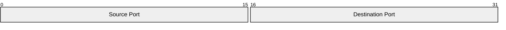

# Packet

- **Keyword(s):** `packet`
- **Introduced:** mermaid v11.0.0+. The `+<count>` bit-count field shorthand followed in v11.7.0+. Not marked beta or experimental in the doc.
- **Use when:** documenting the bit/byte layout of a network packet, binary header, or wire format.
- **Avoid when:** you're diagramming message flow between systems over time, not a single message's internal layout — use `sequenceDiagram` instead.

## Minimal example



## Core syntax

Each line after the (optional) title defines one field:

```text
packet
start-end: "Field name"     %% multi-bit field, explicit range
bit: "Field name"           %% single-bit field
```

### Bit-count shorthand (v11.7.0+)

Instead of tracking start/end by hand, use `+<count>` — it starts immediately after the previous field:

```text
packet
+8: "Message Type"
+16: "Sequence Number"
9-15: "you can still mix explicit ranges in"
```

### Title

Either frontmatter or an inline `title` statement:

```text
---
title: "TCP Packet"
---
packet
0-15: "Source Port"
```

```text
packet
title UDP Packet
+16: "Source Port"
```

## Gotchas

- `+count` and explicit `start-end` ranges can be freely mixed (the doc calls this out as fine) — `+count` always continues from the end of whichever field came immediately before it, explicit or shorthand.
- A single bit uses just `bit:` (one number), not `bit-bit:` — the doc's `106: "URG"` style, not `106-106:`.
- Field descriptions must be quoted strings.

## Deeper

- [examples.md](../../assets/packet/examples.md) — real protocol headers
