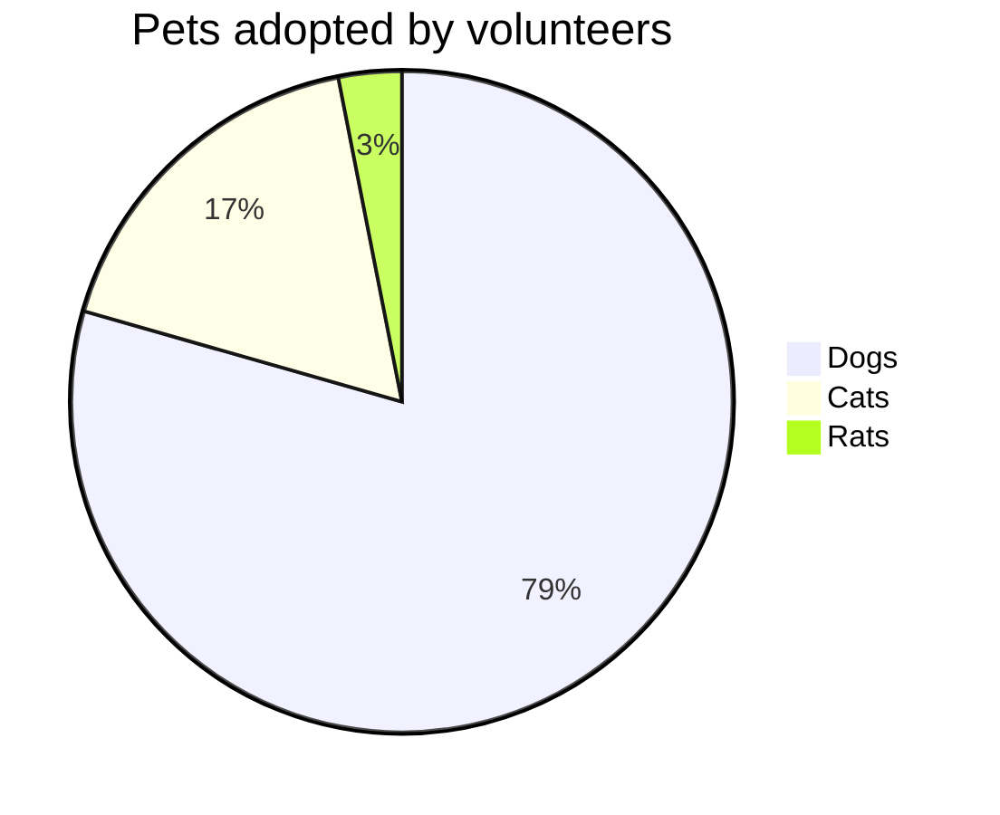
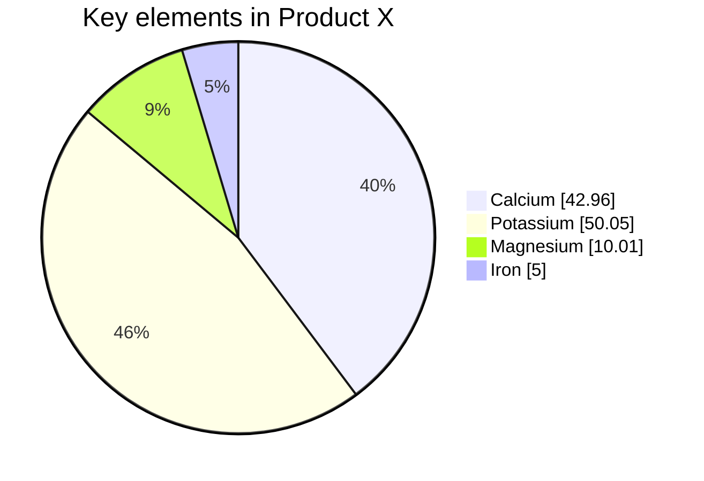

# Pie Chart

- **Keyword(s):** `pie`
- **Introduced:** core — in mermaid since 10.9.6 or earlier (verified against the v10.9.6 diagram registry), so it renders on effectively any deployed mermaid — the doc gives no introduction version for the diagram itself. Config knobs `donutHole`, `legendPosition`, `highlightSlice` are v11.16.0+. Not beta.
- **Use when:** showing proportional share of a whole across a small number of categories.
- **Avoid when:** you have more than ~6-7 categories, need to compare exact magnitudes, or need a hierarchy — use `xychart-beta` (bar) or `treemap-beta` instead.

## Minimal example

## Core syntax

- `pie` starts the diagram; optional `showData` right after it prints each value next to its legend label.
- Optional `title <text>` on the next line.
- Then one `"label" : value` line per slice. Values must be positive numbers greater than zero (up to 2 decimal places) — negative or zero values error out.
- Slices render clockwise in the order the labels are written.

## Config (v11.16.0+, via frontmatter `config.pie`)

| Key | Effect | Default |
|---|---|---|
| `textPosition` | slice-label radial position, 0.0 (center) to 1.0 (edge) | `0.75` |
| `donutHole` | turns it into a donut chart; ratio `0`–`0.9` | `0` |
| `legendPosition` | `top`, `bottom`, `left`, `right`, `center` | `right` |
| `highlightSlice` | highlight the slice matching a label; `'hover'` highlights on mouseover | none |

## Gotchas

- Values must be strictly positive — `0` or a negative number errors, it does not just render an empty slice.
- Labels are quoted strings; unquoted labels are not part of the documented syntax.
- `donutHole`/`legendPosition`/`highlightSlice` require mermaid 11.16.0+ — older renders ignore or error on the config block depending on how strict the embedding tool is (GitHub in particular lags mermaid releases).

## Deeper

See `../../assets/pie/examples.md` for realistic examples.
