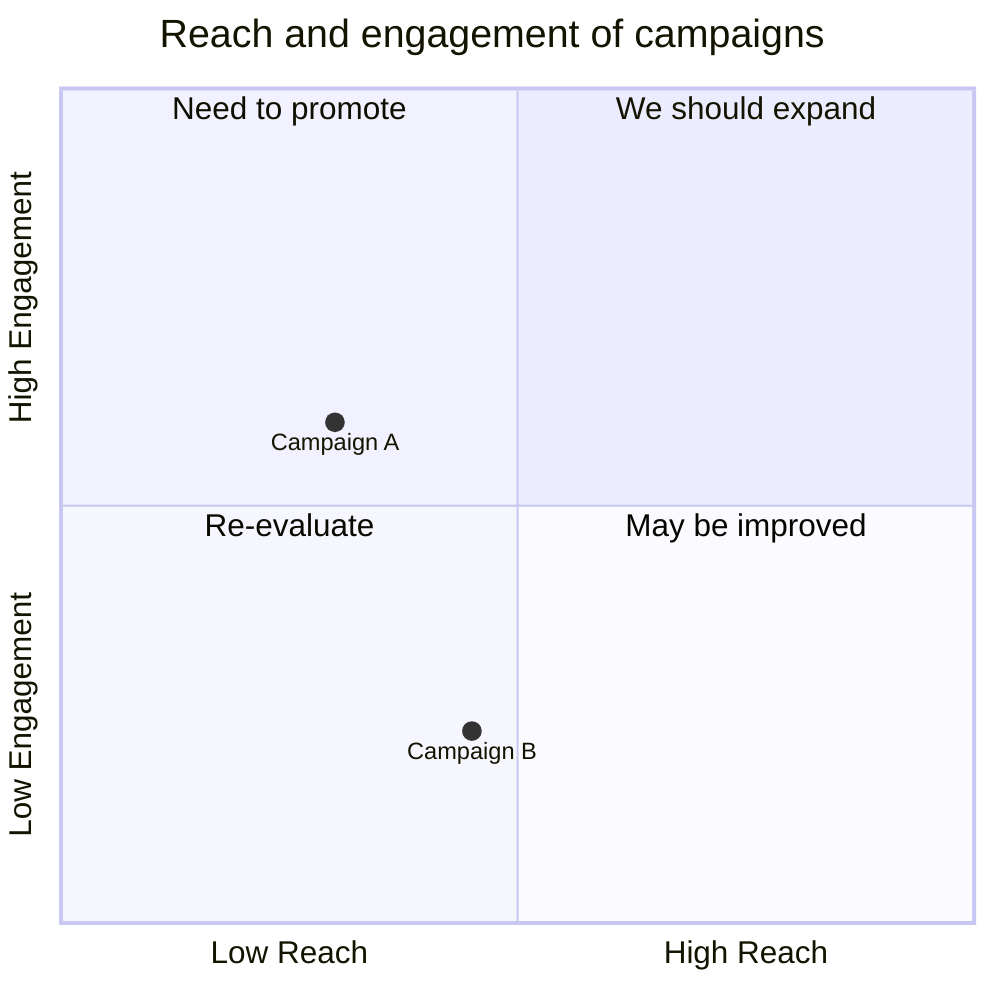
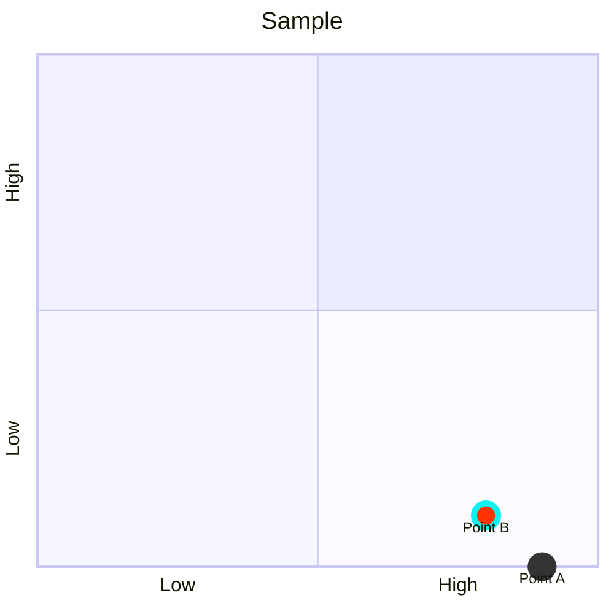
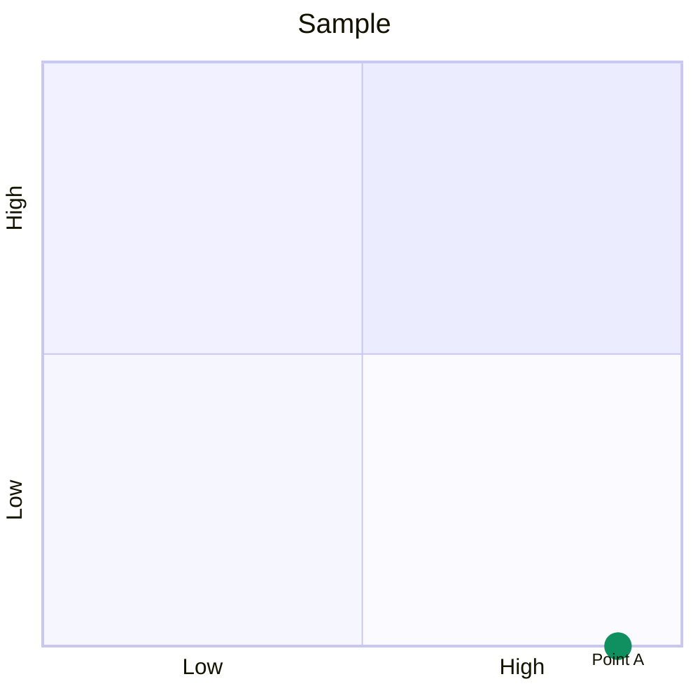

# Quadrant Chart

- **Keyword(s):** `quadrantChart`
- **Introduced:** core — in mermaid since 10.9.6 or earlier (verified against the v10.9.6 diagram registry), so it renders on effectively any deployed mermaid — the doc gives no introduction version. Not beta.
- **Use when:** plotting items on two independent axes (e.g. reach vs. engagement, urgency vs. importance) to bucket them into four named regions.
- **Avoid when:** you need more than two dimensions, or an actual numeric scale on the axes — use `xychart-beta` for a real numeric axis chart.

## Minimal example

## Core syntax

- `title <text>` — optional, rendered at the top.
- `x-axis <left text> --> <right text>` or just `x-axis <left text>` (right label omitted).
- `y-axis <bottom text> --> <top text>` or just `y-axis <bottom text>` (top label omitted).
- `quadrant-1`..`quadrant-4` label the four regions: 1 = top-right, 2 = top-left, 3 = bottom-left, 4 = bottom-right. All optional.
- Points: `<label>: [x, y]`, both x and y constrained to the range 0–1.
- If no points are given, axis and quadrant text render centered in each quadrant; once points exist, axis labels shift to the chart edges.

## Point styling

Direct, per-point (wins over class and theme):

Or via shared classes with `:::className` and `classDef`:

Precedence: direct styles > class styles > theme styles.

| Style key | Effect |
|---|---|
| `color` | point fill color |
| `radius` | point radius |
| `stroke-width` | point border width |
| `stroke-color` | point border color (no effect without `stroke-width`) |

## Gotchas

- Point coordinates outside `[0, 1]` are out of spec — the doc defines the range as 0 to 1 for both axes.
- Axis label layout differs depending on whether the chart has points: no points → labels centered in quadrants; with points → axis labels move to chart edges. Don't be surprised the same chart looks different once you add data.
- `quadrant-N` numbering is fixed to screen position (1=top-right, clockwise from there is not how it maps — 2 is top-left, 3 bottom-left, 4 bottom-right), not to any inherent priority ordering.

## Deeper

See `../../assets/quadrantChart/examples.md` for realistic examples.
