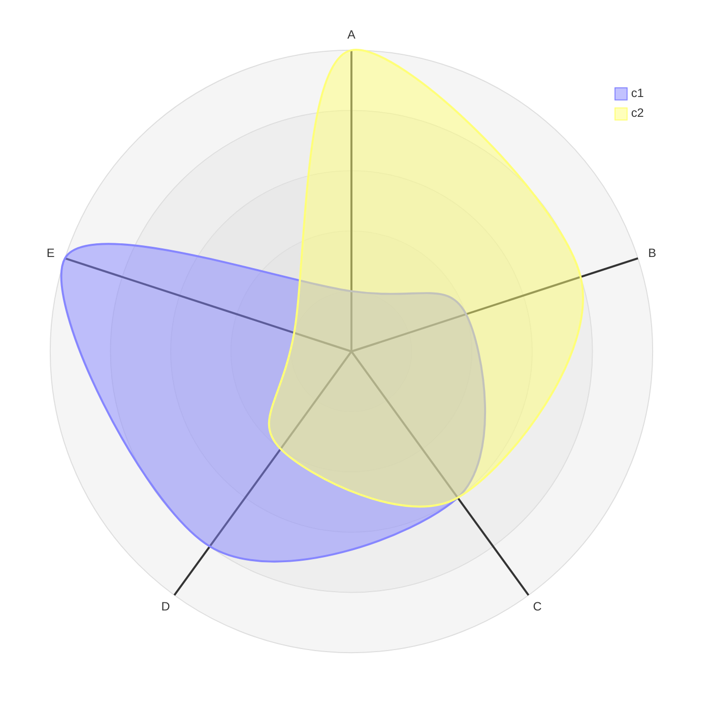
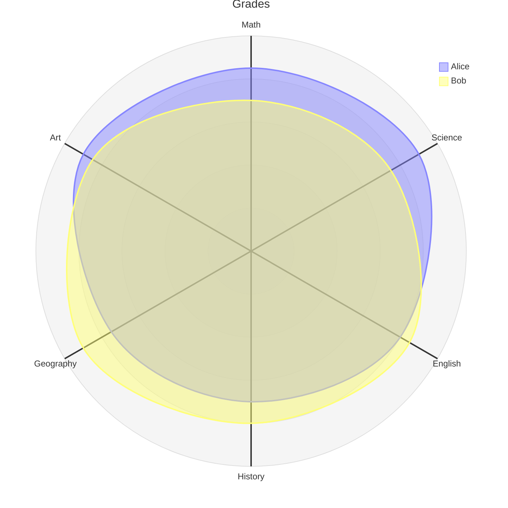

# Radar Diagram

- **Keyword(s):** `radar-beta`
- **Introduced:** v11.6.0+ (stated in the doc title). **Beta** — keyword carries `-beta`, syntax may change between mermaid versions; check your renderer's pinned version, GitHub in particular lags.
- **Use when:** comparing multiple entities across 3+ shared dimensions on the same scale (skills, ratings, spec comparisons). Also known as spider/star/cobweb/polar/Kiviat chart.
- **Avoid when:** you have only 1-2 dimensions, or the dimensions aren't on a comparable scale — use `xychart-beta` (bar) instead.

## Minimal example

## Core syntax

- `axis id1["Label1"], id2["Label2"], ...` — defines the spokes. Label is optional (falls back to the id); multiple axes per line, comma-separated; multiple `axis` lines are additive.
- `curve id1["Label1"]{v1, v2, v3}` — one curve's values, positional (matches axis declaration order) unless you use key:value pairs: `curve id4{ axis3: 30, axis1: 20, axis2: 10 }`. Multiple curves per line, comma-separated.
- `title <text>` — optional, or set via frontmatter `title:`.
- Options (bare keyword + value, own line each): `showLegend true|false` (default shown), `max <n>`, `min <n>` (default `0`, auto-computed from data if `max` omitted), `graticule circle|polygon` (default `circle`), `ticks <n>` (default `5` concentric rings).

## Gotchas

- Positional curve values must match the exact order axes were declared in across ALL `axis` lines combined — easy to get silently wrong when axes span multiple `axis` lines. Use key:value pairs (`curve id{ axisId: val, ... }`) if you want to avoid ordering bugs.
- `max`/`min` are diagram-wide, not per-curve — all curves share one scale.
- `graticule polygon` vs the default `circle` changes the visual grid shape but not the data; don't confuse it with axis count.
- Beta keyword means syntax stability is not guaranteed release to release — pin your mermaid version if this matters.

## Deeper

See `../../assets/radar-beta/examples.md` for realistic examples.
