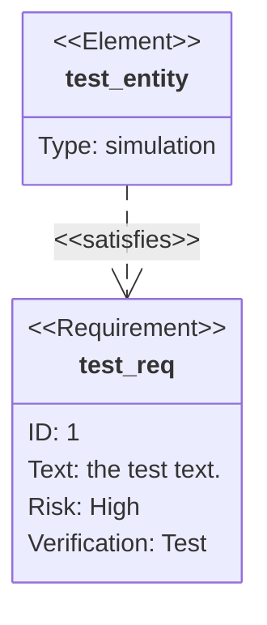

# Requirement Diagram

- **Keyword(s):** `requirementDiagram`
- **Introduced:** core — in mermaid since 10.9.6 or earlier (verified against the v10.9.6 diagram registry), so it renders on effectively any deployed mermaid — the official doc gives no version number and does not mark this diagram type beta.
- **Use when:** tracing formal requirements (SysML-style) to the elements that satisfy, verify, or derive from them — compliance/traceability documentation.
- **Avoid when:** you just want a general dependency graph or checklist — use `flowchart` or `kanban`; this diagram's value is specifically the requirement/risk/verification vocabulary.

## Minimal example



## Core syntax

Three component kinds: `requirement`, `element`, and a relationship line between them.

```text
<type> user_defined_name {
    id: user_defined_id
    text: user_defined text
    risk: <risk>
    verifymethod: <method>
}
```

```text
element user_defined_name {
    type: user_defined_type
    docref: user_defined_ref
}
```

```text
{source} - <relType> -> {destination}
{destination} <- <relType> - {source}
```

Requirement `<type>`, `risk`, `verifymethod`, and relationship type are all enumerations — see [shapes.md](../../assets/requirementDiagram/shapes.md) for the full lists. `element` fields (`type`, `docref`) are freeform, user-defined text.

### Direction

```text
direction LR
```

Valid values: `TB` (default), `BT`, `LR`, `RL`. Place the `direction` statement after the diagram keyword, before the requirement/element definitions.

### Styling

Direct: `style test_req fill:#ffa,stroke:#000`. Reusable: `classDef important fill:#f96` then `class test_req,test_entity important`, or the shorthand `requirement test_req:::important { ... }`. A class named `default` applies to every node unless overridden.

## Gotchas

- **Unquoted field values containing a hyphen break the parser** — `id: AUTH-1` and `text: multi-factor authentication` both fail with `Expecting 'NEWLINE', got 'LINE'`. Quote any `text:` or `id:` value that has a hyphen (or otherwise looks ambiguous): `id: "AUTH-1"`, `text: "multi-factor authentication"`. Confirmed against mermaid 11.16.0.
- The doc's enumeration table capitalizes `Risk` values (`Low`, `Medium`, `High`) and `VerificationMethod` values (`Analysis`, `Inspection`, `Test`, `Demonstration`), but every worked example in the doc uses lowercase (`risk: high`, `verifymethod: test`) — lowercase is the form actually demonstrated as working.
- The `:::` shorthand class syntax can only attach classes to one requirement/element at a time; for multiple targets use the `class` keyword with a comma-separated list instead.

## Deeper

- [shapes.md](../../assets/requirementDiagram/shapes.md) — requirement types, risk levels, verification methods, relationship types
- [examples.md](../../assets/requirementDiagram/examples.md) — realistic traceability diagrams
