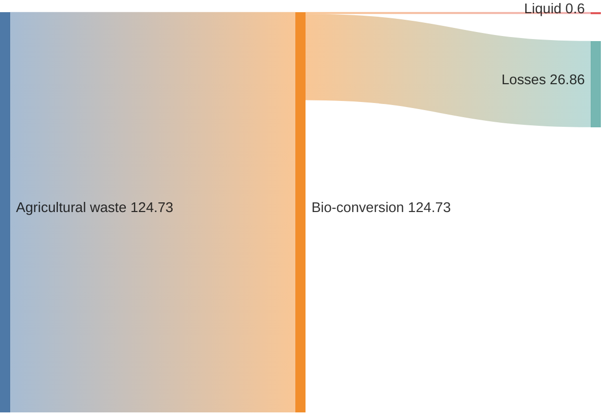
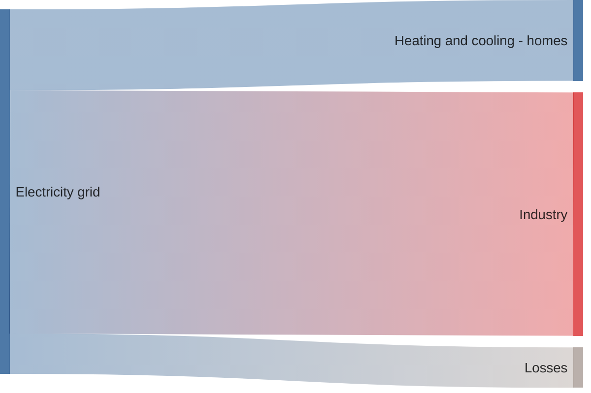

# Sankey Diagram

- **Keyword(s):** `sankey`
- **Introduced:** v10.3.0+ (stated in the doc title). The doc's own warning box still calls it "an experimental diagram" whose syntax "is to be extended in the nearest future" — no `-beta` suffix on the keyword, but treat it as unstable in practice. `labelStyle`, `nodeWidth`, `nodePadding`, `nodeColors` config are v11.15.0+.
- **Use when:** visualizing flow/quantity moving between named stages (energy flows, funnels, budget allocation).
- **Avoid when:** you need a strict hierarchy (parent/child containment) rather than flow — use `treemap-beta` instead.

## Minimal example

## Core syntax

The diagram body is raw CSV: `source,target,value` — exactly 3 columns, no header row.

- Start with the `sankey` keyword alone, then a blank line, then CSV rows.
- One row = one link, `source,target,value`. Repeated source/target names automatically become the same node.
- Empty lines between rows are allowed (for readability) even though standard CSV doesn't permit them.
- A value containing a comma must be double-quoted: `Pumped heat,"Heating and cooling, homes",193.026`.
- A literal double quote inside a quoted field is escaped by doubling it: `"Heating and cooling, ""homes"""`.
- `%% comment` lines are supported (as elsewhere in mermaid).

## Config (frontmatter `config.sankey`)

| Key | Effect | Values |
|---|---|---|
| `showValues` | print the numeric value on links | `true`/`false` |
| `linkColor` | link coloring rule | `source`, `target`, `gradient`, or a hex code |
| `nodeAlignment` | node column alignment | `justify`, `center`, `left`, `right` |
| `labelStyle` (v11.15.0+) | `legacy` (plain text) or `outlined` (background stroke, better readability) |
| `nodeWidth` (v11.15.0+) | node rectangle width in px, default `10` |
| `nodePadding` (v11.15.0+) | vertical padding between nodes in px, default `12` |
| `nodeColors` (v11.15.0+) | map of node name → CSS color (hex/`rgb()`/`hsl()`/named); unlisted nodes use the default scheme |

## Gotchas

- Exactly 3 columns — no header row, no 4th column for metadata.
- The body is CSV, so commas inside a name MUST be quoted or the row misparses into 4+ fields.
- No native node-only declarations — every node must appear in at least one `source,target,value` row; there's no way to declare an isolated node.
- Despite shipping since v10.3.0, the doc still flags this as experimental — expect syntax drift across mermaid versions and check your renderer's pinned version before relying on newer config keys (`labelStyle`, `nodeColors`, etc. need 11.15.0+).

## Deeper

See `../../assets/sankey/examples.md` for realistic examples.
