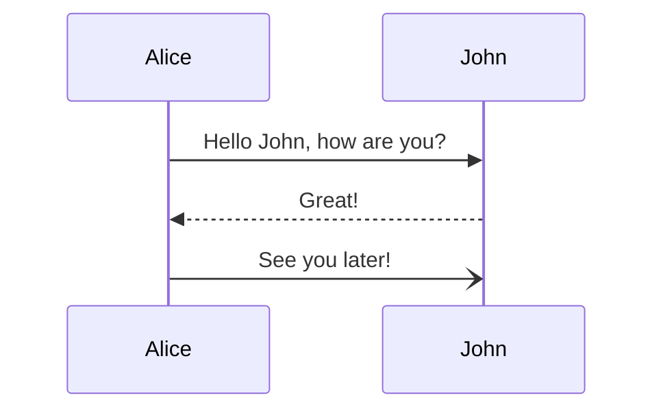
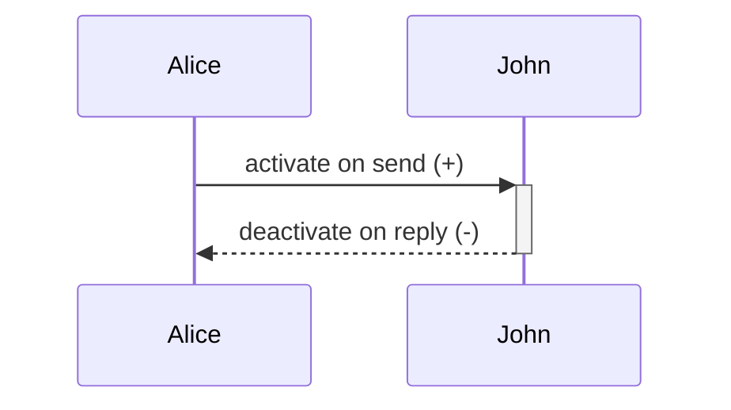

# Sequence Diagram

- **Keyword(s):** `sequenceDiagram`
- **Introduced:** core — in mermaid since 10.9.6 or earlier (verified against the v10.9.6 diagram registry), so it renders on effectively any deployed mermaid (source doc doesn't state it). Per-feature versions: click/link tooltips v0.5.2+, actor creation/destruction v10.3.0+ (unfixable create/destroy ordering error needs v10.7.0+), bidirectional arrows (`<<->>`, `<<-->>`) v11.0.0+, half-arrows and central `()` connections v11.12.3+, autonumber start/increment values v11.15.0+.
- **Use when:** you need to show time-ordered messages between participants (API calls, protocol handshakes, event flows).
- **Avoid when:** you need to show static structure or relationships between types - use `classDiagram` instead.

## Minimal example

## Core syntax

Participants are implicit (declared in order of first appearance) or explicit via `participant Name` / `actor Name`, which also lets you control display order. Alias with `participant A as Alice`.

Message arrows (see `../../assets/sequenceDiagram/shapes.md` for the full table and the participant-type vocabulary):

Notes: `Note right of Actor: text`, `Note left of Actor: text`, `Note over A,B: text` (spans two participants).

Grouping constructs, all closed with `end`:

| Construct | Purpose |
| --- | --- |
| `loop text ... end` | repeated interaction |
| `alt text ... else ... end` | either/or branches |
| `opt text ... end` | optional branch, no else |
| `par text ... and ... end` | concurrent actions (nestable) |
| `critical text ... option ... end` | action with conditional handling, options optional |
| `break text ... end` | stop the sequence (e.g. to model an exception) |
| `rect rgb(r,g,b) ... end` | background highlight over a region |

`autonumber` before the first message turns on sequence numbers; `autonumber <start> <increment>` (v11.15.0+) sets the starting value and step.

Comments: `%% comment text` on its own line.

## Gotchas

- A literal `end` in message/note text can break the parser - wrap it in parens/brackets/braces: `(end)`, `[end]`, `{end}`.
- `box` group colors must be given **before** the optional description, e.g. `box Aqua Group Description`.
- Hex colors (`#ff0000`) are **not supported** in `box` headers because `#` starts a comment - use `rgb()`, `rgba()`, `hsl()`, or `hsla()` instead.
- A semicolon inside message text needs escaping as `#59;` because semicolons can be used in place of line breaks in the markup.
- Escape other special characters with decimal entity codes, e.g. `#9829;` for a heart, `#35;` to render a literal `#`.
- Actor names with line breaks require an alias (`participant Alice as Alice Johnson`) - you can't ` ` an implicit participant name.
- Only the message recipient can be `create`d; either the sender or recipient can be `destroy`ed.
- Participant "type" symbols (boundary/control/entity/database/collections/queue) require the JSON-config syntax `participant X@{ "type": "boundary" }`, not a plain keyword.

## Deeper

See `../../assets/sequenceDiagram/shapes.md` for the arrow-type and participant-type tables, and `../../assets/sequenceDiagram/examples.md` for worked examples.
