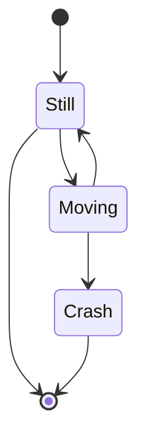
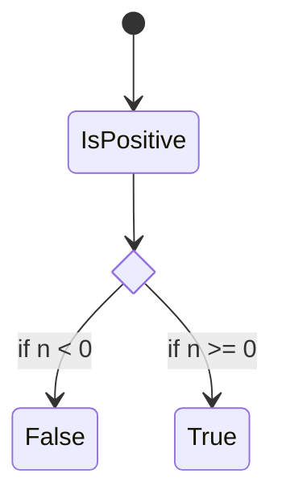

# State Diagram

- **Keyword(s):** `stateDiagram-v2` (current renderer; the plain `stateDiagram` keyword still works and uses the older renderer)
- **Introduced:** core — in mermaid since 10.9.6 or earlier (verified against the v10.9.6 diagram registry), so it renders on effectively any deployed mermaid - the source doc doesn't give a version for either renderer.
- **Use when:** you need to model the finite states of a single system/entity and the transitions between them.
- **Avoid when:** you need timing/order of messages between multiple actors - use `sequenceDiagram`; or static object structure - use `classDiagram`.

## Minimal example

## Core syntax

A state is just an id (`stateId`), optionally with a description via `state "text" as s2` or `s2 : text`. `[*]` marks the diagram's start (as a source) or end (as a target) of a transition.

Transitions: `s1 --> s2` (auto-declares undefined states), with an optional label `s1 --> s2: A transition`.

Composite states nest sub-diagrams: `state First { [*] --> second second --> [*] }`, and can be layered arbitrarily deep. You can transition between composite states from outside, but not between internal states that belong to different composite states.

Choice/fork/join model branching and concurrency inside a composite state:

Concurrency inside a composite state: separate parallel regions with a bare `--` line.

Notes: `note right of State1 ... end note` (multi-line) or `note left of State2 : inline text`.

Direction: `direction LR` (also `TB`, `BT`, `RL`) - can be set per composite state too.

Comments: `%% comment text`, on its own line or trailing a statement.

## Gotchas

- The doc states `classDef` styles **cannot** be applied to start/end (`[*]`) states or to/within composite states - but the doc's own styling example then applies `class end badBadEvent`. Treat start/end/composite styling as unsupported per the stated limitation; don't rely on that one example.
- State names with spaces must be defined via an id first (`yswsii: Your state with spaces in it`) and referenced by that id everywhere else, including in `:::style` shorthand (`yswsii:::yourState`).
- Transitions can't cross between internal states of two different composite states directly - route through the composite state's own boundary instead.

## Deeper

No `shapes.md` for this diagram - the only real vocabulary is `[*]`, `<<choice>>`, and `<<fork>>`/`<<join>>`, all covered above. See `../../assets/stateDiagram/examples.md` for worked examples.
