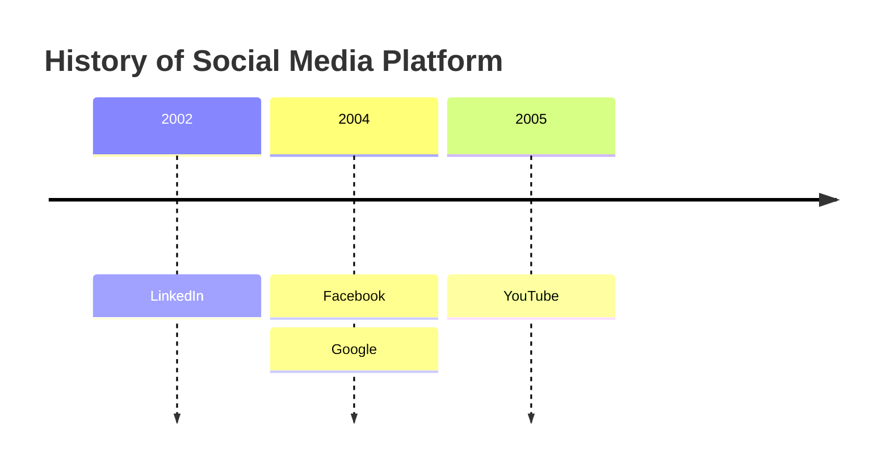
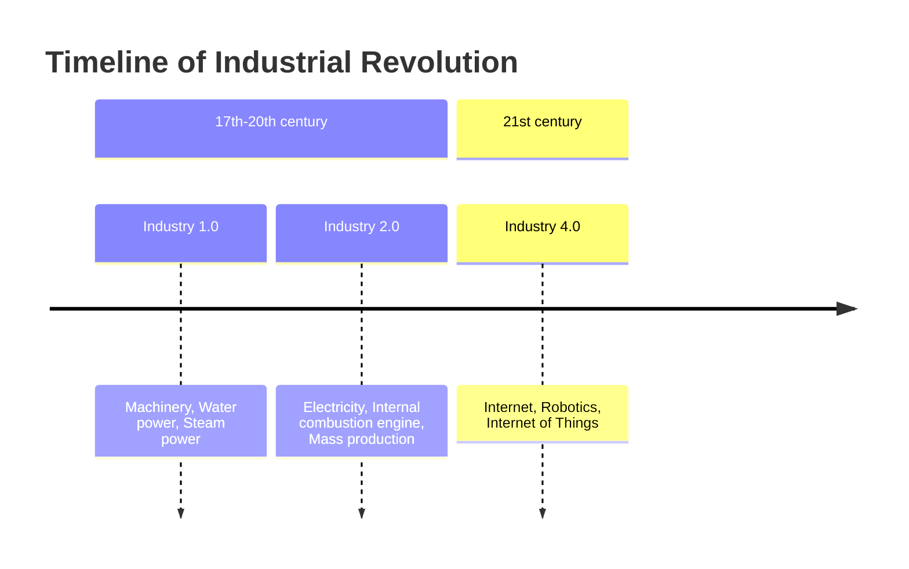

# Timeline Diagram

- **Keyword(s):** `timeline`
- **Introduced:** core — in mermaid since 10.9.6 or earlier (verified against the v10.9.6 diagram registry), so it renders on effectively any deployed mermaid — the doc gives no version. The doc calls the diagram "experimental for now," but clarifies "the syntax is stable except for the icon integration which is the experimental part." Not a `-beta` keyword. Direction control (`timeline TD`) is v11.14.0+.
- **Use when:** showing a chronological sequence of events/eras, optionally grouped into sections, without needing real calendar math.
- **Avoid when:** you need actual dated durations, dependencies, or a project schedule — use `gantt` instead.

## Minimal example

## Core syntax

- `timeline` starts the diagram, optionally followed by a direction keyword: `LR` (default, left-to-right) or `TD` (top-down, v11.14.0+).
- `title <text>` — optional.
- Each entry: `<time period> : <event>`. Time period and event are both free text, not restricted to numbers/dates.
- Multiple events under one time period: repeat the colon on the same or continuation lines.
  - Same line: `2004 : Facebook : Google`
  - Continuation lines: a bare `: <event>` line (no time period) attaches to the preceding time period.
- `section <name>` groups subsequent time periods until the next `section` — all periods before the first `section` fall into an implicit default section.
- Time periods render left-to-right (or top-to-bottom with `TD`) in file order; events within a period render top-to-bottom (or left-to-right).
- ` ` forces a manual line break inside text; long text otherwise auto-wraps.

## Color scheme

- With sections defined: each section gets one color, shared by all its periods/events.
- Without sections: each time period gets its own color by default (`disableMulticolor` off). Set `timeline: { disableMulticolor: true }` in config to force one shared scheme instead.
- Override colors directly via theme variables `cScale0`..`cScale11` (background) and `cScaleLabel0`..`cScaleLabel11` (foreground); repeats if you have more than 12 sections/periods.

## Gotchas

- A continuation event line (bare `: text`) must line up as its own line — it attaches to whichever time period preceded it, so reordering or misplacing it silently reassigns the event.
- Without `section`, color varies per time period by default — if you want a uniform look you must explicitly set `disableMulticolor: true`, it's not the default.
- `timeline TD` requires v11.14.0+ — older pinned renders will not recognize the direction keyword.
- The doc's "experimental" caveat applies specifically to icon integration (not covered in the fetched syntax doc), not to the core section/period/event syntax — don't assume the whole diagram type is unstable.

## Deeper

See `../../assets/timeline/examples.md` for realistic examples.
